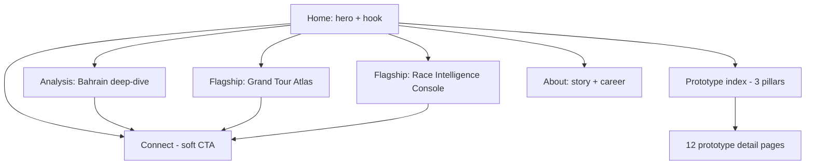
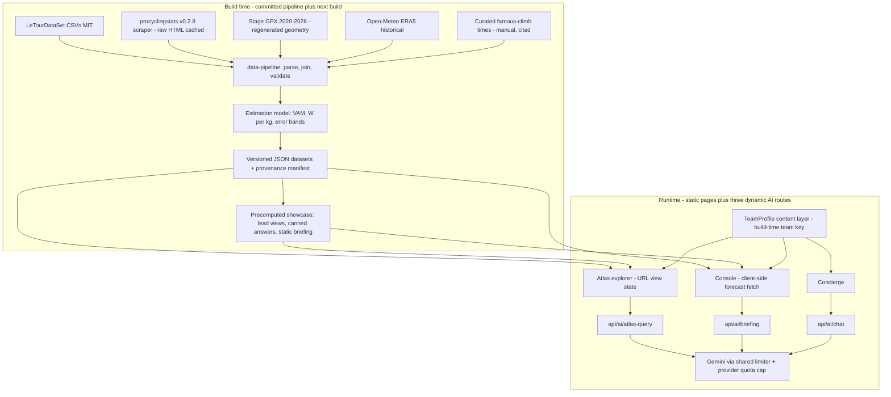
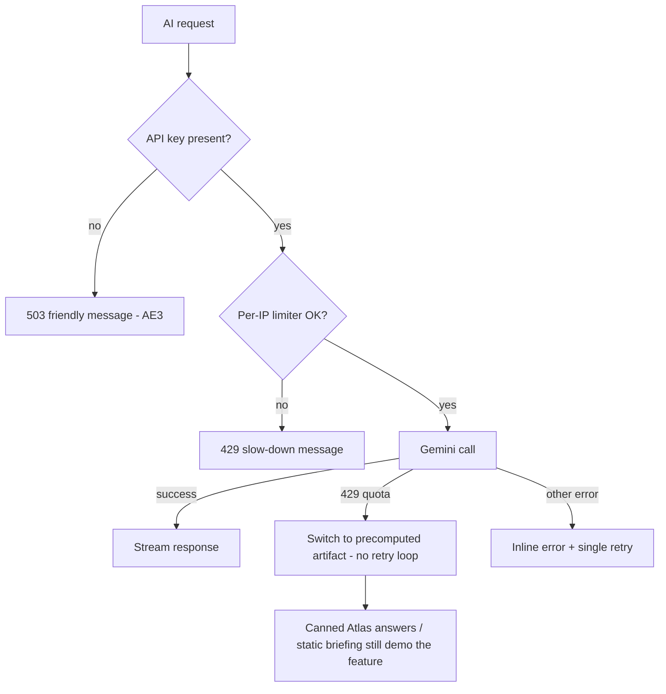

# Cycling WorldTour Outreach Site - Plan

## Goal Capsule

- **Objective:** Build a premium job-outreach website pitching Dominik Benger as the data/AI/cloud capability UCI WorldTeams are racing to acquire — first recipient Team Bahrain Victorious — anchored by two flagship data tools and 12 interactive prototypes, with the goal of earning a conversation that leads to a role in pro cycling.
- **Target repo:** `cycling-application` — a new sibling repo created by U1 (alongside `amazon-application` and `job-application`). All file paths in Implementation Units are relative to it. This plan document lives in `web-app-resume`; U1 copies it and the research docs into the new repo.
- **Product authority:** The Product Contract below, confirmed with Dominik on 2026-07-05. Product Contract preservation: unchanged from the requirements-only version, except Outstanding Questions were resolved into Planning Contract decisions, Sources gained the plan-phase research docs, and R24/R26 design-quality wording was strengthened at Dominik's direction (2026-07-05: /impeccable + Mobbin MCP + shadcn/ui made explicit and binding).
- **Execution profile:** Greenfield build in dependency order (Unit Index below). Verification is build + lint + targeted data-integrity tests + browser smoke — no e2e suite. Design quality gates through the /impeccable pass in U2.
- **Stop conditions:** Surface to Dominik instead of guessing on: any copy claim about his career or the team, any change to the Product Contract's positioning/tone doctrines, the robots indexing decision (U17), and final pre-send approval (U18).
- **Open blockers:** None. Largest execution risk is historical data acquisition (U4); its validation gates run before dependent units proceed.

---

## Product Contract

### Summary

A portfolio-led outreach site presenting Dominik as one person who builds a WorldTeam's data & AI capability end-to-end — anchored by the **Grand Tour Atlas** (~20 years of AI-queryable historical race intelligence) and the **Race Intelligence Console** (agentic race-day briefings for real 2026 stages), plus 12 interactive prototypes across three pillars. Bahrain Victorious is the first, deeply-tailored recipient; team-specific content lives in a swappable layer so later teams are a content change. The only ask on the site is a soft "let's connect."

### Problem Frame

Dominik wants to pivot his career into professional road cycling — the sport he fell in love with after leaving Google — bringing nine-plus years of advertising analytics, BI-at-scale, and AI-native product work to a WorldTeam. Teams hire through networks, not job boards, so the pitch must create its own channel and prove capability on contact.

The timing is favorable. Data infrastructure just became regulatory (UCI mandates a digital performance logbook from 2026) and competitive: Visma runs a real-time Control Room with ML nutrition models, INEOS signed a €100M AI title partnership and an AWS generative-AI program, UAE runs a physiology powerhouse. Bahrain Victorious — government-funded as a nation-branding vehicle, with a roster led by Tiberi, Lenny Martinez, and Mohorič — has no public data-science identity beyond off-the-shelf TrainingPeaks. Its funder's return is soft-power exposure, a measurement problem squarely in Dominik's professional wheelhouse. Two prior outreach sites (`klar.dbenger.com`, `amazon.dbenger.com`) proved the working-prototypes-instead-of-cover-letter format; this site adapts that format to a new industry where the reader is a GM (Milan Eržen) and a marginal-gains performance director (Rod Ellingworth), not a hiring manager with a job posting.

### Key Decisions

- **Open positioning, carried by the flagships.** No job title is claimed; the site shows range across three pillars (race intelligence, business & sponsorship, data platform & AI). The two flagship tools are the de facto positioning — "historical mastery + operational firepower."
- **Two flagships: Atlas + Console.** Backward-looking proof of data mastery plus forward-looking operational value. Talent scouting was demoted to a prototype to avoid publicly evaluating current young riders.
- **Portfolio-led structure.** The proven Klar/Amazon shape (person → proof → tools, nothing buried) chosen over briefing-led and flagship-led alternatives in wireframe review.
- **Respect-first hook.** The homepage leads with Bahrain's ambition (Project Lenny, Tiberi's GC campaign, the new Bianchi era) and the WorldTour data arms race — never Bahrain's 2025 shortfall. The results-conversion angle appears only in the analysis page, framed as headroom, written like someone rooting for them. Direct deficit-calling was rejected as offensive.
- **Honest-data doctrine.** Real race power telemetry is not public; teams guard it as IP. Long-horizon performance views use climb-time-derived estimates (W/kg, VAM) with visible "modeled estimate" labels, error bands, and methodology notes; prototypes use clearly-labeled seeded synthetic data where real data is non-public. Credibility with an expert reader outranks spectacle.
- **Bahrain-first, built adaptable.** Team-specific content (hooks, accents, analysis, names) is isolated in a swappable content layer; a version for a second team requires content work only, no component changes.
- **Soft CTA only.** "Let's connect" — no role proposal, no pilot pitch. Chosen over the research recommendation of a de-risked pilot offer; the work argues, the ask stays light.
- **Ships complete.** No cut-down v1: both flagships, all 12 prototypes, and the premium design bar are in before anything is sent ("everything at once").
- **Chassis inherited from the `amazon-application` sibling, identity built new.** Next.js App Router + shadcn/ui + Recharts shared chart theme + framer-motion + server-side Gemini proxy pattern (thinking-budget and snake_case pitfalls known), with a new cycling-native visual identity — not a re-skin of the Amazon ink-navy/orange theme.
- **Tenure stated as "9+ years at Google," verbatim, per Dominik's explicit direction (2026-07-05).** Documented employment dates compute ~7.5 years (Aug 2017–Feb 2025); the discrepancy and fact-check risk were flagged and Dominik accepted them. Do not revert this without his instruction.

### Actors

- A1. Dominik Benger — owner, sender, subject of the pitch.
- A2. Milan Eržen — Bahrain Victorious General Manager; primary recipient; gives the site ~90 seconds on first contact and decides whether to reply.
- A3. Rod Ellingworth — team management, ex-Sky/INEOS marginal-gains architect; technical validator who will judge methodology credibility.
- A4. Future team leadership — later recipients (Visma, UAE, Lidl-Trek, …) via the swappable content layer.
- A5. Site AI concierge — grounded assistant answering visitor questions from the site knowledge base.

### Requirements

**Positioning, narrative, and tone**

- R1. The site presents Dominik as a single builder of a WorldTeam's data & AI capability across three pillars — Race & Performance Intelligence, Team Business & Sponsorship, Data Platform & AI — without claiming a specific job title.
- R2. The homepage hook leads with Bahrain's ambition and the sport-wide data arms race; no page states Bahrain's 2025 shortfall as criticism.
- R3. The analysis page may address the 2025 results-conversion angle only as headroom ("this roster's ceiling is higher than its results"), in a supportive tone.
- R4. The personal story (12 years of basketball, career ended by four knee surgeries, a data career, then road cycling) appears as a compact narrative; cycling credibility is stated honestly — two years of riding and following the peloton, no sports-science credentials implied.
- R5. The only call to action is a soft "let's connect" (email + LinkedIn); no role proposal or pilot pitch appears anywhere.
- R6. Every career and team fact on the site withstands public fact-checking, with one recorded exception: Google tenure reads "9+ years at Google" (see Key Decisions).
- R7. Team-facing content demonstrates insider currency: Bianchi-era equipment (Power2Max meters, Shimano), Project Lenny, Tiberi's GC campaign, the Ultrahuman/CORE training-tech reality, the UCI 2026 digital-logbook mandate, and 2026 metric zeitgeist (durability/power-after-kJ, 120 g/h fueling, heat adaptation).

**Site architecture**

- R8. Portfolio-led structure: home (hero + hook → flagship cards → pillar/prototype grid → story → connect), plus an analysis page (Bahrain deep-dive), one page per flagship, a prototype index with a detail page per prototype, and an about page.
- R9. Every prototype detail page pairs the working demo with a method note (technique + its limitation), a data-provenance disclosure, a "what this takes in production" note, and mapped resume evidence.
- R10. An AI concierge chat, grounded in a site knowledge base (Dominik's profile + cycling research + site content), is available site-wide and declines questions outside its knowledge rather than inventing answers.

**Flagship: Grand Tour Atlas**

- R11. Covers roughly twenty years of Grand Tour racing (Tour de France at minimum; Giro/Vuelta if data acquisition permits), explorable by edition, stage, team, and rider.
- R12. Blends at least four public source families: race results/startlists, stage routes/elevation/climb catalogs, historical weather, and climb-time-derived performance estimates.
- R13. Every estimation-derived figure (W/kg, VAM) carries a visible "modeled estimate" label, an error band, and a link to a methodology explainer.
- R14. AI layer: natural-language questions return charts plus written analysis; the Atlas can generate era and edition narratives.
- R15. The Atlas is fully team-agnostic and ships unchanged in any team's version of the site.

**Flagship: Race Intelligence Console**

- R16. For a selected real 2026 stage, blends route, elevation, weather, startlist, and historical analogues into echelon/crosswind risk zones, breakaway-survival probability, climb demand profiles, and a TT pacing curve.
- R17. Agentic output: generates a directeur-sportif-style race briefing document from the blended inputs.
- R18. Console models carry the same method-note and uncertainty framing as the Atlas.

**Prototype suite**

- R19. At least 10 interactive prototypes ship (working set: 12), each a self-contained interactive demo, organized under the three pillars.
- R20. The working set is the table below; individual entries are swappable at planning time without renegotiating scope.

| Pillar | Prototype | What it demonstrates |
|---|---|---|
| Race & Performance Intelligence | Durability Profiler | Power-after-kJ fatigue curves — the defining 2026 metric — on labeled demo data |
| Race & Performance Intelligence | Fueling Planner | 120 g/h carb periodization against stage demand profiles |
| Race & Performance Intelligence | Wearables Command Center | Ultrahuman CGM + CORE temp + power streams unified into one athlete view (mirrors Bahrain's actual training-tech partners) |
| Race & Performance Intelligence | TT Pacing Optimizer | Course-segmented power plans (Segaert/TT relevance) |
| Team Business & Sponsorship | Nation-Brand Exposure ROI | Media/exposure value measurement for a government funder |
| Team Business & Sponsorship | Fan & Social Value Analytics | Content performance quantified into sponsor narrative |
| Team Business & Sponsorship | UCI Points & Relegation Strategist | Points-per-budget roster and calendar optimization |
| Team Business & Sponsorship | Calendar & Logistics Optimizer | Race-program and travel optimization across a 60-staff season |
| Data Platform & AI | Digital-Logbook Compliance Hub | The UCI 2026 mandate turned into a data product |
| Data Platform & AI | Team Data Platform Blueprint | Interactive cloud architecture — the lean "Control Room for Bahrain" |
| Data Platform & AI | Agentic Race-Recon Generator | GPX + weather + history composed into a stage recon document |
| Data Platform & AI | Talent Radar (historical mode) | U23 trajectory modeling validated on past cases (e.g., would it have flagged Pogačar in 2018) — no scoring of current riders |

- R21. Prototypes use clearly-labeled, seeded synthetic data wherever real data is non-public; each carries the R9 scaffolding.

**Adaptability and deployment**

- R22. All team-specific content is isolated in a swappable content layer; producing a second team's version requires content-layer changes and a new deploy only — zero component changes.
- R23. First deployment targets `bahrain.dbenger.com`, following the `klar.`/`amazon.` sibling convention.

**Design and experience quality**

- R24. The design is a bespoke, premium, cycling-native identity — designed under /impeccable guidance on a shadcn/ui component system with a shared chart theme — and must not read as a template, a re-skin of the Amazon site, or generic AI-generated design ("AI slop": uniform icon-in-circle card grids, gradient heroes, interchangeable SaaS layouts).
- R25. Fully responsive; `prefers-reduced-motion` respected; first load stays fast with heavy flagship data lazy-loaded.
- R26. A design-inspiration pass uses the Mobbin MCP for design and component references (connected at build time) plus curated references; if Mobbin is unavailable the pass proceeds with /impeccable + shadcn/ui + curated references alone.
- R27. All AI features run through server-side Gemini proxy routes (key server-side; graceful degradation with a friendly message when the key is absent).
- R28. Basic visit analytics are wired in so Dominik can see engagement after sending (sibling-site pattern).

### Key Flows

- F1. Cold first visit (A2, ~90 seconds)
  - **Trigger:** Eržen opens the link from Dominik's outreach message.
  - **Steps:** Hook lands (their ambition + the arms race) → flagship cards pull him into the Atlas or Console → visible craft and honest method labels register → story section humanizes → soft connect.
  - **Outcome:** Reply or forward to Ellingworth. **Covers R1, R2, R5, R8.**
- F2. Technical validation (A3)
  - **Trigger:** Ellingworth receives the forward.
  - **Steps:** Analysis page → methodology explainers → prototype method notes → spot-checks facts (equipment, riders, metrics) against reality.
  - **Outcome:** Nothing embarrasses; the method survives an expert. **Covers R3, R6, R7, R9, R13, R18.**
- F3. Second-team adaptation (A1, A4)
  - **Trigger:** Dominik targets the next team.
  - **Steps:** Duplicate content layer → replace team hooks/analysis/accents → deploy to a new subdomain.
  - **Outcome:** A "made for us" site for team #2 with no component work. **Covers R15, R22, R23.**
- F4. Concierge Q&A (A5, any visitor)
  - **Trigger:** Visitor asks the chat a question.
  - **Steps:** Grounded answer from the knowledge base; out-of-scope questions declined gracefully; nudge toward connect where natural.
  - **Outcome:** No hallucinated claims about the team or Dominik. **Covers R10.**

### Acceptance Examples

- AE1. **Covers R13.** Given a visitor viewing a climb performance figure in the Atlas, when the figure derives from climb-time estimation, then it shows a "modeled estimate" label with an error band and links the methodology explainer.
- AE2. **Covers R16, R18.** Given the Console composing a briefing, when the live weather source is unavailable, then it falls back to last-known data and labels the briefing accordingly instead of failing or silently presenting stale data as live.
- AE3. **Covers R27.** Given an environment without `GEMINI_API_KEY`, when a visitor uses any AI feature, then a friendly unavailable message appears and every non-AI part of the site works fully.
- AE4. **Covers R25.** Given a visitor with `prefers-reduced-motion`, when any page loads, then entrance animations collapse to instant and all content remains reachable.
- AE5. **Covers R22.** Given the site adapted for a second team, when the content layer is swapped, then no component file requires modification.
- AE6. **Covers R10.** Given the concierge asked something outside its knowledge (e.g., team salary details), then it declines and redirects rather than inventing an answer.

### Success Criteria

- A reply or meeting from Bahrain Victorious leadership (primary, external — not fully controllable; the site's job is to make ignoring it hard).
- The insider test: a knowledgeable cycling reader finds current rider, equipment, and metric references correct — the site reads as built by someone inside the sport's numbers, not a fan with a dashboard.
- The Ellingworth test: every methodology claim survives expert scrutiny; no data claim anywhere is falsifiable by someone who knows what teams actually measure.
- The extraordinary test: the flagships are artifacts no other candidate could plausibly send — worth forwarding even if no role exists today.
- Reusability: a second team's version requires roughly a day of content work, no engineering.

### Scope Boundaries

**Deferred for later**

- Additional team versions (Visma, UAE, Lidl-Trek …) — architecture supports them; content work per team.
- Women's-team and development-squad analytics angle beyond the U23 talent prototype (LeTourDataSet's women's CSVs, 2022–2025, make this a natural later extension).
- Giro and Vuelta coverage in the Atlas — the data schema ships expansion-ready; acquisition and validation are deferred.
- Live in-race data integrations; video/computer-vision demos; a PDF/print leave-behind; multi-language content.

**Outside this product's identity**

- Sports-science or physiology authority — the site positions around the team's physiologists, never as one of them.
- Public evaluation of current young riders by name.
- Consulting-pitch framing (pilot offers, pricing, service menus).
- Deficit-calling content about any team.
- Claims of real race power telemetry — the data does not publicly exist; pretending otherwise fails the site's entire premise.

### Dependencies / Assumptions

- Public-data acquisition is the largest build risk: procyclingstats.com has no official API and the `procyclingstats` scraper (pinned v0.2.8) parses HTML that can break; all scraping happens at build time with raw-HTML caching and schema validation (see KTD3). The MIT-licensed LeTourDataSet backbone plus Open-Meteo (CC BY 4.0) de-risk the rest.
- `GEMINI_API_KEY` with provider-side quota caps set in Google AI Studio (the hard spend ceiling for public AI routes).
- Mobbin MCP is not connected in the authoring environment today; R26 defines the fallback.
- New sibling repo, Vercel project, and DNS for `bahrain.dbenger.com` follow the established klar/amazon pattern.
- Send window assumption: August 2026 (post-Tour, when teams make staffing decisions) is the target context, not a deadline; "ships complete" governs readiness.
- Team facts (roster, partners, results) were researched 2026-07-05 and drift; team-fact surfaces carry "as of" dating and U18 re-verifies before send.
- Dominik gives final approval on all copy claims before send.

### Outstanding Questions

**Deferred to implementation**

- Indexing: `robots.ts` allow-all (sibling default) vs `noindex` — a named-team pitch surfacing in search is more sensitive than the Amazon site. Default: follow the sibling (indexable); confirm with Dominik at U17.
- Final curated 2026 stage set for the Console — calendar-dependent at build time (U9).
- Font selection and final accent palette — decided inside the U2 design pass under the DESIGN.md discipline.
- Historical GPX gap handling per edition — U4's validation decides per-edition profile-only vs map treatment within the KTD5 boundary.

### Sources / Research

- `docs/brainstorms/cycling-outreach-research-metrics.md` — pro cycling metrics landscape 2020–2026, public-data availability verdict, platform landscape, AI frontiers (URL-cited).
- `docs/brainstorms/cycling-outreach-research-teams.md` — WorldTeam operations, budgets, Bahrain Victorious org/roster/partners, rival data programs, business-angle analysis (URL-cited).
- `docs/brainstorms/cycling-outreach-grounding.md` — verified structure of the two sibling outreach sites and Dominik's profile; claims independently verified against source 2026-07-05.
- `docs/brainstorms/cycling-outreach-plan-chassis.md` — implementation-grade digest of the `amazon-application` chassis (chat route mechanics, registry pattern, design contract, pitfalls) with file:line pointers, plus the ten chassis deltas this build adds.
- `docs/brainstorms/cycling-outreach-plan-data-sources.md` — buildable data-source stack with licenses, fields, and risks; the physics model and its citation; validation-first checklist.
- `docs/brainstorms/cycling-outreach-plan-flow-gaps.md` — user-flow and edge-case analysis; four critical gaps (mobile lead views, AI-quota fallback, shareable view state, AI spend exposure) resolved by this plan.
- Load-bearing external references: Visma Control Room (visma.com insights), INEOS–Netcompany and AWS gen-AI case study, UCI digital-logbook mandate (uci.org), ITA power-data passport pilot, ProCyclingStats API absence (procyclingstats.readthedocs.io), Bahrain partners page (bahraincyclingteam.com/partners), Martin et al. (1998) *J. Applied Biomechanics* 14(3) power model, Open-Meteo API docs, thomascamminady/LeTourDataSet (MIT).

---

## Planning Contract

### Key Technical Decisions

- **KTD1 — New sibling repo `cycling-application`.** Team-agnostic repo name (the site is multi-team by design); first deploy is Bahrain's. Created by U1; this plan and the six research docs copy into it so the build is self-contained.
- **KTD2 — Inherit the `amazon-application` chassis; borrow three Klar patterns.** From amazon: Next.js 16 + React 19, Tailwind v4 OKLCH semantic tokens via `@theme inline`, shadcn/ui on Base UI (not Radix), Recharts through one `chart-theme.tsx`, framer-motion with reduced-motion discipline, the SSE Gemini route template (force-dynamic, `system_instruction` snake_case, `thinkingBudget: 128`, per-IP limiter, 503 key-degradation, thought-part filtering), lazy `dynamic(ssr:false)` prototype registry with client `MvpHost`, typed `src/data/` content contracts, `next/og` OG image, `@vercel/analytics`. From job-application: dual chat mount (embedded on home + FAB elsewhere), pathname-aware chat starters, and the role-keyed content indirection that KTD11 generalizes. Do not copy Klar's eager prototype imports or non-streaming chat.
- **KTD3 — Static-first data: all acquisition at build time, no database.** A committed Python pipeline (`data-pipeline/`, uv-managed) scrapes/downloads → caches raw HTML → parses with pinned `procyclingstats` v0.2.8 (~1 req/s throttle) → validates against schemas → emits versioned JSON consumed by the app. Backbone: LeTourDataSet (MIT) for 1903–2024 stages/rankings, enriched and cross-validated by PCS `Stage`/`RaceStartlist`/`RaceClimbs`; FirstCyclingAPI as fallback source. The deployed site never scrapes or queries external data services at request time (single exception: KTD7 weather forecasts). Rationale: scraper fragility contained to build time; zero runtime dependencies; reproducible; the pipeline itself demonstrates data-engineering craft.
- **KTD4 — Atlas depth: Tour de France 2005–2025, schema expansion-ready.** One Grand Tour done deeply beats three done thin; TdF has the best data coverage and was the confirmed centerpiece. Dataset schema keys on `(race, edition, stage)` so Giro/Vuelta land later without migration.
- **KTD5 — Route-geometry licensing boundary.** Map polylines only where cleanly obtainable: 2020+ archive GPX and 2026 stage GPX (geometry regenerated/simplified — raw third-party files are never re-hosted). 2005–2019 editions render elevation-profile views built from distance/elevation/climb data instead of maps. This is licensing hygiene as part of the honesty doctrine.
- **KTD6 — Estimation methodology: transparent rule-of-thumb, citable basis, calibrated.** UI figures compute W/kg ≈ VAM / (200 + 10 × gradient%) with ±5–10% error bands rendered on every estimate; the methodology explainer cites Martin et al. (1998) as the full power-balance basis and shows the model agreeing with a published benchmark (e.g., a famous Alpe d'Huez climb time) so an expert sees calibration, not just labeling. Famous-climb reference times are manually transcribed and cited (no bulk pull of view-only archives).
- **KTD7 — Weather: historical at build time, forecasts on demand.** Open-Meteo ERA5 historical (hourly, CC BY 4.0, attribution rendered in the Atlas) is baked into the dataset. 2026 forecasts exceed no 16-day horizon, so the Console fetches forecasts client-side at view time; past 2026 stages use archived actuals; the default showcase stage ships with a precomputed weather snapshot labeled as such.
- **KTD8 — Showcase-precompute doctrine (one artifact, two jobs).** Every AI-dependent surface ships a precomputed static artifact: the Atlas lead view + canned example query results, and one fully pre-generated Console briefing. These serve as (a) the instant mobile "money shot" for the 90-second phone visit and (b) the fallback when Gemini is down or quota-exhausted — the flagships demo fully with zero live AI. Quota exhaustion (429) gets a distinct UX that switches to the precomputed artifact without a retry loop.
- **KTD9 — Forwardable view state.** Both flagships encode their view state in the URL (query params via `useSearchParams`/`router.replace`) so a specific Atlas view or Console briefing can be forwarded — the conversion moment of F1→F2. Flagship pages get their own OG metadata; the primary OG identity stays team-neutral (Dominik + cycling data) with the team name in title/description, keeping cached link previews forward-safe across team versions.
- **KTD10 — AI cost/abuse posture: provider ceiling + shared limiter, no new infrastructure.** Hard spend cap set as Google AI Studio quota limits (survives serverless cold starts); one shared per-IP limiter module used by all AI routes (in-memory per instance, best-effort burst control); concise prompts and `maxOutputTokens` caps. Trade-off accepted: per-instance limiters are imperfect on serverless, and the durable backstop is the provider cap plus KTD8 fallbacks — no Redis/KV dependency for an outreach site.
- **KTD11 — Team content layer.** A typed `TeamProfile` module (generalizing Klar's role-keyed indirection) holds ALL team framing: name, accents, hooks, analysis-page section config, roster facts with "as of" dates, concierge persona fragment, OG copy, `metadataBase`, and 404 copy. Components read only from the active profile, selected by a build-time `NEXT_PUBLIC_TEAM` key. R22 is proven by an AE5 dry-run: a stub second-team profile builds with zero component edits.
- **KTD12 — Testing posture: tests where credibility lives.** `data-pipeline/` gets pytest suites — schema validation, cross-source join integrity, winner spot-checks against known history, and estimation-model calibration against published values. The app gets Vitest for data loaders, view-state encoding, and the estimation display math. No e2e framework; UI verification is `next build` + lint + a browser smoke checklist (both siblings ship zero tests — this harness is net-new and deliberately minimal).
- **KTD13 — Design quality process: /impeccable + Mobbin MCP + shadcn/ui.** U2 produces the new repo's DESIGN.md under the /impeccable skill's guidance, with the Mobbin MCP as the design/component inspiration source (fallback per R26) and shadcn/ui as the component base: single committed dark OKLCH theme, one scarce cycling-native accent, mono `.tnum` numerics, all chart styling through `chart-theme.tsx`, `max-w-6xl`/`max-w-3xl` rhythm, and an explicit anti-AI-slop no-list — the discipline that made the Amazon site read hand-crafted, with a new identity. A second /impeccable audit runs across the assembled site at U17 before launch.
- **KTD14 — Tenure phrasing consistency.** "9+ years at Google" appears verbatim everywhere on this site including the concierge knowledge base (per Dominik's directive). Note for A1: the Amazon site's knowledge file says "eight years" — a cross-site inconsistency a fact-checker could notice; reconciling the sibling is Dominik's call, outside this plan's scope.

### High-Level Technical Design

Build-time vs runtime separation — the architecture in one view:

Every AI request degrades along one path — the same gate logic shared by all three routes:

### Sequencing

Six phases in dependency order: **A Foundation** (U1–U3) → **B Data engine** (U4–U6) → **C Flagships** (U7–U10) → **D Prototypes** (U11–U14) → **E Narrative & assembly** (U15–U17) → **F Launch** (U18). Phase B's validation gates (U4) run before C proceeds; D depends only on A, so prototypes can interleave with B/C if desired. U15 lands after C and D so home-page cards link to real destinations.

---

## Implementation Units

Unit Index — navigation only; unit bodies are authoritative:

| U-ID | Title | Key files | Depends on |
|---|---|---|---|
| U1 | Repo bootstrap & chassis scaffold | `package.json`, `src/app/layout.tsx`, `src/app/globals.css`, `AGENTS.md` | — |
| U2 | Design system & DESIGN.md | `DESIGN.md`, `src/app/globals.css`, `src/components/charts/chart-theme.tsx` | U1 |
| U3 | Team content layer | `src/data/team/types.ts`, `src/data/team/bahrain.ts` | U1 |
| U4 | Data pipeline & acquisition | `data-pipeline/` | U1 |
| U5 | Estimation model & calibration | `data-pipeline/model/`, `data-pipeline/tests/` | U4 |
| U6 | Atlas dataset & showcase build | `data-pipeline/build_atlas.py`, `src/data/atlas/` | U4, U5 |
| U7 | Atlas explorer UI | `src/app/atlas/page.tsx`, `src/components/atlas/` | U2, U3, U6 |
| U8 | Atlas AI query layer | `src/app/api/ai/atlas-query/route.ts` | U7 |
| U9 | Console data & models | `data-pipeline/build_console.py`, `src/data/console/` | U4, U5 |
| U10 | Console UI & briefing agent | `src/app/console/page.tsx`, `src/app/api/ai/briefing/route.ts` | U2, U3, U8, U9 |
| U11 | Prototype infrastructure | `src/components/prototypes/mvp-registry.tsx`, `src/data/prototypes.ts` | U2, U3 |
| U12 | Race & Performance prototypes (4) | `src/components/prototypes/mvps/` | U11 |
| U13 | Business & Sponsorship prototypes (4) | `src/components/prototypes/mvps/` | U11 |
| U14 | Data Platform & AI prototypes (4) | `src/components/prototypes/mvps/` | U11 |
| U15 | Home, analysis, about pages | `src/app/page.tsx`, `src/app/analysis/page.tsx`, `src/app/about/page.tsx` | U2, U3, U7, U10, U11 |
| U16 | Concierge chat | `src/data/knowledge.ts`, `src/app/api/ai/chat/route.ts`, `src/components/chat/` | U3, U8 |
| U17 | Meta, OG, perf & a11y polish | `src/app/opengraph-image.tsx`, `src/app/robots.ts` | U7, U10, U15, U16 |
| U18 | Deploy & launch | Vercel project, DNS, `docs/pre-send-checklist.md` | all |

### U1. Repo bootstrap & chassis scaffold

- **Goal:** A running `cycling-application` Next.js repo matching the amazon chassis shape, with docs seeded and CI-less quality scripts working.
- **Requirements:** R24 (foundation), R28.
- **Dependencies:** none.
- **Files:** `package.json`, `next.config.ts`, `tsconfig.json`, `components.json`, `src/app/layout.tsx`, `src/app/globals.css` (skeleton), `src/app/robots.ts`, `src/app/not-found.tsx`, `src/lib/format.ts`, `src/lib/utils.ts`, `src/components/ui/` (shadcn init), `AGENTS.md`, `README.md`, `docs/` (this plan + six research docs copied in).
- **Approach:** Scaffold with the same dependency set as `amazon-application/package.json` (Next 16, React 19, `@base-ui/react`, recharts, framer-motion, shadcn, `@vercel/analytics`; dev: Tailwind v4, ESLint 9) plus Vitest. Port `lib/format.ts` (en-US pinned locales) and the layout composition (fonts via `next/font/local` + mono, ChatProvider slot, `<Analytics/>`). Seed AGENTS.md from the amazon one: the read-`node_modules/next/dist/docs`-first rule, async `params`, Base UI caveats, seeded-randomness rule, Gemini pitfalls, content-honesty rules — adapted to this repo.
- **Patterns to follow:** `amazon-application/src/app/layout.tsx`, `amazon-application/AGENTS.md`, `amazon-application/src/lib/format.ts`.
- **Test scenarios:** Test expectation: none — scaffolding; verified by build/lint running.
- **Verification:** `npm run dev` serves a themed placeholder page; `npm run build` and `npm run lint` pass; `npx vitest run` executes an empty suite successfully.

### U2. Design system & DESIGN.md

- **Goal:** The cycling-native visual identity: committed OKLCH token set, typography, chart theme, and a DESIGN.md contract every later unit obeys.
- **Requirements:** R24, R26, R25 (reduced-motion baseline).
- **Dependencies:** U1.
- **Files:** `DESIGN.md`, `src/app/globals.css` (full token set via `@theme inline`), `src/components/charts/chart-theme.tsx`, font files under `src/app/fonts/` or `public/fonts/`.
- **Approach:** Run the design pass under the /impeccable skill; use the Mobbin MCP for design and component reference boards if connected, else curated references (R26 fallback). All UI composes from shadcn/ui primitives (Base UI) restyled to the DESIGN.md tokens. Produce: single committed dark theme with a cycling-native surface (not amazon's ink-navy), ONE scarce saturated accent + one supporting data color, self-hosted display/body font + mono for numerics (`.tnum` everywhere numbers appear), `CHART`/`SERIES_COLORS`/`AXIS`/`GRID`/`ChartTooltip` exports extended with elevation-profile and map-accent colors (KTD2/KTD13). DESIGN.md records tokens, spacing rhythm, motion rules (entrance-only, reduced-motion collapses to instant), and the anti-AI-slop no-list (no gradient text, no glassmorphism, no nested cards, no uniform icon-in-circle card grids, no purple/blue gradient heroes, no interchangeable SaaS hero/features/CTA scaffolding — every layout choice carries product-specific reasoning).
- **Execution note:** This unit is design-first — iterate in the browser against a styleboard page before locking tokens; delete the styleboard page after.
- **Patterns to follow:** `amazon-application/DESIGN.md`, `amazon-application/src/app/globals.css:7-93`, `amazon-application/src/components/charts/chart-theme.tsx`.
- **Test scenarios:** Test expectation: none — design artifact; the contract is enforced by review in later units.
- **Verification:** DESIGN.md exists and is self-consistent; tokens render on a sample page in light-less (single dark) theme; chart theme renders a sample Recharts chart with mono ticks; build passes.

### U3. Team content layer

- **Goal:** Every team-specific word, color accent, and fact behind one typed, swappable module — the mechanism that makes team #2 a content job.
- **Requirements:** R7, R15, R22; AE5.
- **Dependencies:** U1.
- **Files:** `src/data/team/types.ts` (`TeamProfile`), `src/data/team/bahrain.ts`, `src/data/team/index.ts` (build-time selection via `NEXT_PUBLIC_TEAM`), `src/data/team/_example-team.ts` (AE5 dry-run stub), `src/data/team/team.test.ts`.
- **Approach:** `TeamProfile` carries: identity (name, short name, accent token overrides), hook content (ambition items, arms-race references), analysis-page section config (typed section list so per-team analysis structure can differ without new components), roster/equipment facts each with `asOf: "2026-07"` dating (KTD11, flow-gap I3), concierge persona fragment + team facts for the knowledge base, OG title/description copy, `metadataBase`, 404 copy line. Generalizes Klar's `skills-roles.ts` role-keyed indirection. Bahrain profile content sourced from `docs/brainstorms/cycling-outreach-research-teams.md` (Bianchi era, Power2Max/Shimano, Project Lenny, Tiberi GC, Ultrahuman/CORE, respect-first hook items).
- **Patterns to follow:** `job-application/src/data/skills-roles.ts` (entity-keyed content), `amazon-application/src/data/types.ts` (contract style).
- **Test scenarios:** (1) Vitest: profile resolution returns bahrain by default and `_example-team` when `NEXT_PUBLIC_TEAM=example`; (2) Covers AE5: `NEXT_PUBLIC_TEAM=example npm run build` succeeds with zero component edits (build-level dry-run); (3) every roster/equipment fact object has a non-empty `asOf` field (schema test).
- **Verification:** Both team builds compile; grep confirms no team name string-literals outside `src/data/team/`.

### U4. Data pipeline & acquisition

- **Goal:** A committed, reproducible pipeline that acquires every Atlas/Console source with provenance, caching, and validation gates.
- **Requirements:** R11, R12 (acquisition half); KTD3, KTD5, KTD7.
- **Dependencies:** U1.
- **Files:** `data-pipeline/pyproject.toml` (uv), `data-pipeline/README.md`, `data-pipeline/sources/` (one module per source: `letour_dataset.py`, `pcs.py`, `gpx.py`, `weather.py`, `climbs_curated.py`), `data-pipeline/cache/` (gitignored raw HTML), `data-pipeline/schemas/`, `data-pipeline/validate.py`, `data-pipeline/provenance.json` (emitted), `data-pipeline/tests/test_sources.py`, `data-pipeline/tests/test_validate.py`.
- **Approach:** Sources per KTD3: LeTourDataSet CSVs (vendored or fetched by tag, MIT notice kept), `procyclingstats==0.2.8` pinned with ~1 req/s throttle + on-disk raw HTML cache so re-runs never re-hit PCS, cyclingstage GPX for 2020–2026 (geometry simplified/regenerated before commit — raw files never committed, KTD5), Open-Meteo ERA5 archive per stage-day/finish-town, and a hand-curated, citation-carrying famous-climb times file (KTD6). `validate.py` gates: every TdF edition 2005–2025 present with 15–21 stages (mountain-era variance tolerated explicitly); stage winners spot-checked against a known-answers list (~20 famous stages); LeTourDataSet↔PCS join coverage ≥ threshold with mismatches reported; GPX coverage report per edition (drives profile-only vs map per KTD5).
- **Execution note:** Validate the three riskiest assumptions first, before building out all sources: (a) PCS `Stage` parses a 2005 stage, (b) LeTourDataSet joins to PCS keys, (c) one end-to-end climb-time → W/kg number lands within the published band. These are the data-source digest's "validate first" items — fail fast here.
- **Patterns to follow:** `docs/brainstorms/cycling-outreach-plan-data-sources.md` (source stack, throttle/caching rules, licensing notes).
- **Test scenarios:** pytest: (1) schema validation rejects a malformed stage record; (2) join produces exactly one row per (edition, stage) — no dupes/orphans; (3) winner spot-check list passes; (4) throttle/cache: a second run of a cached fetch makes zero network calls (mock); (5) provenance manifest lists every source with retrieval date and license.
- **Verification:** `uv run python -m pytest` green in `data-pipeline/`; `uv run python validate.py` prints a full gate report with zero criticals; provenance.json complete.

### U5. Estimation model & calibration

- **Goal:** The credibility core: climb-time → VAM → W/kg estimation with error bands, provably agreeing with published reference values.
- **Requirements:** R12 (estimates), R13 (the numbers behind the labels); KTD6.
- **Dependencies:** U4.
- **Files:** `data-pipeline/model/estimation.py`, `data-pipeline/model/references.py` (published benchmark values, cited), `data-pipeline/tests/test_estimation.py`, methodology content emitted to `src/data/atlas/methodology.json`.
- **Approach:** Implement VAM = vertical m/h from climb length × gradient × time; W/kg via the rule-of-thumb VAM / (200 + 10 × gradient%); carry a Martin et al. (1998) full power-balance cross-check (rider+8 kg bike, Crr 0.004–0.005, CdA 0.3–0.4, altitude-adjusted ρ, 2–3% drivetrain) to show the two agree within band; attach ±5–10% error bands to every output (wider on shallow gradients where the rule-of-thumb biases high). Methodology JSON carries the explainer content including the calibration table (flow-gap I6: show the model matching a famous benchmark).
- **Execution note:** Test-first — write the calibration expectations from published values before implementing the model.
- **Test scenarios:** pytest: (1) Covers AE1's data basis: every emitted estimate object carries value + band + method tag; (2) calibration: ≥3 famous climb references (e.g., Alpe d'Huez record eras) reproduce within the stated band; (3) rule-of-thumb vs Martin cross-check divergence < band width on 8–12% gradients; (4) degenerate inputs (zero gradient, missing time) rejected, never emitted as estimates.
- **Verification:** Calibration table in methodology.json shows model-vs-published agreement; pytest green.

### U6. Atlas dataset & showcase build

- **Goal:** The Atlas's consumable data: per-edition chunks, cross-era aggregates, and the precomputed showcase artifacts.
- **Requirements:** R11, R12; KTD4, KTD8.
- **Dependencies:** U4, U5.
- **Files:** `data-pipeline/build_atlas.py`, `data-pipeline/tests/test_build_atlas.py`, outputs to `src/data/atlas/index.json` (editions manifest + aggregates), `src/data/atlas/editions/<year>.json` (lazy-loaded chunks), `src/data/atlas/showcase.json` (lead view + canned query results), `src/lib/atlas-data.ts` (typed loaders), `src/lib/atlas-data.test.ts`.
- **Approach:** Precompute what charts need: era aggregates (speed evolution, winning-margin trends, team dominance eras, the 120 g/h-era inflection), per-edition stage tables with weather joins, per-climb estimate series across years, rider/team career slices. Emit small index + per-edition chunks so first paint loads only `index.json` + showcase (R25). Showcase set: the lead-view dataset plus 6–10 canned NL-query results (question, query-spec, chart config, narrative — pre-generated and hand-reviewed) doubling as quota fallback (KTD8).
- **Patterns to follow:** amazon's typed `src/data/` contract style; chunking is net-new (chassis delta 1).
- **Test scenarios:** Vitest on loaders: (1) index manifest lists exactly the editions with emitted chunks; (2) a chunk round-trips its schema type; (3) showcase JSON satisfies the canned-answer schema (question + chart config + narrative present for every entry). pytest on builder: (4) aggregates recompute deterministically from the same inputs (byte-identical output).
- **Verification:** `uv run python build_atlas.py` emits all files; total first-paint payload (index + showcase) under ~150 kB gzipped; loaders typed with no `any`.

### U7. Atlas explorer UI

- **Goal:** The flagship explorer: instant static money shot, progressive exploration across four dimensions, honest labeling throughout, forwardable views.
- **Requirements:** R11, R13, R15, R25; AE1; KTD5, KTD9.
- **Dependencies:** U2, U3, U6.
- **Files:** `src/app/atlas/page.tsx`, `src/app/atlas/layout.tsx` (metadata), `src/components/atlas/` (`AtlasLeadView.tsx`, `AtlasExplorer.tsx`, `EditionView.tsx`, `StageView.tsx`, `RiderTeamView.tsx`, `ElevationProfile.tsx`, `StageMap.tsx`, `EstimateBadge.tsx`, `MethodologyPanel.tsx`), `src/lib/atlas-url-state.ts`, `src/lib/atlas-url-state.test.ts`, `src/components/atlas/atlas.test.tsx`.
- **Approach:** Page opens on the static lead view (showcase data, zero interaction required — flow-gap C1) with exploration disclosed below. Explorer state (edition/stage/team/rider, active metric) encodes to URL query params via a small codec (KTD9) so any view is forwardable; `generateMetadata` reflects the view in the page description. `EstimateBadge` renders the label + band and links `MethodologyPanel` (AE1); maps render only for editions the U4 coverage report cleared (KTD5), older editions get `ElevationProfile`; Open-Meteo CC BY attribution in the footer of the page. All charts through `chart-theme.tsx`. Per-edition chunks fetched lazily on navigation (R25).
- **Patterns to follow:** `amazon-application/src/components/prototypes/mvps/CohortLtvMvp.tsx` (controls + `useMemo` derived data + `MVPPanel` composition), DESIGN.md from U2.
- **Test scenarios:** Vitest: (1) URL codec round-trips every view state permutation; (2) Covers AE1: any estimate-bearing datum renders `EstimateBadge` (component test with estimate + non-estimate fixtures); (3) editions without map clearance render profile view (fixture from coverage report). Browser smoke (U17 checklist): lead view paints without interaction on a phone viewport; deep link restores the exact view.
- **Verification:** Lighthouse-style check: `/atlas` first contentful paint on a throttled mobile profile shows the lead view; `npm run build` keeps `/atlas` static except data chunk fetches.

### U8. Atlas AI query layer

- **Goal:** Natural-language questions become charts + written analysis — with graceful empty states and a quota-proof fallback.
- **Requirements:** R14, R27; KTD8, KTD10.
- **Dependencies:** U7.
- **Files:** `src/app/api/ai/atlas-query/route.ts`, `src/lib/ai/limiter.ts` (shared per-IP module), `src/lib/ai/query-spec.ts` (spec schema + executor over aggregates), `src/lib/ai/query-spec.test.ts`, `src/components/atlas/AtlasAsk.tsx`.
- **Approach:** Route follows the chassis template (force-dynamic, key-degradation 503, snake_case `system_instruction`, `thinkingBudget: 128`) but returns structured JSON, not SSE prose: Gemini translates the question to a constrained query-spec (dimension filters + metric + chart type) which the executor runs against precomputed aggregates; a second short generation writes the narrative from the executed result — the model never fabricates numbers (numbers come from the dataset). Unparseable/out-of-domain questions return a typed "can't answer that" with example queries (flow-gap I5); out-of-Atlas asks (e.g., "2005 power data") get the honest-data explanation. Gemini 429 flips the UI to canned showcase answers with a "live queries are resting" note and no retry hammering (KTD8/C2). All AI routes import the shared limiter (KTD10).
- **Patterns to follow:** `amazon-application/src/app/api/ai/chat/route.ts` (template), `src/data/atlas/showcase.json` canned answers (U6).
- **Test scenarios:** Vitest: (1) query-spec executor returns correct aggregates for a fixture spec; (2) spec schema rejects out-of-range dimensions; (3) Covers AE3: missing key → 503 + UI shows friendly message with canned answers still available; (4) 429 path renders fallback without a retry button; (5) empty-result spec renders the example-queries empty state.
- **Verification:** Manual: five NL questions of varied shape produce sensible chart+narrative; nonsense input lands in the guided empty state; with the key removed, the Ask panel still demos via canned answers.

### U9. Console data & models

- **Goal:** The Console's stage set and the race-intelligence computations, honest about uncertainty and analogue coverage.
- **Requirements:** R16, R18; KTD7.
- **Dependencies:** U4, U5.
- **Files:** `data-pipeline/build_console.py`, outputs to `src/data/console/stages/<id>.json` + `src/data/console/index.json` + `src/data/console/showcase-briefing.json`, `src/lib/console-models.ts` (client-side computations), `src/lib/console-models.test.ts`, `src/lib/weather.ts` (on-demand forecast fetch), `src/lib/weather.test.ts`.
- **Approach:** Curated 2026 stage set: one default showcase stage fully precomputed (route, demand profile, analogues, weather snapshot, and the KTD8 static briefing) plus a small selectable set (late-2026 stages within realistic windows). Computations with method notes: crosswind/echelon risk zones (route bearing × forecast wind vectors on exposed segments), breakaway-survival heuristic from historical analogues (similar profile-score/stage-type outcomes), climb demand profiles (U5 model inverted: target W/kg → time), TT pacing curve (segment-wise power distribution). Analogue matching by profile score + stage type + finale shape; stages with no adequate analogue say so and omit that panel (flow-gap M1). Forecast fetch is client-side at view time with the 16-day horizon surfaced honestly — beyond horizon shows ERA5 climatology labeled as such (KTD7).
- **Patterns to follow:** `docs/brainstorms/cycling-outreach-plan-data-sources.md` Q3/Q5/Q6; U5 model API.
- **Test scenarios:** Vitest: (1) echelon model flags known-exposed fixture segments when wind is crosswise, not when parallel; (2) analogue matcher returns empty (not weak matches) below similarity threshold; (3) demand profile inverts the U5 model consistently (round-trip within tolerance); (4) weather module: beyond-horizon date returns climatology-labeled data, never a fake forecast.
- **Verification:** Showcase stage JSON complete including static briefing; pipeline reproducible; models documented with method notes in the emitted data.

### U10. Console UI & briefing agent

- **Goal:** The second flagship: stage intelligence at a glance, an agentic briefing on demand, resilient to weather/AI failures.
- **Requirements:** R16, R17, R18, R25, R27; AE2; KTD8, KTD9.
- **Dependencies:** U2, U3, U8, U9.
- **Files:** `src/app/console/page.tsx`, `src/app/console/layout.tsx`, `src/components/console/` (`ConsoleLeadView.tsx`, `StagePicker.tsx`, `RiskMap.tsx`, `DemandProfile.tsx`, `PacingCurve.tsx`, `BriefingPanel.tsx`), `src/components/console/console.test.tsx`, `src/app/api/ai/briefing/route.ts`.
- **Approach:** Opens on the showcase stage's precomputed lead view (C1). Briefing route composes the DS-style document server-side: Gemini receives the stage's computed intelligence (risk zones, analogues, demand, weather) as structured context and writes the briefing — numbers from data, prose from the model, streamed via the SSE template. Weather-unavailable → last-known/climatology data with an explicit label in the briefing header (AE2); Gemini 429 → the static pre-generated briefing with a "generated earlier" label, no retry loop (KTD8). Stage selection + briefing state in URL params (KTD9).
- **Patterns to follow:** chassis SSE route template; U8's limiter; DESIGN.md.
- **Test scenarios:** Vitest: (1) Covers AE2: weather-fetch failure fixture produces a briefing context flagged `weatherStale: true` and the UI renders the stale label; (2) Covers AE3: keyless env renders the static briefing with its label; (3) URL state round-trips stage selection. Manual: generate briefings for two stages; verify numbers in prose match the panels (no fabricated figures).
- **Verification:** Showcase stage demos fully offline-from-AI; a live briefing generates end-to-end when the key is present; mobile viewport shows the lead view without interaction.

### U11. Prototype infrastructure

- **Goal:** The scaffolding that makes 12 prototypes cheap and uniform: registry, detail scaffold with honesty features, pillar-grouped index.
- **Requirements:** R8 (prototype surfaces), R9, R19; KTD2.
- **Dependencies:** U2, U3.
- **Files:** `src/data/prototypes.ts` + `src/data/types.ts` (Prototype contract), `src/data/prototypes.test.ts` (registry↔data contract test), `src/components/prototypes/mvp-registry.tsx` (12 fixed slugs → `dynamic(ssr:false)`), `src/components/prototypes/PrototypeDetail.tsx`, `src/components/prototypes/MVPPanel.tsx`, `src/components/prototypes/MvpSkeleton.tsx`, `src/app/prototypes/page.tsx` (pillar-grouped grid), `src/app/prototypes/[slug]/page.tsx` (`generateStaticParams` + `generateMetadata`).
- **Approach:** Prototype contract adapts amazon's: `id, slug, title, subtitle, pillar, insight, whatItShows, methodNote, provenance` (synthetic/real-source disclosure — R9), `productionNote` ("what this takes for real"), `skillMapping[], icon, tags[]`, optional `teamHook` (from TeamProfile). Registry slug list is the fixed file-name contract, all lazy (chassis delta 5). Detail page renders the full R9 scaffolding; index groups by pillar with the three-pillar framing.
- **Patterns to follow:** `amazon-application/src/components/prototypes/mvp-registry.tsx`, `PrototypeDetail.tsx`, `prototypes/[slug]/page.tsx` (async `params`!).
- **Test scenarios:** Vitest: (1) every `prototypes.ts` entry has a registry component and vice versa (contract test — catches the fixed-name drift); (2) every entry carries non-empty methodNote, provenance, productionNote (R9 schema test); (3) `generateStaticParams` emits 12 slugs.
- **Verification:** `/prototypes` renders 12 cards in 3 pillar groups; an unknown slug 404s; each detail page prerenders statically.

### U12. Race & Performance prototypes (4)

- **Goal:** Durability Profiler, Fueling Planner, Wearables Command Center, TT Pacing Optimizer — interactive, seeded, honest.
- **Requirements:** R19, R20 (rows 1–4), R21, R7; covers F2's prototype credibility.
- **Dependencies:** U11.
- **Files:** `src/components/prototypes/mvps/DurabilityProfilerMvp.tsx`, `FuelingPlannerMvp.tsx`, `WearablesCommandMvp.tsx`, `TtPacingMvp.tsx`, `src/components/prototypes/mvps/pillar-race.test.tsx`; entries in `src/data/prototypes.ts`.
- **Approach:** Follow the canonical MVP convention (docstring → `mulberry32` seeded module-level data → `useState` controls → `useMemo` derived chart data → controls card + `MVPPanel` charts → `aria-live` insight → provenance disclaimer). Domain content: durability = power-after-kJ curves (fresh vs 2500/3500 kJ) with a "durability index" control; fueling = carb g/h periodization vs stage demand (pull demand shapes from U6 real stage profiles where possible — provenance says which); wearables = Ultrahuman/CORE/Power2Max streams into one athlete timeline (synthetic, mirrors Bahrain's real partners per TeamProfile hook); TT pacing = segment power distribution vs course profile with W' balance readout.
- **Execution note:** Each MVP is a meaningful standalone commit; keep each in the 500–900 LOC band the chassis established.
- **Patterns to follow:** `amazon-application/src/components/prototypes/mvps/CohortLtvMvp.tsx`; U5 model for any W/kg math (never a second ad-hoc formula).
- **Test scenarios:** Per MVP: seeded data builds deterministically (snapshot of first N points); controls change derived series (one behavioral assertion each); provenance line present. Covers AE4 via the shared reveal discipline (checked in U17's audit).
- **Verification:** Each demo loads via its lazy chunk, is interactive on mobile, and carries the R9 scaffolding on its detail page.

### U13. Business & Sponsorship prototypes (4)

- **Goal:** Nation-Brand Exposure ROI, Fan & Social Value Analytics, UCI Points & Relegation Strategist, Calendar & Logistics Optimizer.
- **Requirements:** R19, R20 (rows 5–8), R21, R7.
- **Dependencies:** U11.
- **Files:** `src/components/prototypes/mvps/ExposureRoiMvp.tsx`, `FanValueMvp.tsx`, `RelegationStrategistMvp.tsx`, `LogisticsOptimizerMvp.tsx`, `src/components/prototypes/mvps/pillar-business.test.tsx`; data entries.
- **Approach:** Same MVP convention. Exposure ROI = media-value model (broadcast seconds × audience × placement quality) with scenario controls — the government-funder angle, Dominik's Google-analytics wheelhouse made visible; fan value = content→sponsor-narrative funnel; relegation strategist = UCI points-per-budget optimizer over a synthetic roster/calendar (a real, famous team pain); logistics = calendar/travel load balancer. All synthetic, seeded, disclosed.
- **Patterns to follow:** U12's established rhythm.
- **Test scenarios:** Same trio per MVP as U12 (deterministic build, one behavioral assertion, provenance present).
- **Verification:** As U12.

### U14. Data Platform & AI prototypes (4)

- **Goal:** Digital-Logbook Compliance Hub, Team Data Platform Blueprint, Agentic Race-Recon Generator, Talent Radar (historical mode).
- **Requirements:** R19, R20 (rows 9–12), R21, R7; Scope Boundaries (no current-rider scoring).
- **Dependencies:** U11.
- **Files:** `src/components/prototypes/mvps/LogbookHubMvp.tsx`, `PlatformBlueprintMvp.tsx`, `RaceReconMvp.tsx`, `TalentRadarMvp.tsx`, `src/components/prototypes/mvps/pillar-platform.test.tsx`; data entries.
- **Approach:** Logbook hub = the UCI 2026 mandate as a compliance data product (rider coverage matrix, alerting); platform blueprint = interactive architecture diagram of the lean team data platform (click a component → what it does/costs — the "Control Room for Bahrain" pitch); race-recon = template-composed stage recon document from route+weather+history inputs (deterministic composition, no live AI — the agentic version is the Console; methodNote says so); talent radar = trajectory curves on historical cases only (validated "would have flagged" backtests, e.g., Pogačar 2018), with an explicit no-current-riders note.
- **Patterns to follow:** U12's rhythm; `amazon-application` `AmcSqlBlock` analog for the blueprint's detail overlays.
- **Test scenarios:** Same trio per MVP; plus talent radar renders only riders from the historical fixture list (guard test for the scope boundary).
- **Verification:** As U12; the no-current-rider boundary visible in the UI copy.

### U15. Home, analysis, about pages

- **Goal:** The narrative shell: respect-first hook, flagship cards, pillar grid, headroom analysis, personal story, soft connect.
- **Requirements:** R1–R5, R7, R8; F1.
- **Dependencies:** U2, U3, U7, U10, U11.
- **Files:** `src/app/page.tsx`, `src/components/home/` (`Hero.tsx`, `HookSection.tsx`, `FlagshipCards.tsx`, `PillarGrid.tsx`, `StorySection.tsx`, `ConnectCta.tsx`), `src/components/home/home.test.tsx`, `src/app/analysis/page.tsx` + `src/components/analysis/` (+ `src/components/analysis/analysis.test.tsx`), `src/app/about/page.tsx` + `src/components/about/`, content in `src/data/` (home.ts, analysis via TeamProfile, about.ts).
- **Approach:** Hero + hook per the respect-first doctrine (R2): ambition items + arms-race references from TeamProfile; flagship cards lead to lead views; pillar grid frames the 12 prototypes; story section per R4 (basketball → surgeries → data career → the bike, honest two-years framing); connect = email + LinkedIn, nothing else (R5). Analysis page renders TeamProfile's section config: the headroom framing (R3), whitespace-vs-rivals, what-I'd-build — with "as of" stamps on team facts. About carries career content with the R6/KTD14 tenure phrasing. All copy drafts live in data files for Dominik's review (Goal Capsule stop condition).
- **Patterns to follow:** `amazon-application/src/app/page.tsx` section composition; SiteNav/SiteFooter from U1 scaffold.
- **Test scenarios:** Vitest: (1) home renders zero team-name literals outside TeamProfile consumption (swap-safety); (2) analysis sections render from a fixture profile (structure-agnostic renderer works for a differently-shaped second team); (3) connect section contains exactly the two contact affordances (R5 guard).
- **Verification:** Full click-through of F1's path on mobile and desktop; copy review flagged for Dominik.

### U16. Concierge chat

- **Goal:** The site-wide grounded assistant — helpful on-site, strictly honest off-knowledge.
- **Requirements:** R10, R27; AE6; KTD14.
- **Dependencies:** U3, U8.
- **Files:** `src/data/knowledge.ts`, `src/data/knowledge.test.ts`, `src/app/api/ai/chat/route.ts`, `src/components/chat/` (`ChatProvider.tsx`, `ChatWidget.tsx`, `EmbeddedChat.tsx`), starters config, `docs/concierge-qa.md` (adversarial QA list).
- **Approach:** Route = chassis SSE template + shared limiter. Knowledge base composed from: Dominik profile (with "9+ years at Google" per KTD14), TeamProfile concierge fragment, condensed cycling research (metrics zeitgeist, data landscape), and site map ("what's on this site"). System instruction adds the strict decline rule (flow-gap I2): never state cycling facts not present in the knowledge base even when the model "knows" them — decline and point to what the site does cover (AE6's hard cases are in-domain-but-not-in-KB questions like "Tiberi's FTP"). Dual mount + pathname-aware starters ported from Klar. 429 → polite "resting" message, no retry loop.
- **Patterns to follow:** `amazon-application/src/app/api/ai/chat/route.ts` + `ChatProvider/ChatWidget`; `job-application` `EmbeddedChat` + route-keyed starters.
- **Test scenarios:** (1) Covers AE6 + AE3: keyless env → 503 friendly path; adversarial QA list (manual, committed as `docs/concierge-qa.md`): salary question declines; "Tiberi's FTP" declines with honest-data explanation; "2027 signings" declines; on-KB questions answer with KB facts; tenure question answers "9+ years"; (2) Vitest: knowledge assembly includes TeamProfile fragment (swap test).
- **Verification:** Adversarial QA list passes by hand; chat works embedded on home and as FAB elsewhere; streaming + retry behave per chassis.

### U17. Meta, OG, perf & a11y polish

- **Goal:** The send-readiness layer: link previews, indexing decision, motion/a11y audit, performance budget.
- **Requirements:** R25, R28; AE4; KTD9 (per-flagship OG), flow-gap I3/M2/M3.
- **Dependencies:** U7, U10, U15, U16.
- **Files:** `src/app/opengraph-image.tsx` (+ per-flagship `opengraph-image.tsx` under `atlas/` and `console/`), `src/app/robots.ts`, metadata blocks in layouts, `docs/browser-smoke.md` (the checklist).
- **Approach:** Team-neutral primary OG (Dominik + cycling data identity; team name in title/description only — KTD9); per-flagship OG cards for the forward moment; verify previews render in email/LinkedIn/WhatsApp form factors. Resolve the indexing question with Dominik (Outstanding Question — default allow-all). Reduced-motion audit across framer-motion usage (AE4, chassis rule: one branch + `duration:0`). Performance pass: `/` and lead views paint fast on throttled mobile; per-edition chunks and MVP chunks load lazily; bundle check that no flagship data enters the shared bundle. "As of" stamps render on all team-fact surfaces (I3). Final /impeccable audit across all assembled pages against the DESIGN.md contract (including the anti-AI-slop no-list); findings fixed before U18.
- **Patterns to follow:** `amazon-application/src/app/opengraph-image.tsx`, `robots.ts`, `layout.tsx` metadata.
- **Test scenarios:** (1) Covers AE4: reduced-motion emulation shows instant reveals on home/atlas/console (browser check, scripted in the smoke doc); (2) Vitest: OG copy sources from TeamProfile (swap-safe); (3) smoke checklist: deep links, 404, mobile nav, skip-link, chat on every page.
- **Verification:** `docs/browser-smoke.md` executed and checked off; link preview screenshots captured for Dominik; build output shows expected static/dynamic split; /impeccable audit findings resolved.

### U18. Deploy & launch

- **Goal:** Live at `bahrain.dbenger.com`, quota-capped, fact-refreshed, approved for send.
- **Requirements:** R23, R6 (pre-send refresh); Definition of Done tail.
- **Dependencies:** all prior units.
- **Files:** Vercel project settings (env: `GEMINI_API_KEY`, `NEXT_PUBLIC_TEAM=bahrain`), DNS record for `bahrain.dbenger.com`, `docs/pre-send-checklist.md`.
- **Approach:** Vercel project from the new repo (auto-deploy from GitHub; `npx vercel --prod` fallback per sibling experience); set Google AI Studio quota caps (KTD10 spend ceiling) and verify the 429 fallback path live; DNS per sibling convention. Pre-send checklist: re-verify every team fact against current reality (transfers happen — I3), refresh "as of" stamps, confirm quota headroom, test the link cold from email/LinkedIn/WhatsApp on a phone, and obtain Dominik's explicit copy approval (stop condition).
- **Test scenarios:** Test expectation: none — operational; verified by the live smoke below.
- **Verification:** Production smoke: all pages live, AI features work, fallbacks verified by temporarily removing the key in a preview env, analytics events arriving; checklist signed off by Dominik.

---

## Verification Contract

| Gate | Command / method | Applies to | Green means |
|---|---|---|---|
| Lint | `npm run lint` | every unit | zero errors |
| Build | `npm run build` | every unit | compiles; expected static/dynamic route split |
| App tests | `npx vitest run` | U3, U6–U11, U15–U17 | loaders, codecs, contracts, guards pass |
| Pipeline tests | `cd data-pipeline && uv run python -m pytest` | U4–U6, U9 | schema, join, spot-check, calibration suites pass |
| Data validation | `cd data-pipeline && uv run python validate.py` | U4, U6, U9 | gate report zero criticals; coverage report emitted |
| Browser smoke | `docs/browser-smoke.md` checklist (chrome-devtools MCP or manual) | U7, U10, U15–U17 | lead views, deep links, fallbacks, reduced motion, mobile nav all pass |
| AI fallback drill | preview deploy with key removed / quota simulated | U8, U10, U16 | AE3 + KTD8 behavior verified live |

Acceptance Examples trace: AE1→U5/U7, AE2→U9/U10, AE3→U8/U10/U16 + fallback drill, AE4→U17, AE5→U3 (dry-run build), AE6→U16 (adversarial QA list).

---

## Definition of Done

- All 18 units landed in dependency order; every Verification Contract gate green.
- All six Acceptance Examples demonstrably pass (trace above).
- The four flow-gap criticals are closed: static lead views on both flagships, precomputed AI fallbacks live-drilled, URL view state forwardable, provider spend cap configured.
- Design bar met: DESIGN.md contract holds across all pages; the /impeccable-guided design pass ran at U2 and the final /impeccable audit ran across the assembled site at U17; the Mobbin MCP was consulted for design/component inspiration (or its R26 fallback used); all UI composes from shadcn/ui; no AI-slop patterns per the DESIGN.md no-list.
- Honest-data doctrine visible end-to-end: estimate labels + bands everywhere applicable, methodology explainer with calibration table, provenance disclosures on all 12 prototypes, licensing/attribution notices (Open-Meteo CC BY, LeTourDataSet MIT) rendered.
- Site live at `bahrain.dbenger.com` with analytics flowing; pre-send checklist executed including team-fact refresh and link-preview verification.
- Dominik has explicitly approved all copy claims (career facts, team facts, tenure phrasing) — the plan's standing stop condition.
- No dead-end or experimental code from abandoned approaches remains in the repo; the working tree at done contains only shipped work, docs, and the committed pipeline.
