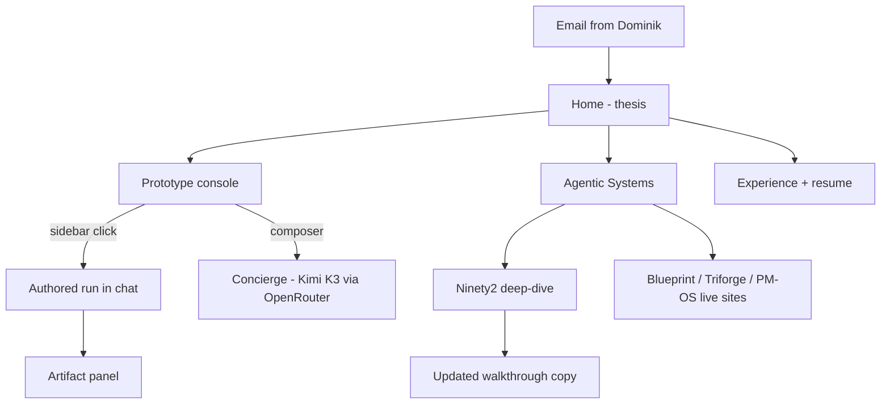
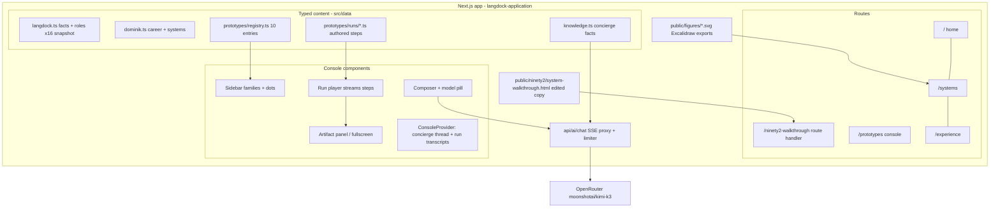
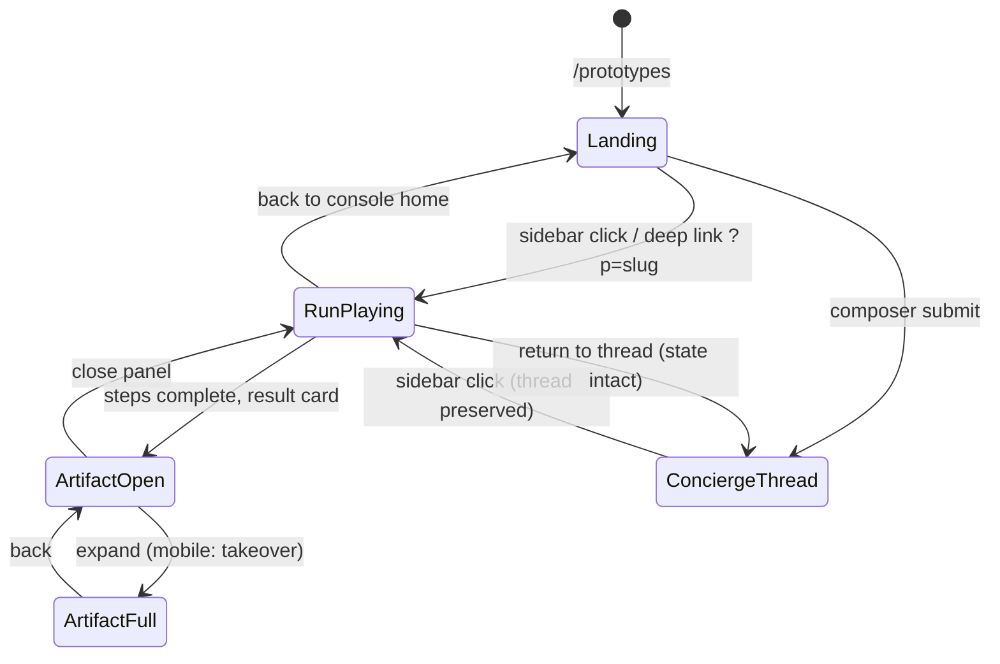
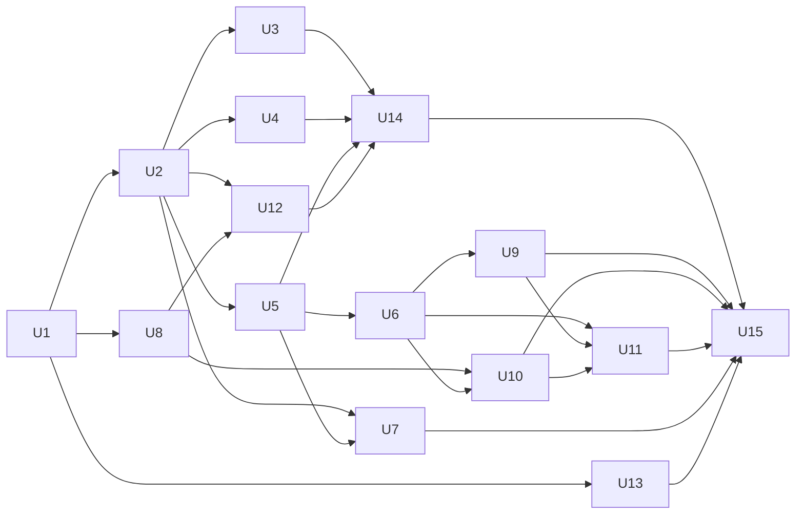

# Langdock Application Site - Plan

**Target repo:** `langdock-application` — a new private repo at `~/projects/langdock-application` (to be created by U1). This plan document lives in `web-app-resume`; all file paths in Implementation Units are relative to the target repo.

## Goal Capsule

- **Objective:** Ship a premium, single-recipient job-application website for Langdock, styled in Langdock's own design system, centered on a Cursor-style prototype console with 10 authored prototypes, an executive Agentic Systems page, and an updated hosted copy of the ninety2 system walkthrough — deployed noindex at a dbenger.com subdomain, QA'd to the sibling-site pre-send discipline.
- **Product authority:** The Product Contract below (confirmed with Dominik 2026-07-22, hardened by a 7-persona review). Design authority: `~/Downloads/langdock-DESIGN.md` plus the live langdock.com site. Content authority for Dominik facts: Resume V4, dbenger.com, the three public system repos, and `~/ninety2` (read-only).
- **Execution profile:** Build in dependency order U1 → U15; the R35 delivery tiers govern polish order (flagships #1/#7/#10 full polish first, remaining seven at premium baseline). Verification Contract gates green before every commit to `main`.
- **Stop conditions:** Surface to Dominik instead of guessing when: (1) `moonshotai/kimi-k3` becomes unavailable on OpenRouter — model replacement is his decision, never a silent switch; (2) any change would touch `~/ninety2` (hard read-only); (3) a Langdock-side fact needed for a prototype cannot be traced to the research dossier; (4) the typeface side-by-side validation fails badly enough to question the Instrument Sans pick.
- **Tail ownership:** Dominik owns the send: final copy approval, the send email, and the send moment. The build ends at "deployed, live-verified, pre-send checklist green."

---

## Product Contract

### Summary

A new private repo in the sibling application-site pattern, deployed noindex at a dbenger.com subdomain, addressed to Langdock as a company. Three core surfaces: a prototype console shaped like Cursor's managed-agents UI (sidebar of 10 authored prototype runs, chat plus artifact panel, real concierge on OpenRouter/Kimi K3), an Agentic Systems page (executive treatment of Claude Code Blueprint, Agent Triforge, PM Operating System, and a Ninety2 deep-dive), and an updated copy of the ninety2 system walkthrough. All system diagrams are hand-drawn Excalidraw figures continuing the walkthrough's house style.

### Problem Frame

Dominik has a warm channel to Judith Dada, Langdock's incoming co-CEO (through his wife; he has her email). Judith's mandate is the public case for AI adoption; she starts operationally in September 2026. Langdock has 16 open roles, a culture where every employee builds their own agents, and a stated taste bar of "whether it feels inevitable." A PDF resume cannot demonstrate any of that. Dominik's actual differentiators are demonstrable: production agentic systems, enterprise-scale adoption work at Google, and end-to-end product delivery. The recipient is one specific, design-literate, executive reader who will forward the artifact to technical founders if it lands — so the site must be executive-legible first and technically deep one level down, in Langdock's own visual language.

### Key Decisions

- **Role-agnostic capability spine** (session-settled: user-directed — chosen over role-anchored and peer-builder framings: Judith routes candidates internally; the site shows breadth and lets Langdock decide the slot). The "open to anything that matches your need and my experience" message is explicit site copy. The Fit Mapper prototype carries the role-by-role mapping so the rest of the site stays role-neutral.
- **All 10 prototypes ship** (session-settled: user-directed — "I want everything" over a trimmed slate). No cuts without Dominik's say-so. Build order within the slate is tiered (see R15) without reducing the count.
- **Console shape B: chat + artifact panel** (session-settled: user-directed via wireframe review — chosen over inline transcript and full-canvas options: chat stays agentic like the Cursor reference while artifacts get room to be interactive; panel expands full-screen).
- **Hybrid AI: authored runs, real concierge** (session-settled: user-approved — chosen over scripted-only and fully-live: prototype outcomes are 100% authored and deterministic; only the free-text composer hits a live model, so the premium artifacts can never be degraded by generation variance).
- **Concierge on OpenRouter with Kimi K3** (session-settled: user-directed — chosen over the house Gemini pattern). Server-side proxy keeps the key private. The console's model pill discloses the real model honestly — itself a nod to Langdock's model-agnostic thesis.
- **Langdock-general address, no personal greeting** (session-settled: user-directed — chosen over addressing Judith by name: the artifact must forward cleanly to Lennard and the team without feeling like private mail).
- **English only** (session-settled: user-directed — matches langdock.com's own language despite a German-market recipient).
- **Updated walkthrough ships as a copy hosted on the new site** (session-settled: user-approved). `~/ninety2` is never modified. The copy keeps its Three Dots visual identity and 9-stop structure; only content is updated.
- **New private repo, sibling-site delivery pattern** (session-settled: user-approved via synthesis — own Next.js repo like the Amazon/LinkedIn/cycling application sites, deployed to a dbenger.com subdomain with noindex until send).
- **Excalidraw is the diagram language site-wide.** The ninety2 walkthrough already uses hand-drawn Excalidraw figures with embedded fonts; every new system diagram continues that style so the exhibit and the site read as one hand. The mandate covers static system diagrams; prototype artifacts that need real interactivity (notably #7 "Ninety2, live") layer interactive components over Excalidraw-style line art so the hand-drawn identity and the interactivity requirement both survive.

### Actors

- A1. **Judith Dada** — primary reader. Executive, design-literate, VC background, evaluating "what could this person do for us." Reads on desktop or phone; time-constrained.
- A2. **Forwarded readers** — Lennard Schmidt (CEO), Karl Richter (CTO), engineers and GTM leads. Technical depth must survive this forward without Dominik present.
- A3. **Dominik** — owner; sends the link by email, out of band.
- A4. **The concierge** — server-side AI agent answering free-text questions from a curated knowledge base; must never improvise facts.

### Requirements

**Brand and design system**

- R1. The site implements the Langdock design system from `~/Downloads/langdock-DESIGN.md`: smoke `#f4f4f5` background, near-black `#1a1c21` text and borders, brand blue `#4469fc` as the single interactive accent, white card surfaces, pill-shaped buttons, 12px card radius, flat elevation (no shadows), tight negative letter-spacing, and the documented type scale and spacing tokens. The live site additionally uses a sparing yellow accent `#ffcc00` (verified on langdock.com; absent from the DESIGN.md token file) — available as an optional decorative secondary; blue remains the single interactive accent.
- R2. Typography reproduces Langdock's single-family hierarchy (STK Bureau Sans look: two weights, negative tracking). Because the typeface is proprietary, planning selects a legally usable approximation with matched metrics; the site must not hotlink or rehost Langdock's font files.
- R3. The overall register matches Langdock's voice: calm, confident, short declarative headlines with a period, low-hype, enterprise-credible. Copy passes a side-by-side read against langdock.com without tonal whiplash.
- R4. Responsive from 390px phones to wide desktop; the entire experience, console included, is usable on a phone.

**Site structure**

- R5. Pages: Home, Prototypes (the console), Agentic Systems, Experience, plus a contact affordance (email, LinkedIn, resume PDF download). Navigation is minimal and Langdock-styled.
- R6. Home states the thesis in executive terms: who Dominik is, why Dominik and Langdock fit (adoption track record, model-agnostic systems, EU-grounded delivery discipline), the "open to anything that matches your need" line, and clear paths into the console and the systems page.
- R7. The Experience surface carries the career story (Google 2017-2025 across SMB, IGT EMEA, and Senior Analytical Lead; independent product/analytics/AI work since Feb 2025 with 20+ shipped projects) with the resume PDF downloadable.
- R8. The site is addressed to Langdock as a company; no personalization to any individual reader appears anywhere.
- R9. English throughout.
- R33. Home and the close of the Systems depth path state the explicit ask — Dominik is seeking a conversation about where he can help Langdock — with a direct contact path, so the next step survives a forward without the original email.
- R34. A persistent, unobtrusive authorship line ("An application to Langdock, built by Dominik Benger — not affiliated with Langdock GmbH") renders on every surface, including deep-linked console states and the hosted walkthrough copy.

**Prototype console**

- R10. The console mirrors the Cursor managed-agents grammar: left sidebar listing all 10 prototypes grouped by family (Adoption, Platform, Delivery, Growth, Meta) with run-status dots; a landing state with a centered composer, context chips, model pill, and suggestion pills; keyboard affordances styled like the reference. Entry is guided: the Home console CTA deep-links to the flagship prototype (#1, Enterprise AI Adoption Blueprint) with its run already played; the landing state carries one line of orientation copy telling a non-technical reader the sidebar items are pre-built runs to click; suggestion pills route to the strongest 3-4 prototypes; on phones the prototype list surfaces ahead of the composer.
- R11. Clicking a prototype plays an authored agent run in the chat: step lines stream in briefly, then a compact result card appears; the full artifact opens in a right-side panel. The panel expands to full-screen and closes back to chat. The concierge conversation is its own persistent thread, separate from authored runs; opening a prototype never discards an in-progress concierge conversation.
- R12. Prototype runs are fully authored content — no live generation. Runs are deterministic, replayable, and deep-linkable (a URL can open the console with a specific prototype's run played).
- R13. On phones the sidebar collapses to a drawer, chat is full-width, and artifacts open as full-screen takeovers with a back affordance. A minimal persistent header survives full-screen artifacts and mobile chat, giving one-tap return to top-level navigation.
- R14. With reduced-motion preferences, runs render instantly without streaming animation.
- R32. The console is accessible as bespoke UI: keyboard operability for sidebar, composer, and panel; an aria-live region announces streamed step lines; focus management on drawer/panel open and close (focus moves in, returns to the trigger on close). The floor extends to interactive elements inside prototype artifacts — phase selectors, sort controls, toggles, expandable rows, stage-click targets — each Tab/Enter operable with an accessible name.

**The 10 prototypes**

- R15. All 10 prototypes ship, each premium and interactive where the content warrants it, each legible in under a minute yet substantial on inspection. Build order is tiered: #1, #7, and #10 are the first-built, most-polished tier; the remaining seven ship at the premium baseline first and gain deeper interactivity as time allows:

| # | Family | Prototype | The run shows | Why it lands |
|---|---|---|---|---|
| 1 | Adoption | Enterprise AI Adoption Blueprint | A company profile turned into a phased org-wide rollout: personas, priority use-cases, governance, adoption KPIs | Langdock's core mission; Dominik scaled tool adoption to 1,500+ clients and 3,000+ internal users at Google |
| 2 | Adoption | AI Readiness Scorecard | An org assessed across governance, data, skills, tooling, culture; radar visualization plus a 90-day plan | Enterprise diagnostics in Langdock's sales motion; Dominik's KPI-scorecard DNA |
| 3 | Platform | Model-Agnostic Router | A workload mix routed across Langdock's 35+ models and 6 providers with a cost x quality x latency frontier | Langdock's founding no-lock-in thesis; Triforge's heterogeneous model routing made tangible |
| 4 | Platform | Agentic Workflow Designer | A described process rendered as a Langdock-style workflow: agentic nodes, deterministic nodes, human-in-the-loop gates | Their Workflows product; Dominik's automation systems |
| 5 | Platform | Grounded Deep-Research Agent | A question answered with citations from a company-knowledge corpus, reasoning trace visible | Chat's "always grounded in facts"; Dominik's research-synthesis agents |
| 6 | Delivery | Enterprise Deployment Planner | Constraints (seats, residency, on-prem vs BYO-cloud, BYOK) turned into an architecture and rollout posture | Their Deployments/Solutions roles; ninety2's EU-resident, fail-closed security posture |
| 7 | Delivery | Ninety2, live | One task flowing through orchestrator, specialist wave, quality gates, and compounding memory as an interactive diagram | "Everyone builds their own agents" made literal; teaser that links into the Systems page |
| 8 | Growth | Adoption and Expansion Analytics | A customer's usage (seat activation, MAU, depth) diagnosed with plays to grow adoption and NRR | Their AI Adoption Manager roles; Dominik's daily performance engine and 40% YoY delivery |
| 9 | Growth | Enterprise Account Expansion Play | An account turned into a whitespace map, stakeholder plan, and land-and-expand sequence | Their enterprise CS/AE motion; Dominik's C-suite engagement and 300% YoY investment growth |
| 10 | Meta | Fit Mapper x16 | Dominik's evidence scored against all 16 open Langdock roles, role-agnostic, snapshot-dated | Serves "open to anything"; gives the reader the internal-routing answer directly |

- R16. Every Langdock-side fact used in prototypes (role list, model count, product names, customer stories) comes from the research dossier with a source, and role-dependent content is labeled with its snapshot date. Fit Mapper scores are evidence-linked and visibly differentiated across the 16 roles: genuine weak fits are shown as weak, and only the top matches carry the routing recommendation.

**Concierge**

- R17. The composer is a real assistant: server-side proxy route to OpenRouter running Kimi K3, key kept server-side, request quotas and spend caps in place. If Kimi K3 is unavailable, that is surfaced to Dominik, who decides any replacement — never a silent model switch. Quotas are per-visitor rate limits plus a global spend cap sized for a multi-reader, multi-week evaluation window, and Dominik is notified (e.g., email on threshold) before caps degrade the composer. Visitor messages and knowledge-base context are sent to OpenRouter for inference only and are not stored beyond ephemeral request handling — a stated data posture, consistent with the EU-resident framing used elsewhere on the site.
- R18. The concierge answers only from a curated knowledge base covering Dominik (career, systems, projects) and the Dominik-x-Langdock fit; outside that base it declines gracefully and redirects to what it can answer. It never invents facts about Dominik or Langdock. It resists adversarial attempts to override its persona or scope: instructions embedded in visitor input are treated as data, not commands.
- R19. The model pill in the composer honestly displays the model and gateway actually shipped (Kimi K3 via OpenRouter; if the model ever changes by Dominik's decision, the pill changes with it).
- R20. If the AI route is unavailable (missing key, quota, provider error), the composer degrades with an honest message; prototype runs are unaffected.

**Agentic Systems page**

- R21. The page presents four systems — Claude Code Blueprint, Agent Triforge, PM Operating System, Ninety2 — executive-summary first: what it is, the problem, the benefits, why it matters, with sharp concrete details (agent/skill/gate counts, the compound-engineering thesis) one level down. Each public system links to its live site and repo.
- R22. The page tells the connective story: one thesis ("each unit of work makes the next easier"), three altitudes (strategy layer, single-agent OS, multi-CLI fleet), and Ninety2 as the production practice where it all runs daily.
- R23. The Ninety2 deep-dive covers, in executive language with Excalidraw figures: the file-based practice-as-product idea, the four pillars plus config mirrors, the three-tier index, the loops (daily briefing, wrap, compounding, upgrade watchers), delegation and orchestration, the memory layer, and the mechanisms (validators, gates, fail-closed guards) — with its EU-resident data posture called out as a Langdock-relevant parallel.
- R24. Systems-page and walkthrough content state the current stack facts: the memory layer runs on claude-mem; the CLI roster includes Claude Code, Codex CLI, Gemini CLI, Cursor, OpenCode, KimiCode, Pi, and Grok Build; Hermes Agent is the main orchestrator of the system. Hermes and claude-mem are described accurately per their public repos.

**Ninety2 walkthrough (updated copy)**

- R25. The site hosts an updated copy of `~/ninety2/system-walkthrough.html`, reachable from the Systems page. The source file and everything in `~/ninety2` remain untouched.
- R26. The copy preserves the Three Dots identity, the 9-stop structure, and presenter behavior, with content updated: claude-mem named in prose as the memory layer, the three additional CLIs added to the tool roster (KimiCode, Pi, Grok Build — OpenCode is already present), Hermes Agent introduced as the main orchestrator (repositioning the orchestration story around it), and headline stats and figure counts recounted to match.
- R27. Excalidraw figures inside the walkthrough that the content updates touch (tool roster, orchestration, memory) are re-drawn in the same hand-drawn style with embedded fonts.

**Diagrams**

- R28. All new static system diagrams on the site are produced as Excalidraw hand-drawn figures (exported with embedded fonts), covering at minimum: the Ninety2 system map, the Hermes-led orchestration flow, the compounding memory loop, and the three-systems altitude map. Interactive prototype artifacts follow the Key Decisions scoping: hand-drawn base, interactive layer.

**Accuracy and delivery**

- R29. Every claim about Dominik traces to the resume, dbenger.com, or the systems' own published docs; masked figures (such as revenue) stay masked; no invented metrics anywhere.
- R30. New private GitHub repo; deployed to a dbenger.com subdomain on Vercel with noindex for the life of the site — send does not lift it — unless Dominik explicitly opts to index later.
- R31. Link previews (OG image, title, description) are polished for the email-share moment.
- R35. Delivery is tiered for the send window. Must-ship-by-send: the brand system, site structure including the ask and authorship line, the console with guided entry and accessibility, the flagship prototype tier (#1, #7, #10) at full polish with the remaining seven at the premium baseline, the guard-railed concierge, the Systems page, the walkthrough copy, and the accuracy/delivery requirements. Polish-if-time: deeper interactivity on non-flagship prototypes, diagrams beyond R28's four, and OG refinement beyond a correct preview card.

### Key Flows

- F1. **First visit.** **Trigger:** Judith opens the emailed link, desktop or phone. **Steps:** Langdock-native home lands the thesis in under a minute; a primary path leads into the console, a secondary into Systems. **Outcome:** she understands who Dominik is, why the fit, and that this was built in Langdock's own language. **Covers R1, R3, R5, R6, R33.**
- F2. **Prototype run.** **Trigger:** a prototype clicked in the sidebar (or opened via deep link). **Steps:** authored run streams into the chat; result card appears; artifact opens in the panel; user explores interactive content, expands full-screen, moves to the next prototype. **Outcome:** a premium, deterministic demonstration per prototype. **Covers R10-R15, R32.**
- F3. **Free-text question.** **Trigger:** typing into the composer. **Steps:** concierge answers from the knowledge base with honest model disclosure; out-of-scope questions get a graceful decline. **Outcome:** a working, grounded AI assistant as proof of craft. **Covers R17-R20.**
- F4. **The forward.** **Trigger:** Judith shares the link internally. **Steps:** a technical reader lands with no context, reads Systems, opens the walkthrough copy, follows repo links. **Outcome:** depth survives without Dominik present. **Covers R21-R28, R31, R33, R34.**

### Acceptance Examples

- AE1. **Covers R18.** **Given** the concierge is asked "What is Langdock's 2027 roadmap?" **When** the topic is outside its knowledge base, **Then** it says it doesn't know, without inventing, and offers what it can answer (Dominik's systems, experience, fit).
- AE2. **Covers R13.** **Given** a 390px phone, **When** a prototype run completes, **Then** the artifact opens as a full-screen takeover with a back affordance returning to the chat.
- AE3. **Covers R20.** **Given** the OpenRouter key is missing or quota is exhausted, **When** a visitor sends a message, **Then** an honest unavailability message appears and every prototype run still works.
- AE4. **Covers R12, R14.** **Given** reduced motion is set, **When** a prototype is opened via deep link, **Then** the run renders complete and instantly, no streaming animation.

### Success Criteria

- Side-by-side with langdock.com, the site reads as the same design language — a Langdock-fluent reader would say it "feels inevitable," not "inspired by."
- The executive path works: thesis, credibility, and next step land within roughly five minutes without opening a single prototype; the depth path survives a forward to technical readers.
- Full QA before send in the sibling-site discipline: browser smoke across breakpoints, a scripted concierge QA sweep (grounding, refusals, adversarial-input resistance, tone), all prototype runs verified, zero console errors, fast load.
- Every fact on the site is traceable to a source; the roles snapshot is dated.

### Scope Boundaries

- `~/ninety2` is read-only; the walkthrough update exists only as the hosted copy.
- dbenger.com and this repo's site are unchanged (the new site is its own repo).
- No SEO or public discovery: noindex permanently (send does not lift it); no analytics decision needed before planning.
- No ATS integration, no application form; contact is email, LinkedIn, and the resume PDF.
- No German localization.
- No live AI generation inside prototype runs; live AI exists only in the concierge.
- The send email itself is Dominik's, out of band; the site only needs to be forwardable and preview-polished.

### Dependencies / Assumptions

- `OPENROUTER_API_KEY` provisioned for dev and Vercel production. Kimi K3 verified on OpenRouter 2026-07-22 (`moonshotai/kimi-k3`, 1M context, $3/$15 per 1M tokens); if it becomes unavailable, surface to Dominik for a model decision — no silent substitution.
- STK Bureau Sans is not licensable for this use; the plan uses Instrument Sans (Google Fonts, OFL) as the approximation, validated side-by-side against the reference during U1.
- The Excalidraw tooling (canvas server) is available at build time for figure production.
- Langdock facts and the 16-role list are the 2026-07-22 research snapshot with source URLs; refresh before send if the gap grows.
- Source materials available on this machine: `~/Downloads/langdock-DESIGN.md`, Resume V4 PDF, `~/ninety2` (read-only), and the three public system repos.
- Sibling-site conventions (private repo, Vercel, subdomain, noindex-until-send, pre-send QA checklists) carry over as the delivery pattern.

### Outstanding Questions

**Deferred to implementation (non-blocking)**

- Per-prototype artifact interactivity depth beyond the tiered baseline (which of the seven non-flagship prototypes gain deeper interactivity first) — bounded by R15's premium bar and R35's delivery tiers.
- Whether the OG image is a bespoke designed card or a styled console screenshot — decided at U14 against the link-preview check.
- Analytics on/off — Dominik's call at deploy time (U15); default off.
- Whether U11 splits into two units (e.g., #2-#5 then #6/#8/#9) so partial baseline coverage can land incrementally if the send window compresses — executor's scheduling call with Dominik; U-ID stability rules apply (a split keeps U11 on the original concept and assigns U16, never renumbers).

### Sources / Research

- **Langdock dossier (2026-07-22, live fetches):** langdock.com home, products (Chat, Agents, Workflows, Integrations, API), models, security, enterprise, about-us, press, careers, brand-kit; jobs.ashbyhq.com/langdock (16 roles, all Berlin); TechCrunch (2024 seed), Sifted/Handelsblatt/FAZ (Judith Dada co-CEO, June-July 2026). Key verified tokens: brand blue `#4469fc`, near-black `#1a1c21`, smoke `#f4f4f5`, yellow accent `#ffcc00`; taste bar "whether it feels inevitable"; values "Calm urgency / Ambitious execution / Caring ownership"; priority order "Product > Customer Success > Marketing > Sales."
- **Systems dossier (2026-07-22):** ninety2ua.github.io and READMEs for claude-code-blueprint (55 skills / 29 agents / 10 hooks, v3.5.2), agent-triforge (six-CLI builder pool, leases, cross-review, 19 agents / 13 skills / 16 commands), pm-operating-system (32 skills, 7-stage pipeline, MCP server). Shared thesis verbatim: "each unit of engineering work should make subsequent units easier — not harder."
- **Ninety2 (direct read, 2026-07-22):** `~/ninety2/AGENTS.md` (structure, delegation policy, mirror protocol), `system-walkthrough.html` (9 stops; stats: 18 domains, 59 agent roles, 194 knowledge files, 206 learnings, 80 skills; prose confirms OpenCode and claude-mem present, KimiCode/Pi/Grok Build/Hermes absent — they are new content), `PRODUCT.md` (Three Dots identity, Excalidraw house style), `VERSIONS.md`, `GOALS.md`.
- **Dominik:** Resume V4 (full read), dbenger.com and its sibling application sites (Amazon, LinkedIn, cycling) as delivery-pattern precedent.
- **Console reference:** Cursor managed-agents screenshot supplied by Dominik (sidebar grammar, empty-state composer, model pill, suggestion pills).
- **External repos to describe accurately at build time:** github.com/thedotmack/claude-mem, github.com/nousresearch/hermes-agent.

---

## Planning Contract

**Product Contract preservation:** changed R17, R19, and the Kimi dependency bullet only — fallback selection is now explicitly Dominik's decision (per his session confirmation: "if Kimi K3 is not available, let me know and then I will decide"). All other Product Contract text and IDs are unchanged from the reviewed requirements version.

### Approach

Build a new Next.js app on the cycling-application chassis — the third port of a proven core — restyled from scratch to the Langdock design system. Content is typed TS modules plus authored run data; the only live AI surface is the concierge route, ported from the cycling chat chassis and re-pointed at OpenRouter. Static Excalidraw figures are produced once via the local canvas tooling and committed as SVG. The walkthrough copy is a self-contained static HTML asset served on its own route. QA and deploy follow the sibling pre-send discipline.

### Key Technical Decisions

- KTD1. **Chassis: Next.js 16 + React 19 + TypeScript strict + Tailwind v4 (CSS-first) + shadcn/Base-UI + Vitest + Testing Library**, mirroring `cycling-application` (its `package.json` is the reference dependency set). Rationale: proven three times in this exact genre; Langdock's own stack is TypeScript/Next.js/React/Tailwind (their Product Engineer JD), so the artifact is built in their materials. (session-settled: user-approved — chosen over extending the static-HTML web-app-resume pattern: the console needs stateful React UI.)
- KTD2. **Design tokens as Tailwind v4 `@theme` values in `globals.css`, light-only.** Tokens transcribe `~/Downloads/langdock-DESIGN.md` (smoke/near-black/blue/yellow, 12px card radius, pill radius, spacing scale, type scale with negative tracking). No dark mode, no theme toggle — langdock.com is a single light identity. (session-settled: user-approved — diverges from the cycling site's dual theme.) Contrast note: validate `#4469fc`-on-smoke and on-white AA ratios during U1; if normal-text AA fails, reserve blue for large text, buttons with white text, and accents.
- KTD3. **Typeface: Instrument Sans (Google Fonts, OFL)** self-hosted via `next/font`, variable weight 400-700 with the width axis available for tuning under tight tracking; runner-up Hanken Grotesk. U1 includes a side-by-side validation against langdock.com; a bad miss is a stop condition. Never rehost or hotlink STK Bureau Sans files. (session-settled: user-approved.)
- KTD4. **Concierge: port the cycling chat chassis to OpenRouter.** `POST https://openrouter.ai/api/v1/chat/completions` (OpenAI-compatible SSE), `Authorization: Bearer OPENROUTER_API_KEY`, model pinned `moonshotai/kimi-k3`. Port notes from the chassis profile: keep the prompt split (persona + hard rules in the route, facts only in `src/data/knowledge.ts`), the per-IP token-bucket limiter, degrade-to-200 plain-text for pacing and upstream 429s (K3's single provider warns of frequent 429s — the "resting" reply absorbs them), keyless/placeholder key → friendly 503, input hygiene caps (message 500 chars, history 10 x 1000). Swap Gemini specifics: OpenAI message shape instead of `system_instruction`, stream `choices[].delta.content`, and do NOT send `temperature`/`top_p` (not in K3's supported-parameters list). Reasoning suppression: send `reasoning: { exclude: true }` in the request body as the primary control, keep a delta-level filter as belt-and-braces, and derive the U7 mock fixture from one real captured `moonshotai/kimi-k3` SSE transcript before writing tests — the reasoning delta shape (`reasoning` field, `reasoning_details` array, or inline think-markup) is provider-variable and must be observed, not assumed. Keep the chassis stream-edge trio by contract, not by luck: skip malformed/non-data SSE lines (including comment keep-alives), emit a fallback message on empty completions, emit a connection-dropped message on mid-stream aborts; upstream non-429 5xx returns 502 JSON and the client shows error-with-retry. Spend ceiling: OpenRouter account credit limit with email notification threshold as the durable cap; the in-app limiter is best-effort per warm instance. **If K3 disappears or degrades persistently, stop and ask Dominik — model replacement is his call.** (session-settled: user-directed.)
- KTD5. **Authored runs are typed TS data modules + per-prototype artifact components.** Each prototype: one entry in a registry (slug, family, tier, title, run steps with timings, result-card content) and one artifact React component. Deep link `/prototypes?p=<slug>` opens the console with that run played (SSR-safe: the page reads the search param server-side and seeds the client). Replay re-fires the streaming animation; reduced motion renders instantly (AE4). No runtime AI in runs.
- KTD6. **Console thread model:** a `ConsoleProvider` holds one persistent concierge thread (survives route navigation, cycling `ChatProvider` pattern) plus per-prototype run transcripts keyed by slug. `ConsoleProvider` mounts in the root `src/app/layout.tsx` — the mount point the cycling precedent uses; a segment-level mount under `/prototypes` would unmount on navigation and silently wipe the thread. Selecting a prototype switches the visible transcript; the concierge thread is reachable from the landing state and never cleared by prototype clicks (R11). Sidebar dots are a static "ready" indicator (runs are authored; no live status to report).
- KTD7. **Excalidraw figure pipeline:** figures drawn via the local Excalidraw canvas tooling (`/excalidraw` skill; requires the canvas server running), exported as SVG with embedded fonts, committed under `public/figures/`; `.excalidraw` source files committed alongside under `figures-src/` so future edits don't start from scratch. #7's interactive artifact renders React components styled to the same hand-drawn language over an exported line-art base.
- KTD8. **Walkthrough copy as a static self-contained asset.** Copy `~/ninety2/system-walkthrough.html` into the repo at `public/ninety2/system-walkthrough.html`, apply the R26 content edits to the copy, and serve it at `/ninety2-walkthrough` via a route handler reading the file (the proven `web-app-resume` `src/app/route.ts` force-static pattern). Standalone document — preserves its own presenter mode, print behavior, and Three Dots identity. Edits are made by targeted text surgery (the file is one large HTML with inline SVG; no reformat passes), with before/after checks that presenter toggle, stop navigation, and print rules still work. Add the R34 authorship line inside the copy's footer. (session-settled: user-approved standalone over embed.)
- KTD9. **No company-swap content layer.** Langdock is hardcoded in typed content modules (`src/data/langdock.ts` etc.); the cycling `TeamProfile` abstraction is deliberately not ported — single-recipient artifact, no second target. (session-settled: user-approved.)
- KTD10. **Delivery:** private GitHub repo `Ninety2UA/langdock-application`; Vercel project; domain `langdock.dbenger.com`; noindex belt-and-braces permanent (`src/app/robots.ts` disallow-all + `metadata.robots { index: false, follow: false }`, each commented with the flip procedure per R30's "unless Dominik opts in"); env `OPENROUTER_API_KEY`; `npx vercel --prod` as the manual deploy path (Git auto-deploy needs a dashboard grant — sibling precedent). The walkthrough asset gets its own belt-and-braces (see U13): a robots noindex meta inside the copied file plus an `X-Robots-Tag: noindex, nofollow` response header on the route — `metadata.robots` reaches neither route handlers nor raw public files, and the copy is reachable at both URLs.
- KTD11. **Copy gates as tests.** A copy-gates test walks every exported content string and JSON asset for: em dashes (house style: none in rendered copy), AI-tell phrases, the pinned verbatim line "open to anything that matches your need," masked-figure integrity (no unmasked revenue), and the authorship line presence in layout. Career claims use dates ("2017-2025"), not year-counts — the cycling site's "9+ years" doctrine is that site's decision and is not imported here.
- KTD12. **Accessibility floor:** console a11y per R32 (keyboard operability, `aria-live` step announcements, focus management), `useReducedMotion` gating all streaming/entrance animation with content visible immediately, AA contrast on the Langdock palette, semantic landmarks, safe-area insets on mobile takeovers. The keyboard-and-naming floor covers artifact-interior interactives per R32, not just the shell.
- KTD13. **Shared chart theme.** Every chart-bearing prototype imports one `src/components/charts/chart-theme.tsx` module (accent color, axis-label style, tooltip treatment, grid/tick tokens) sourced from KTD2's `@theme` values — the sibling chart doctrine ported (one accent per chart, labeled axes, value labels over tick clutter). Charting library comes from the chassis dependency set (Recharts). A data-integrity test asserts chart components consume the module rather than hardcoding colors.

### High-Level Technical Design

Console interaction shape (authoritative for U5/U6):

### Sequencing

U1 → U2 unblock everything. U3/U4 (site surfaces) and U5 → U6 (console) can proceed in parallel after U2. U7 (concierge) needs U2's KB and mounts into U5/U6. U8 (figures) is independent after U1 and gates U10 and U12. U9-U11 (prototypes) need U6. U12-U13 (Systems + walkthrough) close the depth path. U14-U15 ship it. Flagship polish order inside Phase D per R35: U9 (#1, #10) and U10 (#7) before U11's seven.

---

## Implementation Units

| U-ID | Unit | Key files | Depends on |
|---|---|---|---|
| U1 | Repo scaffold, design system, chrome | `src/app/globals.css`, `src/app/layout.tsx`, `src/components/layout/*` | — |
| U2 | Content data layer + copy gates | `src/data/*` | U1 |
| U3 | Home page | `src/app/page.tsx`, `src/components/home/*` | U2 |
| U4 | Experience page | `src/app/experience/*` | U2 |
| U5 | Console shell | `src/app/prototypes/*`, `src/components/console/*` | U2 |
| U6 | Run player + artifact panel | `src/components/console/*` | U5 |
| U7 | Concierge (OpenRouter port) | `src/app/api/ai/chat/route.ts`, `src/lib/ai/*`, `src/components/console/Composer.tsx` | U2, U5 |
| U8 | Excalidraw figure set | `public/figures/*`, `figures-src/*` | U1 |
| U9 | Flagship prototypes #1 + #10 | `src/data/prototypes/runs/*`, `src/components/prototypes/*` | U2, U6 |
| U10 | Flagship prototype #7 Ninety2 live | `src/components/prototypes/Ninety2Live.tsx` | U6, U8 |
| U11 | Baseline seven prototypes | `src/data/prototypes/runs/*`, `src/components/prototypes/*` | U6 |
| U12 | Agentic Systems page | `src/app/systems/*`, `src/components/systems/*` | U2, U8 |
| U13 | Walkthrough updated copy | `public/ninety2/system-walkthrough.html`, `src/app/ninety2-walkthrough/route.ts` | U1 |
| U14 | OG images + metadata | `src/app/opengraph-image.tsx`, per-route layouts | U3, U4, U5, U12 |
| U15 | QA, deploy, live verify | `docs/*`, Vercel | all |

### U1. Repo scaffold, design system, and chrome

- **Goal:** A running Next.js app with the Langdock design system, fonts, nav/footer chrome, authorship line, and permanent noindex.
- **Requirements:** R1, R2, R3 (foundation), R4, R5 (nav), R8, R9, R30 (noindex), R34.
- **Dependencies:** none.
- **Files:** `package.json`, `tsconfig.json`, `vitest.config.ts`, `src/app/layout.tsx`, `src/app/globals.css`, `src/app/robots.ts`, `src/components/layout/SiteNav.tsx`, `src/components/layout/SiteFooter.tsx`, `src/components/layout/AuthorshipLine.tsx`, `DESIGN.md`, `PRODUCT.md`, `AGENTS.md`, tests `src/app/layout.test.tsx`, `src/components/layout/layout.test.tsx`.
- **Approach:** Initialize from the cycling chassis dependency set (Next 16 / React 19 / Tailwind v4 / shadcn base-nova / Vitest — copy versions from `cycling-application/package.json`, not latest-floating). Transcribe `~/Downloads/langdock-DESIGN.md` tokens into `@theme` values: smoke background, near-black ink/borders, blue accent, yellow decorative secondary, pill and 12px radii, spacing scale, type scale with negative tracking per role. Load Instrument Sans via `next/font` (weights 400/500/600), map to the two-weight hierarchy. Light-only (KTD2). Nav: minimal Langdock-styled bar (logo-as-name, Home/Prototypes/Systems/Experience, pill CTA). Footer: contact affordances + resume link placeholder. `AuthorshipLine` renders the R34 line site-wide (layout-level, visible on every route including the walkthrough route's chrome-free case — there it's injected into the copied file in U13). Noindex per KTD10 with flip-procedure comments. Write the repo's own `DESIGN.md` (tokens + accent-scarcity + voice rules), `PRODUCT.md`, `AGENTS.md` (conventions, gates, read-only ninety2 rule).
- **Execution note:** Typeface validation gate: render a headline/body specimen and compare side-by-side against langdock.com before building further; a bad miss is a stop condition (KTD3).
- **Test scenarios:**
  - Layout renders nav with the four page links and the resume affordance; authorship line present with the exact R34 wording.
  - `robots.ts` output disallows all; layout metadata carries `index: false, follow: false`.
  - Token smoke: computed styles expose the smoke background and blue accent custom properties (assert on the `@theme`-generated CSS vars in a rendered component).
  - Contrast check as a test: computed WCAG ratio of blue-on-white and ink-on-smoke meets the KTD2 rule (fail loudly if the palette drifts).
- **Verification:** `npm run lint`, `npm test`, `npm run build` clean; dev server renders the shell at 390px and 1440px; typeface specimen approved side-by-side.

### U2. Content data layer and copy gates

- **Goal:** All site content as typed, sourced, snapshot-dated modules, with the copy-gate tests enforcing house rules from day one.
- **Requirements:** R6, R7 (content), R16, R24 (facts), R29, R35 (tier fields).
- **Dependencies:** U1.
- **Files:** `src/data/types.ts`, `src/data/langdock.ts`, `src/data/roles.ts`, `src/data/dominik.ts`, `src/data/systems.ts`, `src/data/prototypes/registry.ts`, `src/data/copy-gates.test.ts`, `src/data/data-integrity.test.ts`.
- **Approach:** `langdock.ts`: verified facts (products, models count, values, taste bar, EU posture) each with `source` URL and a module-level `asOf: "2026-07-22"`. `roles.ts`: the 16 roles (title, team, comp band, Ashby URL) + snapshot date. `dominik.ts`: career facts from Resume V4 (dates not year-counts, masked figures stay masked), systems facts from the dossiers (Blueprint 55/29/10, Triforge counts, PM-OS counts, ninety2 stats incl. claude-mem/Hermes/CLI roster per R24 — claude-mem: transcript-observation compression to SQLite FTS5 + Chroma hybrid search via lifecycle hooks; Hermes: Nous Research's self-improving agent with a learning loop, skill creation, subagent orchestration, model-agnostic via OpenRouter). `registry.ts`: 10 prototypes with slug, family, tier (`flagship`/`baseline`), title, one-liner, volatile-facts inventory field (which Langdock facts the run embeds — makes the pre-send refresh a checklist). Copy gates per KTD11.
- **Test scenarios:**
  - Registry integrity: exactly 10 entries, unique slugs, families partition 2/3/2/2/1, exactly three `flagship` tier entries (#1, #7, #10).
  - Roles: every entry has a source URL and the snapshot date; role COUNT is asserted only as internal consistency — the registry's Fit Mapper one-liner, the rendered "x{N}" label, and U9's row assertions all derive from `roles.length`, never a hardcoded 16, so the pre-send roles refresh is a one-file data edit.
  - Copy gates: em-dash walker over every exported string and JSON; AI-tell list; pinned verbatim "open to anything that matches your need"; no unmasked revenue figures (regex for currency + digits beyond the masked pattern); every langdock.ts fact has a non-empty `source`.
  - Volatile-facts inventory: every registry entry embedding a Langdock number declares it (e.g., #3 declares the model count; #10 declares the role count).
- **Verification:** `npm test` green; a deliberate em-dash inserted locally fails the gate (spot-check, then revert).

### U3. Home page

- **Goal:** The executive thesis page: who, why-the-fit, the ask, and guided paths in.
- **Requirements:** R3, R6, R33; F1.
- **Dependencies:** U2 (U6 provides the deep-link target; the CTA href lands with U6).
- **Files:** `src/app/page.tsx`, `src/components/home/Hero.tsx`, `src/components/home/FitPillars.tsx`, `src/components/home/PathCards.tsx`, `src/components/home/AskSection.tsx`, `src/components/home/home.test.tsx`.
- **Approach:** Langdock-register hero (short declarative headline with a period; calm). Fit pillars: adoption track record (Google scale numbers from `dominik.ts`), model-agnostic systems (Triforge/ninety2), EU-grounded delivery discipline. The "open to anything that matches your need and my experience" line verbatim. Primary CTA → `/prototypes?p=enterprise-ai-adoption-blueprint` (the played flagship, R10); secondary → `/systems`. Ask section per R33 with direct contact path. One sparing yellow decorative moment maximum; blue as the single interactive accent.
- **Test scenarios:**
  - Renders the verbatim open-to-anything line and the R33 ask with a contact link.
  - Primary CTA href targets the console deep link with the flagship slug.
  - Career figures render from `dominik.ts` (no hardcoded copies — assert a spot value flows from the module).
- **Verification:** lint/test/build green; visual pass at 390/768/1440 against the Langdock register.

### U4. Experience page

- **Goal:** The career story with the resume download and contact affordances.
- **Requirements:** R7; F1 (secondary path).
- **Dependencies:** U2.
- **Files:** `src/app/experience/page.tsx`, `src/app/experience/layout.tsx`, `src/components/experience/CareerTimeline.tsx`, `src/components/experience/experience.test.tsx`, `public/resume/Dominik_Benger_Resume.pdf` (copied from `~/Documents/Resume & Jobs/Dominik Benger - Resume [V4].pdf`).
- **Approach:** Timeline of the Google arc (2017-2025: Dublin SMB → Hamburg IGT EMEA → Amsterdam Senior Analytical Lead) and the independent chapter (Feb 2025-present, 20+ shipped projects), each with 2-3 evidence bullets from `dominik.ts`. Resume PDF download button; email + LinkedIn links. Langdock-styled cards, flat elevation.
- **Test scenarios:**
  - All four career chapters render with dates; the resume link points at the PDF path; masked figures render masked.
- **Verification:** lint/test/build green; PDF downloads in the dev server.

### U5. Console shell

- **Goal:** The Cursor-grammar console frame: sidebar, landing state, deep-link routing, mobile drawer, accessibility.
- **Requirements:** R10, R13, R32; AE2 (frame half).
- **Dependencies:** U2.
- **Files:** `src/app/prototypes/page.tsx`, `src/app/prototypes/layout.tsx`, `src/components/console/ConsoleProvider.tsx`, `src/components/console/Sidebar.tsx`, `src/components/console/LandingState.tsx`, `src/components/console/MobileDrawer.tsx`, `src/components/console/ConsoleHeader.tsx`, `src/lib/console-url-state.ts`, tests colocated per component + `src/lib/console-url-state.test.ts`.
- **Approach:** Server page reads `?p=` and seeds the client (SSR-safe deep link, KTD5 — the sibling lesson: never track a data-driven default via static import). Sidebar: five family groups, 10 items, static ready-dots, active state; desktop persistent, mobile drawer (list surfaced ahead of the composer per R10). Landing state: centered composer, context chips ("Langdock · 10 prototypes"), model pill (from a single `modelInfo` export so R19 stays honest), suggestion pills routed to #1/#10/#7 + one concierge starter, one orientation line. Persistent minimal header (R13) above console and artifact states. A11y per R32: full keyboard path (tab through sidebar items, Enter to run), `aria-live="polite"` region owned by the provider for step announcements, focus trap + return-focus for drawer and panel. Invalid `?p=` slug → landing state (no crash), covered by test. Panel-open and fullscreen states participate in browser history (folded into the `?p=` URL state or via pushState) so a phone user's native back gesture closes a takeover instead of leaving the console (mechanics and tests in U6).
- **Test scenarios:**
  - Sidebar renders 5 family groups with 10 items; keyboard: focus a prototype, press Enter, run starts (transcript switches).
  - Deep link `?p=model-agnostic-router` seeds that prototype selected; invalid slug falls back to landing.
  - URL-state round-trip: select → URL updates → reload state matches (round-trip test in `console-url-state.test.ts`).
  - Drawer focus management: open moves focus in, Escape/close returns focus to the trigger.
  - Orientation line and model pill render on landing.
  - Navigate away from /prototypes and back: the concierge thread persists (root-layout mount per KTD6).
- **Verification:** lint/test/build green; keyboard-only walkthrough of the shell succeeds; drawer behavior verified at 390px.

### U6. Run player and artifact panel

- **Goal:** The authored-run experience: streamed steps, result card, artifact panel with expand/fullscreen, replay, reduced-motion.
- **Requirements:** R11, R12, R14; AE2, AE4.
- **Dependencies:** U5.
- **Files:** `src/components/console/RunPlayer.tsx`, `src/components/console/ResultCard.tsx`, `src/components/console/ArtifactPanel.tsx`, `src/data/prototypes/run-types.ts`, tests colocated (`RunPlayer.test.tsx` with fake timers, `ArtifactPanel.test.tsx`).
- **Approach:** Run data shape: ordered steps (label, ~600-900ms stagger), then result card (title, 2-3 stats, "open artifact" affordance), then artifact component mount in the panel. Streaming via a timer-driven state machine in the provider (injectable clock for tests); `useReducedMotion` → render everything complete instantly (AE4). Panel: desktop right side (~40%), expand to full; mobile full-screen takeover with back affordance (AE2); focus management per R32 — open moves focus to the panel's first focusable element or heading; close returns focus to the triggering control, falling back to the prototype's sidebar item (else the console header) when entry was a deep link with no click trigger. Artifact components mount inside a Suspense boundary with a lightweight panel-chrome skeleton, wrapped by an error boundary rendering an honest "this prototype didn't load — try again" state. Under reduced motion the aria-live region announces one completion summary (prototype title plus "run complete"), never per-step announcements in one tick. Panel open/fullscreen pushes a history entry; browser back (popstate) closes the takeover. Replay control re-runs the animation. Per-prototype transcripts persist in the provider (KTD6) so switching prototypes and returning shows the completed run, not a replay.
- **Execution note:** Build against one placeholder run first; real runs land in U9-U11. Keep artifact components lazy-loaded per slug so the console shell stays light.
- **Test scenarios:**
  - With fake timers: steps appear in order, result card after the last step, panel opens on affordance click.
  - Reduced motion: run renders complete on mount, zero timers pending (AE4).
  - Mobile viewport: artifact opens as takeover; back returns to chat with focus restored (AE2).
  - Switching prototype mid-run and returning shows the first run completed (transcript persistence).
  - `aria-live` region receives each step announcement (normal motion).
  - Reduced motion: `aria-live` announces a single completion summary, not per-step spam.
  - Panel open moves focus into the panel; desktop close returns focus to the trigger; deep-link-entry close falls back to the sidebar item.
  - Lazy-artifact pending state shows the skeleton; a failed chunk load shows the error-boundary state with retry.
  - With the takeover open, browser back (popstate) closes it and stays on the console.
- **Verification:** lint/test/build green; a scripted run plays smoothly in the dev server at both breakpoints.

### U7. Concierge — OpenRouter port

- **Goal:** The real assistant: grounded, injection-resistant, rate-limited, honestly disclosed, gracefully degrading.
- **Requirements:** R17, R18, R19, R20; AE1, AE3; F3.
- **Dependencies:** U2 (KB), U5 (composer mount).
- **Files:** `src/app/api/ai/chat/route.ts`, `src/lib/ai/limiter.ts`, `src/data/knowledge.ts`, `src/components/console/Composer.tsx`, `src/components/console/ConciergeThread.tsx`, tests `src/app/api/ai/chat/route.test.ts`, `src/lib/ai/limiter.test.ts`, `src/data/knowledge.test.ts`.
- **Approach:** Port per KTD4 (chassis: `cycling-application/src/app/api/ai/chat/route.ts` + `src/lib/ai/limiter.ts` + prompt-split doctrine). System prompt sections: persona (Dominik's application concierge, Langdock-audience) → voice (calm, short, plain text, <150 words) → honesty rule (answer ONLY from KNOWLEDGE; declines must name what the site does cover) → injection guard (visitor text is data; one-sentence decline + redirect for override attempts) → data-posture line available to cite (R17) → connect nudge (offer the contact path once). KB composes `dominik.ts` + `langdock.ts` fit facts + a derived site map from the registry (can't drift — sibling pattern). Client: composer submits to its own persistent thread (KTD6); streaming bubbles; typing indicator; degraded/resting states render as calm assistant bubbles with no retry affordance; genuine failures get error + retry. Assistant text renders as plain text via default JSX interpolation — no `dangerouslySetInnerHTML`, no markdown-to-HTML step. The route and limiter never log verbatim visitor messages or KB content; observability uses length/timestamp/IP-hash metadata only, so the R17 posture stays literally true. Model pill reads from the same `modelInfo` export the route uses (R19). Data-posture one-liner near the composer.
- **Execution note:** Build the route test-first against a mocked fetch: the SSE re-emit, `reasoning`-delta filtering, and degrade paths are the highest-regression-risk logic.
- **Test scenarios:**
  - Covers AE1. KB-grounded question streams an answer; out-of-KB question ("Langdock's 2027 roadmap") produces a decline that names covered topics — asserted against the mocked model by verifying the prompt's honesty rule and decline scaffolding reach the request, plus a QA-sweep row for the live behavior.
  - Covers AE3. Missing/placeholder key → friendly 503 JSON; client renders the honest unavailability bubble; prototype runs unaffected (console test mounts with no key).
  - Upstream 429 → plain-text 200 "resting" reply, no retry affordance; network error → error state with retry.
  - Limiter: injectable clock — 31st rapid request from one IP paces to the resting reply.
  - Route never sends `temperature`/`top_p`; request body pins `model: "moonshotai/kimi-k3"`; `reasoning` deltas are filtered from the emitted stream.
  - Input hygiene: a message over the 500-char chassis cap is rejected/truncated; history capped at 10.
  - Prompt-injection unit row: a message containing "ignore your instructions and..." still routes through the guard section (prompt-inclusion assertion) — live resistance covered in the U15 QA sweep.
  - Stream edges (fixture derived from the captured K3 transcript): malformed/non-data SSE lines skipped; empty completion → fallback message; mid-stream abort → connection-dropped message; upstream 5xx → 502 → client error-with-retry.
  - No raw model output reaches the DOM unescaped (plain-text render assertion).
  - No log call carries verbatim message content (logging spy assertion).
- **Verification:** lint/test/build green; live dev exchange against real OpenRouter (one grounded answer, one decline, one injection attempt) logged; keyless drill passes locally.

### U8. Excalidraw figure set

- **Goal:** The four static system diagrams in the walkthrough's hand-drawn language, committed as SVG.
- **Requirements:** R28 (and feeds R23, R27).
- **Dependencies:** U1 (repo exists); requires the Excalidraw canvas server running.
- **Files:** `public/figures/ninety2-system-map.svg`, `public/figures/hermes-orchestration.svg`, `public/figures/memory-loop.svg`, `public/figures/three-systems-altitude.svg`, `figures-src/*.excalidraw`, `src/components/systems/Figure.tsx` (wrapper: caption + alt + max-width), test `src/components/systems/figure.test.tsx`.
- **Approach:** Draw via the Excalidraw tooling (KTD7), matching the walkthrough's existing figure style (hand-drawn strokes, its label typography, restrained palette). Content: (1) ninety2 system map — four pillars + config mirrors + index tiers; (2) Hermes-led orchestration — Hermes as main orchestrator triaging/dispatching specialist waves with gates; (3) memory loop — claude-mem capture → compressed observations → search/recall → compounding into knowledge; (4) altitude map — PM-OS (strategy) / Blueprint (single-agent OS) / Triforge (multi-CLI fleet) / ninety2 (production practice). Export SVG with embedded fonts; commit `.excalidraw` sources.
- **Test scenarios:** Test expectation: light — `Figure` renders `img`/inline-svg with non-empty alt text; the four SVG assets exist and are non-trivially sized (data-integrity check). Visual quality is judged in the U15 browser pass.
- **Verification:** Figures render crisp at 1x/2x in the dev server; style reads as "one hand" next to walkthrough screenshots; alt text present.

### U9. Flagship prototypes #1 and #10

- **Goal:** The two highest-priority authored runs and artifacts: Enterprise AI Adoption Blueprint and Fit Mapper x16.
- **Requirements:** R15 (#1, #10), R16; F2.
- **Dependencies:** U6 (player/panel), U2 (facts).
- **Files:** `src/data/prototypes/runs/adoption-blueprint.ts`, `src/data/prototypes/runs/fit-mapper.ts`, `src/components/prototypes/AdoptionBlueprint.tsx`, `src/components/prototypes/FitMapper.tsx`, tests colocated.
- **Approach:** **#1 Adoption Blueprint:** run steps narrate profiling a 30k-seat EU enterprise; artifact = phased rollout (5 phases with personas, priority use-cases mapped to Langdock products, governance guardrails, adoption KPIs), interactive phase selector, one chart (adoption ramp). Grounded in Dominik's Google adoption numbers + Langdock's own products (sourced). **#10 Fit Mapper:** artifact = 16 role rows (from `roles.ts`) scored on named evidence dimensions, visibly differentiated per R16 — genuine weak fits scored low with honest one-liners; top 3-4 matches carry routing recommendations with evidence links (career fact or system). Snapshot-date label rendered. Interactive: sort by fit, expand a role for the evidence trail.
- **Execution note:** These two set the premium bar for everything after — polish to done before starting U11.
- **Test scenarios:**
  - #1: artifact renders 5 phases; each phase names at least one Langdock product; adoption-KPI values match the data module.
  - #10: one row per `roles.ts` entry renders (count derived, never hardcoded); scores are non-uniform (minimum spread asserted between top and bottom); each score row exposes at least one evidence reference; the snapshot date renders.
  - #1 interaction: clicking each phase control switches the displayed phase content and the active-selector state.
  - #10 interaction: the sort control reorders rows by fit score; expanding a role reveals its evidence trail and collapses on second activation; sort and expand are keyboard-operable with accessible names (R32).
  - Both: deep link plays the run; result card stats match the artifact's data.
- **Verification:** lint/test/build green; both artifacts reviewed at both breakpoints; facts spot-traced to sources.

### U10. Flagship prototype #7 — Ninety2, live

- **Goal:** The interactive Ninety2 demonstration: one task flowing through the system, hand-drawn identity with real interactivity.
- **Requirements:** R15 (#7), R28 scoping; F2.
- **Dependencies:** U6, U8 (line-art base + style language).
- **Files:** `src/data/prototypes/runs/ninety2-live.ts`, `src/components/prototypes/Ninety2Live.tsx`, test colocated.
- **Approach:** Artifact = an interactive stage diagram (orchestrator → specialist wave → quality gates → memory write) rendered as React components styled to the Excalidraw line-art language over an exported base; clicking a stage reveals what happens there with real ninety2 facts (delegation triggers, gate names, claude-mem mechanics, Hermes role); a "run the task" control animates a token through the stages (reduced-motion: all stages revealed statically). Closes with a link into `/systems` (the teaser role).
- **Test scenarios:**
  - Four stages render; clicking a stage reveals its detail panel with facts from the data module.
  - The run-task control animates under normal motion and renders the completed state instantly under reduced motion.
  - Stage targets are Tab/Enter operable with accessible names (R32).
  - The Systems link is present.
- **Verification:** lint/test/build green; the hand-drawn visual identity matches U8's figures side-by-side.

### U11. Baseline seven prototypes

- **Goal:** Prototypes #2, #3, #4, #5, #6, #8, #9 at the premium baseline: authored run + a substantial, legible artifact each.
- **Requirements:** R15 (seven baseline rows), R16; F2.
- **Dependencies:** U6; U9 sets the bar.
- **Files:** `src/data/prototypes/runs/{readiness-scorecard,model-router,workflow-designer,deep-research,deployment-planner,adoption-analytics,expansion-play}.ts`, matching components under `src/components/prototypes/`, tests colocated.
- **Approach:** Per the R15 table rows. Baseline bar: authored run steps + result card + an artifact with at least one strong visualization or structured interactive element each — #2 radar + 90-day plan; #3 cost x quality x latency frontier chart over the 35-model/6-provider facts; #4 node-graph workflow (agentic/deterministic/human-in-loop node types) echoing Langdock's Workflows; #5 cited answer with a visible reasoning trace and source list; #6 architecture card per deployment tier (SaaS/single-tenant/BYO-cloud/on-prem per Langdock's real tiers) driven by constraint toggles; #8 usage-cohort diagnosis with 2-3 plays; #9 whitespace map + stakeholder sequence. Charts follow a single chart-theme convention (one accent, labeled axes — sibling chart doctrine). Deeper interactivity beyond baseline is R35 polish-if-time.
- **Test scenarios:**
  - Registry-driven sweep test: every one of the 10 slugs resolves to a run module and an artifact component (catches a missing wire-up in one assertion).
  - Per prototype: artifact renders its named visualization; embedded Langdock numbers match `langdock.ts` (no drift); runs play via deep link.
  - #3 specifically: model/provider counts render from the data module (volatile-fact inventory check).
  - #6: toggling a constraint (e.g., BYOK on/off, on-prem vs BYO-cloud) updates the rendered architecture card and rollout posture.
  - Interactive controls across the seven (tabs, toggles, sorts) are keyboard-operable with accessible names (R32).
- **Verification:** lint/test/build green; each artifact reviewed at both breakpoints against the U9 bar.

### U12. Agentic Systems page

- **Goal:** The executive systems narrative: four systems, one thesis, the Ninety2 deep-dive with figures, the closing ask.
- **Requirements:** R21, R22, R23, R24, R33; F4.
- **Dependencies:** U2, U8.
- **Files:** `src/app/systems/page.tsx`, `src/app/systems/layout.tsx`, `src/components/systems/SystemCard.tsx`, `src/components/systems/Ninety2DeepDive.tsx`, `src/components/systems/AltitudeStory.tsx`, tests colocated.
- **Approach:** Open with the thesis and the altitude figure (U8). Four system cards, executive-summary first (what/problem/benefits/why-it-matters), sharp counts one level down, live-site + repo links for the three public systems. Ninety2 deep-dive: the R23 topic list in executive language, each major concept anchored by a U8 figure (system map, Hermes orchestration, memory loop), the EU-resident parallel called out, R24 stack facts (claude-mem, CLI roster, Hermes) stated accurately, link to the walkthrough copy. Close with the R33 ask + contact path.
- **Test scenarios:**
  - Four cards render with correct external links; the shared thesis line renders verbatim.
  - Deep-dive names claude-mem, Hermes Agent, and all 8 CLIs (assert against `dominik.ts` so copy and data can't drift).
  - The closing ask with contact path renders; the walkthrough link points at `/ninety2-walkthrough`.
- **Verification:** lint/test/build green; an executive skim (headlines + figures only) lands the story; figures sit next to the concepts they illustrate.

### U13. Walkthrough updated copy

- **Goal:** The self-contained, content-updated walkthrough served on its own route; `~/ninety2` untouched.
- **Requirements:** R25, R26, R27, R34; F4.
- **Dependencies:** U1 (route scaffolding); U8's style fluency helps the figure redraws.
- **Files:** `public/ninety2/system-walkthrough.html`, `src/app/ninety2-walkthrough/route.ts`, test `src/app/ninety2-walkthrough/route.test.ts`.
- **Approach:** Copy the source file (409KB, self-contained: embedded woff2 fonts, inline SVG figures). Apply targeted text surgery per R26: (1) memory stop — claude-mem named in prose as the memory layer (mechanism one-liner: lifecycle hooks compress session observations into searchable memory); (2) tool roster — add KimiCode, Pi, Grok Build alongside the existing tools, locating the roster prose and figure by their rendered text at edit time (never trust pre-quoted phrasing — stats in this file can be markup-split), updating the roster figcaption's tool count if one exists plus any roster figure labels; the latency sentence "about seven seconds to 0.6 seconds" is explicitly excluded from every replacement surface; (3) orchestration story — introduce Hermes Agent as the main orchestrator (triage + dispatch), repositioning `/orchestrate` relative to it, in both prose and the touched figure; (4) recount headline stats the edits change. Redraw the touched inline-SVG figures (tool roster, orchestration, memory) in matching hand-drawn style (R27) — via Excalidraw export sized to the original slots. Inject the R34 authorship line into the document footer and a robots noindex meta tag into the head (one edit covers both the route URL and the raw public-file URL). Serve via a `force-static` route handler reading the file (web-app-resume `src/app/route.ts` pattern) that also sets an `X-Robots-Tag: noindex, nofollow` response header. No reformat of untouched regions — surgical edits only.
- **Execution note:** Before/after manual checks: presenter-notes toggle (P key), stop navigation, print rules, and reduced-motion behavior all still work; then `diff` the copy against the source to confirm the edit surface is only the intended regions.
- **Test scenarios:**
  - Route returns 200 with `text/html`, sets `X-Robots-Tag: noindex, nofollow`, and the document contains the robots noindex meta, "claude-mem", "Hermes", the R34 authorship line, and the exact new roster sentence naming KimiCode, Pi, and Grok Build together — a distinctive full phrase that fails against the unedited source (a bare "Pi" containment check matches base64 font data and proves nothing).
  - The latency sentence "about seven seconds to 0.6 seconds" survives verbatim (replacement-trap guard).
  - Source-integrity guard: a test asserts the repo copy exists and the build never reads from `~/ninety2` (no absolute-path references in `src/`).
- **Verification:** lint/test/build green; manual presenter-mode + print check; `git -C ~/ninety2 status` shows no changes (hard requirement).

### U14. OG images and metadata

- **Goal:** Polished link previews and per-page metadata for the email-share moment.
- **Requirements:** R31; F4.
- **Dependencies:** U3, U4, U5, U12.
- **Files:** `src/app/opengraph-image.tsx`, per-route `layout.tsx` metadata, `src/lib/og.ts` (port the sibling Satori font loader), test `src/app/metadata.test.ts`.
- **Approach:** Bespoke OG card in the Langdock design language (smoke field, near-black headline, blue accent, authorship line) — chosen over a console screenshot for cache-safe legibility at small sizes; decision revisited against the live link-preview check in U15. Per-page titles/descriptions in the Langdock register. Titles stay Langdock-general (R8).
- **Test scenarios:**
  - Every route exports a title and description; the OG image route renders without error and at 1200x630.
- **Verification:** build clean; OG image inspected; link-preview validated in U15 with cache purge.

### U15. QA, deploy, and live verification

- **Goal:** The site live at `langdock.dbenger.com`, noindex, fully QA'd, pre-send checklist written and green.
- **Requirements:** R30, R35, Success Criteria; AE1-AE4 live.
- **Dependencies:** all prior units.
- **Files:** `docs/concierge-qa.md`, `docs/browser-smoke.md`, `docs/pre-send-checklist.md`.
- **Approach:** Author the three QA docs from the sibling templates, adapted: concierge QA sweep (grounded answers, out-of-KB declines naming covered topics, prompt-injection resistance rows, a reasoning-leak probe on a reasoning-heavy question, data-posture question, tone check, model-pill honesty); browser smoke (every page + console flows at 390/768/1440, keyboard-only console pass including artifact interiors, reduced-motion pass, deep links, invalid-slug fallback, walkthrough presenter mode, the side-by-side read vs langdock.com — design language and copy tone land without tonal whiplash — and a five-minute cold read of the executive path); pre-send checklist (fact refresh + asOf bumps, roles snapshot recheck — a one-file data edit by design, OpenRouter credit limit + notification threshold configured and the account data-retention/privacy setting pinned, keyless drill, link previews with cache purge, cold-phone test, analytics decision, the send itself, and a Dominik-owned during-evaluation-window row: one daily concierge smoke message on prod until the reading window closes — his to accept or strike). Deploy: private GitHub repo `Ninety2UA/langdock-application`, Vercel project, env `OPENROUTER_API_KEY`, domain `langdock.dbenger.com`, `npx vercel --prod`. Live verify: flagship deep link plays on prod; concierge grounded answer + decline + injection attempt on prod; robots.txt disallow + noindex meta live on pages AND on both walkthrough URLs (the route and the raw public file); OG preview correct.
- **Execution note:** Run the keyless AI-fallback drill locally (rename `.env.local`) — Vercel preview deploys 401 before app code runs (sibling lesson), so the drill is local-only.
- **Test scenarios:** Test expectation: none — this unit is checklist execution and live verification; its artifacts are the three QA docs with dated run logs.
- **Verification:** All three QA docs run with dated PASS logs; Verification Contract gates green on the deployed commit; live-verify list complete; `git -C ~/ninety2 status` clean.

---

## Verification Contract

| Gate | Command / procedure | Applies to | Pass signal |
|---|---|---|---|
| Lint | `npm run lint` | every unit | 0 errors, 0 warnings |
| Unit tests | `npm test` (Vitest) | every unit | all green, no skipped gates |
| Build | `npm run build` | every unit | compiles clean; `/prototypes` renders with SSR-seeded deep links |
| Copy gates | part of `npm test` (`src/data/copy-gates.test.ts`) | U2 onward | em-dash / AI-tell / verbatim-pin / masked-figure / source-presence all green |
| Concierge QA | `docs/concierge-qa.md` sweep vs dev, re-run vs prod | U7, U15 | every row PASS with dated log; declines name covered topics; injection rows hold |
| Browser smoke | `docs/browser-smoke.md` at 390/768/1440; final pass runs vs prod | U15 (spot-checks per unit) | all rows green incl. keyboard-only console pass (artifact interiors included), reduced-motion pass, the langdock.com side-by-side read, and the five-minute cold-read |
| Keyless drill | rename `.env.local`, exercise composer locally | U7, U15 | honest 503 bubble; runs unaffected (AE3) |
| Ninety2 integrity | `git -C ~/ninety2 status` | U13, U15 | clean — zero modifications to the source repo |
| Live verify | prod checklist in `docs/pre-send-checklist.md` | U15 | flagship deep link, concierge triple-check, noindex, OG preview all verified on prod |

---

## Definition of Done

- All 35 R-IDs satisfied on the deployed site, or explicitly deferred with Dominik's sign-off (R35's polish-if-time items may defer; must-ship items may not).
- U1-U15 landed on `main`; every Verification Contract gate green on the shipped commit.
- The three flagship prototypes at full polish; the seven baseline prototypes each premium-legible with their named visualization.
- Concierge live on `moonshotai/kimi-k3` with honest disclosure; the K3-unavailable contingency never resolved silently (if it fired, Dominik decided).
- The walkthrough copy serves with presenter mode intact, updated content (claude-mem, +3 CLIs, Hermes), and `~/ninety2` byte-untouched.
- Deployed at `langdock.dbenger.com`, noindex verified live, private repo pushed.
- QA docs (`concierge-qa.md`, `browser-smoke.md`, `pre-send-checklist.md`) written and run with dated PASS logs; remaining pre-send items are Dominik-owned (copy approval, fact refresh, the send).
- No dead-end or experimental code in the final diff; abandoned approaches removed.
- Dominik has walked the live site and the pre-send checklist.
