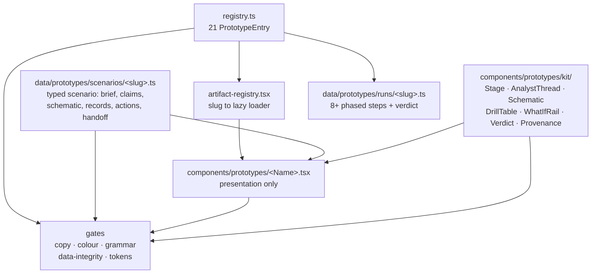
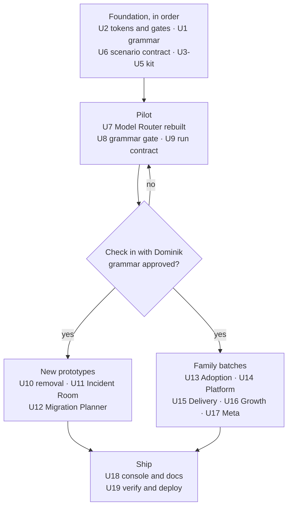

# Prototype Depth Upgrade - Plan

**Target repo:** `langdock-application` (`~/projects/langdock-application`). Every path below is relative to that repo, not to the repo holding this document.

---

## Goal Capsule

**Objective.** Take the Langdock console's prototypes from twenty thin single-screen dashboards to twenty-one deep, premium enterprise workspaces built on one shared six-stage grammar, remove "Ninety2, live", and add two new prototypes that answer questions the current set does not.

**Authority hierarchy.** This plan, then `AGENTS.md` and `DESIGN.md` in the target repo, then the original site plan, which lives in the sibling repo at `~/projects/web-app-resume/docs/plans/2026-07-22-001-feat-langdock-application-site-plan.md` (not inside the target repo, matching the pointer `AGENTS.md` already carries). Where this plan changes a rule the original plan set (prototype count, family partition, flagship count), this plan wins and the gates are updated to match.

**Execution profile.** Foundation and pilot are sequential and gated by a check-in with Dominik. The family batches after that are parallelizable with exclusive file ownership, one agent per family or per prototype. Every landing point runs the full gate set.

**Stop conditions.** Stop and surface rather than guessing when: the pilot's grammar does not fit a family's material; a schematic needs a runtime layout engine; the concierge model behaves differently; or the copy volume starts producing filler that passes the gates but does not read as Langdock.

**Tail ownership.** This plan owns implementation through deploy and live verification. Copy approval and the send to Judith Dada remain Dominik's.

---

## Product Contract

### Summary

Every prototype in the console today is one screen with one idea: a header, three stat tiles, one selector, one to three Recharts charts, and a closing line. They render in 425 to 955 lines, hold two to five pieces of state, contain no schematic diagrams, and expose no reasoning. A reader runs one, learns one thing, and leaves in about forty seconds.

This replaces that shape with a six-stage grammar every prototype grows into: **Brief, Analysis, System, Evidence, Decision, Handoff**. The depth is built from a shared kit of six new components rather than twenty-one bespoke layouts, so the console reads as one product with twenty-one capabilities. "Ninety2, live" is removed and two new prototypes are added: an **AI Incident and Escalation Room** and a **Platform Migration and Consolidation Planner**.

### Problem Frame

The console is the centerpiece of a single-recipient application to a company that sells enterprise AI. Its job is to make an incoming co-CEO believe that the person who built it can build what her company sells. A prototype that renders one chart and one selector does not carry that claim. It demonstrates taste, not capability.

The gap is not polish. Each prototype today shows a conclusion without showing the reasoning that produced it, the shape of the system it describes, the records beneath its numbers, or what it would cost to be wrong. Those four omissions are exactly what separates a dashboard from a tool an enterprise pays for.

A second problem sits underneath. `src/data/copy-gates.test.ts` walks only the modules under `src/data/`, so every word of scenario copy inside the twenty prototype components is currently unchecked for em dashes and AI tells. The house's loudest copy rule does not reach the site's largest body of copy.

### Requirements

**The grammar and the kit**

- R1. Every prototype renders six named stages in order: Brief, Analysis, System, Evidence, Decision, Handoff.
- R2. Each stage leads with a one-line claim that reads without interacting. "Depth one interaction below" applies inside the stage's components (a claim's working, a row's detail, the drawer's body), never to the stage's primary content: the schematic, charts, tables, and what-if rail render open. The per-stage visibility map in the Planning Contract is authoritative.
- R3. A shared kit serves every prototype: the `Stage` scaffold with its `StageIndex`, plus six premium components (analyst thread, schematic canvas, drill-down table, what-if rail, verdict card, provenance drawer).
- R4. The analyst thread is authored and deterministic. No prototype stage calls a model.
- R5. Each artifact offers two or three follow-up questions that seed the live console composer, and degrades to plain text when rendered outside the console provider. Every follow-up must be answerable from the concierge's existing knowledge base, which carries each prototype only as its registry one-liner. A follow-up that references a scenario-internal figure produces a decline at the moment the artifact invites engagement, so scenario internals are out of bounds for these questions.
- R6. Schematics render as hand-built SVG through the shared canvas. No new graph or layout dependency enters the chassis.
- R7. The what-if control is deterministic arithmetic over the prototype's own scenario data and visibly moves the verdict or a headline figure.

**Content depth**

- R8. Every prototype's scenario carries enough material for six stages: a constraint set, at least four reasoning claims each with its evidence and confidence, one schematic, one drill-down table of at least five records, a ranked action list with owner and effort, and an assumptions-and-sensitivity pair.
- R9. Each prototype declares one schematic type and one what-if variable, per the family mapping in the Planning Contract.
- R10. Run transcripts stream at least eight steps grouped by stage phase and close on a verdict line, without the run taking longer in wall-clock than it does today.
- R11. Depth never costs skimmability: a reader who reads only the six stage headlines gets the whole argument, and those headlines render as a jump index at the top of every artifact so the skim path is navigable rather than merely present.

**The prototype set**

- R12. "Ninety2, live" is removed entirely: component, test, run module, registry entry, artifact-registry line, and every reference in other tests.
- R13. The AI Incident and Escalation Room ships as a Delivery flagship, built to the grammar from the start.
- R14. The Platform Migration and Consolidation Planner ships as a Delivery flagship, built to the grammar from the start.
- R15. The registry holds twenty-one prototypes partitioned 4/6/5/4/2 across Adoption, Platform, Delivery, Growth, and Meta, with five flagships, and the data-integrity gate asserts the new shape.

**Data and gates**

- R16. Each prototype's scenario data lives in `src/data/prototypes/scenarios/<slug>.ts`. Components hold presentation only.
- R17. The copy gates reach every word of rendered prototype copy: the scenario modules by import, the strings each what-if `compute` returns by evaluating it across its declared range, and any prose left in component or kit JSX by a comment-stripped source scan. Walking exported values alone would miss all three of the last.
- R18. Stage headlines end with a period, gate-enforced.
- R19. The colour gate scans the prototypes directory recursively, so kit components in a subdirectory cannot escape it.
- R20. Severity reads through new semantic tokens in `src/app/globals.css`, never a hex literal in a component, and the new tokens clear 4.5:1 against both white and smoke under the existing contrast gate.
- R21. A structural gate walks the registry and fails when any prototype stops rendering all six stages or drops its schematic. The schematic assertion keys on a `data-schematic` marker, never on `role="img"` alone, which every existing chart wrapper already carries.

**Behaviour and accessibility**

- R22. Every new interaction is keyboard operable with a visible focus ring, and every schematic carries a `role="img"` label that describes what it shows in prose.
- R23. Under `prefers-reduced-motion` every reveal completes instantly with no timers scheduled.
- R24. Schematics reserve their own height through an intrinsic `viewBox`, never through CSS `aspect-ratio` alone, and render correctly in WebKit at 390px. Every wide region (schematic, drill table) scrolls inside its own labelled, keyboard-focusable container rather than widening the page.

**Content integrity**

- R25. Every scenario declares whether it is authored fiction or built on real sourced facts, and the handoff renders the matching disclosure: the hypothetical-scenario marker for authored scenarios, a dated sources note for real-facts ones.
- R26. Scenario enterprises and every drill-record identifier are fictional and role-descriptive, never a real company or person. Where a real vendor product is named as market context, it appears only in structured inventory fields, never in claim or verdict prose. A gate enforces both rules.

### Success Criteria

- A reader who opens any prototype can state its verdict, see the reasoning that produced it, and name one thing that would change it.
- Every prototype offers roughly four to five screens of substance against today's one, and still reads in six headlines.
- The console reads as one product. A reader moving between two prototypes in different families recognises the same grammar.
- All gates green: lint 0, Vitest, build clean, with the test count materially higher than the pre-work baseline.
- Live at `langdock.dbenger.com` with zero console errors and zero horizontal overflow at 390px in both Chrome and WebKit.

### Scope Boundaries

**In scope.** The twenty-one prototype artifacts, their scenario data, their run transcripts, the shared kit, the registry and its gates, the severity tokens, and the docs that describe the prototype set.

**Out of scope.**
- The console shell, sidebar, session model, and composer. That rearchitecture landed on 2026-07-23 and is not reopened. These narrow exceptions are in scope and named in their units: a `useConsoleOptional()` accessor added beside the existing hook (U3), the run-step and result-card rendering in `RunMessage.tsx` (U9, U18), and the slug-to-loader swap in `artifact-registry.tsx` (U10). No other console file changes.
- The concierge: its model pin, its prompt, its knowledge base, and its behaviour. One exception, named in U18: the canned degrade strings in its route still say "the ten prototype runs" and get their count corrected. Because the knowledge base stays untouched, R5's follow-up questions must stay answerable from what it already carries.
- `/systems`, `/about`, `/`, `/experience`, and `/ninety2-walkthrough`.
- Any prototype beyond the twenty-one this plan defines.

**Deferred to follow-up work.**
- A cross-prototype comparison view. Tempting once every prototype shares a grammar; not required by this plan.
- Export of an artifact to PDF or a shareable link. The provenance drawer establishes the surface; the export itself is later.
- Extending the year-count and masked-figure gates beyond the `dominik` module.

**Outside this product's identity.**
- A simulated model conversation inside an artifact. Runs are deterministic by doctrine; a fake chat would trade the site's honesty for theatre.
- Dark mode for the artifacts. The Langdock identity is light-only by decision.

---

## Planning Contract

### Key Technical Decisions

- KTD1. **One six-stage grammar for all twenty-one, not twenty-one bespoke redesigns.** (session-settled: user-approved - chosen over per-prototype hand design: a shared spine keeps the console reading as one product and makes the work tractable across families.) The stages are load-bearing in order because they are the sequence a competent operator actually works in: understand the brief, follow the reasoning, see the shape, check the evidence, take the decision, hand it off.

- KTD2. **The "chat" is an authored governed reasoning thread plus follow-up questions that seed the real composer.** The house doctrine is that prototype runs are one hundred percent authored and deterministic and only the free-text composer hits a live model. A simulated model conversation inside an artifact would break that. An authored thread of claims, each carrying its evidence and confidence, delivers the same reading experience honestly, and it is the pattern already shipped as the governed chat on `/systems`. The follow-up chips bridge into the genuine concierge conversation that already exists one pane below.

- KTD3. **Schematics are a hand-built SVG kit, not a graph library.** `AGENTS.md` forbids dependencies outside the chassis set without a recorded reason, and authored static diagrams do not justify a runtime layout engine. `Ninety2Live.tsx` already proves the approach works in the house visual language.

- KTD4. **Scenario data moves to `src/data/prototypes/scenarios/<slug>.ts`.** (session-settled: user-directed - chosen over keeping data inline in the components: it keeps files reviewable as they roughly double, matches `AGENTS.md`'s "facts live in data, never inline in components", and brings every prototype's rendered copy under the copy gates for the first time.) Seventeen of the twenty existing prototype tests import derived constants from their component; those imports move to the scenario module.

- KTD5. **Twenty-one prototypes, partitioned 4/6/5/4/2, with five flagships.** (session-settled: user-directed - chosen over a one-for-one swap: both replacement candidates were wanted, so the Incident Room takes the removed Delivery flagship slot and the Migration Planner is added alongside it.) `ai-incident-room` takes the removed entry's array index; `platform-migration-planner` appends at the end.

- KTD6. **Pilot one prototype end to end and check in before the batches fan out.** Twenty-one parallel interpretations of an unproven grammar is the largest risk in this plan. The Model-Agnostic Router is the pilot: it has topology, a genuine cost-quality tradeoff, and a natural what-if variable.

- KTD7. **Progressive depth, not more scrolling.** Every stage states its conclusion in one line at the top and holds the rest one interaction below. This is what keeps "longer" from meaning "worse" for a reader who skims.

- KTD8. **Severity gets its own semantic token triad rather than reusing `--destructive`.** `--destructive` names a destructive action, not a risk grade. Three new tokens (`--severity-high`, `--severity-med`, `--severity-low`) read as one system across the Incident Room, Security Posture, Usage Health, and Rollout Command Center. Proposed starting values `#a32b2b`, `#8a6a00`, `#1c6b52`; the contrast gate is the authority, not these numbers.

  The triad is **foreground-grade only**: text and border on neutral chip surfaces (`text-severity-*`, `border-severity-*`), never a fill under a light label. That matches the site's accent-scarcity register and keeps every usage inside what the contrast gate actually measures, since the gate checks these tokens as foreground against white and smoke and would never see a filled chip.

- KTD9. **Runs get deeper without getting slower.** Step count rises from six to at least eight, so `DEFAULT_STEP_MS` drops from 700ms to roughly 380ms. Ten steps then stream in under four seconds, close to today's total.

- KTD10. **Run modules stay small.** `run-types.ts` statically imports every run module and is pulled by `RunMessage`, which is always mounted, so run transcripts ride in the main console bundle. The depth lives in the lazily-chunked artifact, not in the run.

  This is currently false and the migration is what makes it true. Four run modules hold scenario data their components import: `runs/fit-mapper.ts` is 362 lines exporting the whole `fitByTitle` dataset with `RoleFit`, `fitTier`, and `STRONG_THRESHOLD`; `runs/deployment-planner.ts` is 190 lines exporting `securityPosture`, `seatBands`, and `constraintDimensions`; `runs/model-router.ts` and `runs/deep-research.ts` do the same at smaller scale. All of it sits in the always-mounted bundle today. Each relocation is owned by the unit that rewrites its prototype, named in that unit's Files, so no batch inherits an unassigned move.

### High-Level Technical Design

**Artifact composition.** A prototype becomes a thin presentation component that reads a typed scenario module and renders it through the kit. The gates sit outside and walk the registry.

**Delivery sequence.** Foundation gates the pilot; the pilot gates everything after it. The two new prototypes and the four family batches are independent of each other once the grammar is locked.

**The six stages, defined.**

| Stage | What it carries | Renders open | Kit components |
|---|---|---|---|
| Brief | The scenario, its constraints as chips, and the inputs as a table | All of it | Stage, DrillTable |
| Analysis | Four or more claims, each with evidence and confidence, expandable to the working | Every claim line; first claim's working | Stage, AnalystThread |
| System | One schematic: topology, swimlane, flow, matrix, or blast radius | All of it | Stage, Schematic |
| Evidence | The charts, with a record table beneath that drives a detail panel on selection | Charts, table, first row's detail | Stage, DrillTable, chart-theme |
| Decision | The verdict with confidence, ranked actions with owner and effort, and the what-if control | All of it | Stage, VerdictCard, WhatIfRail |
| Handoff | Assumptions, sensitivity, what production needs, the disclosure, follow-up questions | Disclosure and follow-ups; body collapsible | Stage, ProvenanceDrawer |

The "renders open" column is the answer to the question R2 would otherwise leave the pilot to guess, and the pilot's guess would become the template all five batches copy. Only a claim's working, a non-first row's detail, and the drawer's body sit behind an interaction.

Above the six stages, `StageIndex` lists their headlines as jump links (R11), so the skim path a reader is promised is one they can actually move through.

The Handoff disclosure varies by scenario type (R25): the hypothetical-scenario marker for authored fiction, a dated sources note for the two Meta prototypes built on real facts about Dominik and Langdock's open roles. Rendering the hypothetical marker unconditionally would tell the recipient that the Fit Mapper's real evidence is invented, and a test suite asserting it would enforce that rather than catch it.

**Per-prototype schematic and what-if assignments.** These two choices are the most likely to diverge across parallel batches, so they are fixed here.

| Prototype | Schematic | What-if variable |
|---|---|---|
| Adoption Blueprint | Rollout swimlane, function by phase | Rollout pace, to time-to-target |
| Readiness Scorecard | Dependency graph across the five dimensions | Investment split, to score and date |
| Governance Control Room | Policy enforcement topology to audit sink | Policy strictness, to blocked versus risk |
| Change Playbook | Stakeholder influence map with comms edges | Champion density, to curve endpoint |
| Model Router (pilot) | Routing topology with escalation and guard | Quality floor, to routed cost |
| Workflow Designer | The workflow graph itself | Human-gate placement, to throughput versus error |
| Deep Research | Retrieval to synthesis to citation, with source fan-in | Corpus scope, to citation coverage |
| Eval Harness | Eval pipeline into the regression gate | Pass threshold, to shipped versus escaped |
| Integration Fabric | Connector topology into knowledge coverage | Connector priority, to coverage |
| Cost Simulator | Cost flow from seats through model mix to spend | Seat growth and routing policy, to 12-month spend |
| Deployment Planner | Deployment architecture: tenancy, residency, network, identity | Deployment model, to time-to-live |
| Rollout Command Center | Regional go-live dependency timeline | Phase overlap, to completion date versus risk |
| Security Posture | Control coverage matrix, framework by control | Remediation budget, to residual findings |
| Incident Room (new) | Blast radius with containment cuts | Which control was already on, to blast radius |
| Migration Planner (new) | Migration wave swimlane with dependencies | Amnesty window, to completion versus exposure |
| Adoption Analytics | Activation funnel with drop-off edges | Which drop-off to fix, to MAU |
| Account Expansion | Whitespace map, division by product | Sequence choice, to seats live by Q4 |
| Value Realization | Value chain from activity to payback | Adoption rate, to payback month |
| Usage Health | Cohort flow across healthy, at-risk, churned, recovered | Intervention timing, to retained accounts |
| Fit Mapper | Evidence to capability to role mapping graph | Evidence weighting, to role ranking |
| 90-Day Plan | Workstream dependency timeline | Starting emphasis, to day-90 outcomes |

**Control mode per what-if.** Five of these variables are unordered choices, not magnitudes, and a slider between three named containment controls communicates a ranking that does not exist. The Incident Room, Deployment Planner, Adoption Analytics, Account Expansion, and 90-Day Plan use the rail's **choice** mode; the other sixteen use its **range** mode. Both modes share one `compute`-by-index contract, so no prototype hand-rolls a control.

### Assumptions

- The pilot's grammar fits every family. If a family's material resists a stage, that stage carries a shorter treatment rather than being dropped, and the grammar gate still passes.
- Rendering twenty-one artifacts in one grammar-gate sweep stays inside a tolerable Vitest runtime in jsdom. If it does not, the sweep becomes a source scan and the render assertion moves into each prototype's own test.
- The existing per-prototype tests are rewritten as part of each batch rather than preserved, since the components they assert against are substantially changing.
- Work lands on a feature branch per phase and ff-merges to main with the gate set green, following this repo's existing practice. The removal in U10 and the two new builds in U11 and U12 share one branch so main never sees a red wiring sweep.
- The send stays gated behind the completed upgrade. This is an assumption, not a settled decision: the site is already finished, reviewed, and live, so shipping the current twenty is a real alternative, and every week of rebuild is a week the application is not sent to a reader whose relevance window moves with her start date. The wall-clock budget and the target send window are unknown to this plan (see Open Questions), which is why U7 carries an explicit go/no-go rather than an assumed schedule.
- Eight existing run modules are short-named rather than slug-named: `adoption-blueprint`, `readiness-scorecard`, `model-router`, `workflow-designer`, `deep-research`, `deployment-planner`, `adoption-analytics`, and `expansion-play`. The design diagram's `runs/<slug>.ts` describes the two new runs only. The batches keep the legacy filenames and `run-types.ts` stays the slug-to-module map; renaming is deferred so no batch carries an unstated rename decision, and a batch agent looking for `runs/<slug>.ts` for one of those eight will not find it.

### Open Questions

- Q1. What send window does this build have to beat, and what wall-clock budget does the phased execution get against it? Deferred, not blocking: planning and the foundation units proceed either way, and U7's go/no-go is where the answer changes the plan. If the budget is blown at that point, the descope lever is the family batches, not the pilot or the two new prototypes.

### Implementation Constraints

- `useConsole()` **throws** outside its provider (`src/components/console/ConsoleProvider.tsx:93`). The grammar gate in U8 renders artifacts standalone, so any artifact reaching for console context must read the raw context or a safe variant of the hook, never `useConsole()` directly. This is the single constraint most likely to turn the grammar gate red on first run.
- `copy-gates.test.ts` collects strings by walking exported **values** and never invokes a function, so a what-if `compute`'s returned readout is invisible to it. It also uses top-level static imports, so an unresolvable module fails suite collection rather than one assertion, which is why the gate discovers scenarios from disk instead of importing a barrel seven parallel batches would each have to edit.
- Four run modules export scenario data their components import today: `runs/fit-mapper.ts` (362 lines), `runs/deployment-planner.ts` (190), `runs/model-router.ts`, and `runs/deep-research.ts`. Until each moves, KTD10's claim that runs stay small is aspirational, not descriptive.
- `data-integrity.test.ts` builds its volatile-facts scan path from `src/components/prototypes/<Component>.tsx` only. Moving scenario data out of components migrates every `langdockFacts.<key>` read out of the scanned files, so the scan passes vacuously unless U10 extends it. Five components hold those reads today: ModelRouter, AdoptionBlueprint, AdoptionAnalytics, ExpansionPlay, WorkflowDesigner.
- Every existing prototype already carries `role="img"` on its chart wrappers, so that attribute cannot distinguish a schematic from a chart.
- `sendMessage` has no in-flight guard; the composer disables its send button on busy instead. Any new send path must do the same or two rapid triggers interleave their writes into one session draft.
- `chart-gates.test.ts` uses a non-recursive `readdirSync`, so a `kit/` subdirectory escapes the colour gate until U2 fixes it. Do not put kit components anywhere until that lands.
- `data-integrity.test.ts` hardcodes the count, the partition, the exact `flagshipSlugs` array, and a twenty-entry `componentByShell` map. All four change in U10.
- `console-url-state.test.ts` uses `"ninety2-live"` as its example slug and must move to a surviving one.
- No component may contain a hex literal, an `rgb()`, or an `oklch()` call. Severity colour arrives through the tokens added in U2.
- No em dashes in any rendered string. Headlines end with a period. Career claims use dates, never year-counts.
- `~/ninety2` stays hard read-only. Nothing in this plan reads or writes it.

---

## Implementation Units

### Unit Index

| U-ID | Unit | Key files | Depends on |
|---|---|---|---|
| U1 | Grammar contract, Stage scaffold, jump index | `kit/Stage.tsx`, `kit/StageIndex.tsx`, `kit/types.ts`, `DESIGN.md` | U2 |
| U2 | Severity tokens and gate hardening | `globals.css`, `chart-gates.test.ts`, `copy-gates.test.ts`, `design-tokens.test.ts` | - |
| U3 | Narrative kit | `kit/AnalystThread.tsx`, `kit/VerdictCard.tsx`, `kit/ProvenanceDrawer.tsx` | U1, U2 |
| U4 | Schematic canvas | `kit/Schematic.tsx`, `kit/schematic-layout.ts` | U1, U2 |
| U5 | Interaction kit | `kit/DrillTable.tsx`, `kit/WhatIfRail.tsx` | U1, U2 |
| U6 | Scenario module contract | `data/prototypes/scenario-types.ts`, `scenario-shape.test.ts` | U1 |
| U7 | Pilot: Model Router rebuilt | `ModelRouter.tsx`, `scenarios/model-agnostic-router.ts` | U3, U4, U5, U6 |
| U8 | Grammar gate | `data/prototypes/grammar.test.ts` | U7 |
| U9 | Deepened run contract | `run-types.ts`, `RunMessage.tsx`, `runs/model-router.ts` | U7 |
| U10 | Remove Ninety2 and reshape the registry | `registry.ts`, `artifact-registry.tsx`, `run-types.ts`, `data-integrity.test.ts` | U8, U9 |
| U11 | AI Incident and Escalation Room | `IncidentRoom.tsx`, `scenarios/ai-incident-room.ts` | U10 |
| U12 | Platform Migration and Consolidation Planner | `MigrationPlanner.tsx`, `scenarios/platform-migration-planner.ts` | U10, U11 |
| U13 | Adoption family, four prototypes | 4 components, 4 scenarios, 4 tests, 4 runs | U8, U9, check-in |
| U14 | Platform family, five prototypes | 5 components, 5 scenarios, 5 tests, 5 runs | U8, U9, check-in |
| U15 | Delivery family, three prototypes | 3 components, 3 scenarios, 3 tests, 3 runs | U8, U9, check-in |
| U16 | Growth family, four prototypes | 4 components, 4 scenarios, 4 tests, 4 runs | U8, U9, check-in |
| U17 | Meta family, two prototypes | 2 components, 2 scenarios, 2 tests, 2 runs | U8, U9, check-in |
| U18 | Console surfacing and docs sync | `RunMessage.tsx`, `PRODUCT.md`, `DESIGN.md`, `docs/`, chat `route.ts` literals | U11-U17 |
| U19 | Verify, deploy, live-check | none new | U18 |

"check-in" is the U7 stop with Dominik, not a unit. It gates U10 through U17 and is the plan's primary control against twenty-one divergent readings of an unproven grammar. An executor that reads only this table would otherwise start a batch straight off U8 and U9.

---

### U1. Grammar contract and Stage scaffold

**Goal.** Define the six-stage grammar as a typed contract and a single `Stage` component every prototype composes from, so the structure is enforced by types before it is enforced by a test.

**Requirements.** R1, R2, R11, R22.

**Dependencies.** U2. This unit creates the first file under `kit/`, and until U2's colour gate recurses, anything in that directory is invisible to it.

**Files.**
- `src/components/prototypes/kit/types.ts` (new) - the `StageId` union and the props each stage takes.
- `src/components/prototypes/kit/Stage.tsx` (new) - numbered marker, stage label, headline, optional intro, children. Emits `data-stage="<id>"`.
- `src/components/prototypes/kit/StageIndex.tsx` (new) - the six stage headlines as in-page anchor links, rendered once at the top of every artifact.
- `src/components/prototypes/kit/Stage.test.tsx` and `StageIndex.test.tsx` (new)
- `DESIGN.md` - a Prototype grammar section describing the six stages and the kit.

**Approach.** `StageId` is `"brief" | "analysis" | "system" | "evidence" | "decision" | "handoff"`. `Stage` renders the marker row (index badge, uppercase label, hairline rule) then the headline as an `h3` and children below, with a stable id derived from the stage id so it can be linked to. The headline is required and typed as a string so the period gate in U2 can find it. `data-stage` is the hook the grammar gate reads. No colour beyond semantic tokens; no shadow.

`StageIndex` renders the same six headlines as anchor links at the top of the artifact. It costs no extra authoring because it reads the headlines the scenario already declares, and it turns R11 from an aspiration into a control: the six headlines are the skim path, so make them the visible index and let a reader jump rather than scroll. That matters because artifacts render inline in an already-scrolling chat thread, where three opened prototypes stack into fifteen-plus screens and a reader at Handoff wanting to recheck an Analysis claim has no way back. Quiet by default in the house register: label-sm, muted, hairline-separated, no accent fill.

**Patterns to follow.** The stage-marker treatment in the mockup; the `SectionLabel` helper in `ChangePlaybook.tsx`; the semantic-token discipline throughout `src/components/prototypes/`.

**Test scenarios.**
- Renders the headline as a heading and the label as text.
- Emits `data-stage` matching the `id` prop.
- Renders children inside the stage region.
- Marker index renders 1 through 6 for the six ids in order.
- Marker glyph is `aria-hidden` so the heading is the only announced label.
- Each stage carries a stable id derived from its `StageId`.
- `StageIndex` renders one link per stage, labelled with that stage's headline, in stage order.
- Each link's target resolves to the matching stage's id.
- `StageIndex` is a labelled navigation landmark and every link is keyboard reachable.
- `StageIndex` renders no accent fill and no colour outside the semantic tokens.

**Verification.** `Stage` renders all six ids; `StageIndex` links resolve to them; `DESIGN.md` documents the grammar and the index; lint and test green.

---

### U2. Severity tokens and gate hardening

**Goal.** Add the severity token triad and close the three gate holes that would otherwise let the expansion ship unchecked copy, unchecked colour, and unchecked headlines.

**Requirements.** R17, R18, R19, R20, R26.

**Dependencies.** None. This unit lands first, because the colour gate cannot see a `kit/` subdirectory until it recurses and U1 creates the first kit file. Foundation order is U2, U1, U6, then U3 through U5.

**Files.**
- `src/app/globals.css` - three tokens in `:root` and their `@theme inline` mappings.
- `src/app/design-tokens.test.ts` - contrast assertions for the new tokens against white and smoke.
- `src/components/charts/chart-gates.test.ts` - recurse into subdirectories.
- `src/data/prototypes/scenarios/` - create the directory so the gate's discovery has somewhere to look.
- `src/data/copy-gates.test.ts` - discover scenario modules from disk, evaluate every what-if `compute`, scan component and kit JSX, and add the headline-period and vendor-token rules.

**Approach.** Add `--severity-high`, `--severity-med`, `--severity-low` to `:root` beside `--destructive`, and `--color-severity-*` to `@theme inline` so Tailwind emits `text-severity-high` and friends. Leave `--destructive` alone; it names a destructive action, not a risk grade. Per KTD8 the triad is foreground-grade only, so emit text and border utilities and no fill. The contrast gate computes ratios against `--card` and `--background` and requires above 4.5. The colour gate switches to a recursive walk so `kit/` is covered.

The copy gate grows four ways, because walking exported values alone reaches none of them: discover and load every scenario module; call each scenario's what-if `compute` across its declared range and sweep the returned readouts, which are rendered copy; run a comment-stripped source scan over `src/components/prototypes/**/*.tsx` for the same em-dash and AI-tell patterns, following the source-scan shape `chart-gates.test.ts` already uses; and pin the kit's own chrome by exact wording the way `AUTHORSHIP_LINE` is pinned. Every user-visible string the kit hardcodes (the hypothetical marker, the real-facts note, the stage-index label, empty and error text) is an exported constant swept by the same em-dash and AI-tell rules. The source scan's `src/components/prototypes/**/*.tsx` glob covers `kit/` because the kit lives inside that tree; keep it that way rather than scanning the two directories separately. Add the headline-period rule and a vendor-token rule that fails any scenario naming a real vendor product unless its slug is on a declared allowlist (initially `platform-migration-planner`).

**Discover scenarios from disk, never from a hand-maintained barrel** (`readdirSync` over `src/data/prototypes/scenarios/*.ts` excluding tests, plus an eager glob import; Vitest runs on Vite, so glob imports work). Seven batch units are declared parallelizable with exclusive file ownership, and a barrel every one of them must append to is a shared file across up to seven branches: either they collide in the same region, or a batch skips the edit and its copy silently sits outside the gates until U18, which would make each batch's "copy gate passes on the new scenario modules" verification vacuous. With discovery, a scenario module joins the gates the moment it lands on disk and no batch edits a shared file.

**Execution note.** Write the gate changes before the tokens and content they check, so the first run fails for the right reason and proves the gate has teeth. Because discovery reads a directory rather than importing a barrel, an empty `scenarios/` is a valid starting state and the first failure is a planted offender rather than an unresolved-module error at suite collection.

**Test scenarios.**
- Each severity token exists as a six-digit hex in `globals.css`.
- Each severity token clears 4.5:1 against both `--card` and `--background`.
- The colour gate flags a hex literal planted in a file inside `kit/` (proves recursion).
- The copy gate flags an em dash planted in a scenario module.
- The copy gate flags an em dash planted in a what-if `compute`'s returned string (proves compute output is reached).
- The copy gate flags an AI tell planted in component JSX (proves the source scan is reached).
- The copy gate flags a headline that does not end with a period.
- The copy gate flags a vendor product name in a scenario whose slug is not on the allowlist, and passes the same name in `platform-migration-planner`.
- The hypothetical-marker and real-facts-note strings match their pinned wording exactly.
- The light-only assertion still passes with the new tokens present.

**Verification.** Planted-offender checks fail before the fix and pass after; full gate set green.

---

### U3. Narrative kit: analyst thread, verdict card, provenance drawer

**Goal.** Build the three components that carry the reasoning, the call, and the honesty, so no prototype hand-rolls them.

**Requirements.** R3, R4, R5, R8, R22, R23.

**Dependencies.** U1, U2.

**Files.**
- `src/components/prototypes/kit/AnalystThread.tsx` (new) + test
- `src/components/prototypes/kit/VerdictCard.tsx` (new) + test
- `src/components/prototypes/kit/ProvenanceDrawer.tsx` (new) + test
- `src/components/console/ConsoleProvider.tsx` - add a `useConsoleOptional()` export beside the throwing `useConsole()`.

**Approach.** `AnalystThread` takes an array of claims, each with `claim`, `evidence` chips, `confidence`, and `working`. It renders a rail of nodes with the claim as a disclosure button and the working revealed below, `aria-expanded` wired, first claim open by default. `VerdictCard` takes `verdict`, `confidence`, and ranked `actions` with owner and effort. `ProvenanceDrawer` takes `assumptions`, `sensitivity`, `productionNeeds`, `followUps`, and the scenario's `disclosure` (R25). It renders the disclosure and the follow-up chips outside its collapsible body so both survive a collapsed drawer, and the disclosure text varies by type: the hypothetical-scenario marker for authored fiction, a dated sources note for a real-facts scenario. Both strings are exported constants so U2's copy gate can pin them.

Chips send the question into the console composer when a provider is present, and render disabled while that session's status is `streaming`: `sendMessage` has no in-flight guard, so two rapid taps would interleave two replies into one session draft. The composer already models this by disabling its send button on busy.

The drawer must not call `useConsole()`: that hook throws when no provider is mounted (`ConsoleProvider.tsx:93`) and the U8 grammar gate renders artifacts standalone. Export a safe accessor beside it (`useConsoleOptional()`, returning `null` instead of throwing) and have the drawer degrade to rendering the follow-ups as plain non-interactive text. Adding the safe accessor is the only change this plan makes to console files outside U9 and U18.

**Patterns to follow.** The disclosure pattern in `Ninety2Live.tsx`; the `useReducedMotion` hook at `src/components/console/useReducedMotion.ts`; the chip and well treatments across the existing prototypes.

**Test scenarios.**
- Thread renders every claim's text and its evidence chips.
- Thread's first claim starts expanded and the rest collapsed, with `aria-expanded` matching.
- Clicking a claim toggles its working and its `aria-expanded`.
- Claim toggles operate with Enter and Space from the keyboard.
- Under reduced motion the thread renders with no timers scheduled.
- Verdict card renders the verdict, its confidence, and every action with owner and effort, in rank order.
- Provenance drawer renders assumptions, sensitivity, and production needs.
- A drawer given `disclosure: 'hypothetical'` renders the hypothetical marker and not the sources note; given `disclosure: 'real-facts'` it renders the dated sources note and not the hypothetical marker.
- The disclosure and the follow-up chips render even when the drawer body is collapsed.
- Follow-up chips call `sendMessage` with the question text when inside a console provider.
- Follow-up chips render disabled while the session status is `streaming`, and enabled otherwise.
- Follow-up chips render as text and do not throw when rendered with no console provider.
- `useConsoleOptional()` returns null with no provider mounted, while `useConsole()` still throws (the existing contract is unchanged).

**Verification.** All three render standalone in a test with no provider; reduced-motion path schedules no timers.

---

### U4. Schematic canvas

**Goal.** One typed SVG canvas that renders every schematic form the twenty-one prototypes need, so nobody hand-draws a diagram twice and nobody reaches for a graph library.

**Requirements.** R6, R22, R24.

**Dependencies.** U1, U2.

**Files.**
- `src/components/prototypes/kit/schematic-layout.ts` (new) - column and lane geometry, pure functions.
- `src/components/prototypes/kit/Schematic.tsx` (new) - the renderer.
- `src/components/prototypes/kit/Schematic.test.tsx` (new)
- `src/components/prototypes/kit/schematic-layout.test.ts` (new)

**Approach.** A schematic is declared as typed data: `columns` (each a lane with a title), `nodes` (id, column, label, sublabels, emphasis, severity), and `edges` (from, to, style: solid, dashed, cut). `schematic-layout.ts` places nodes on a fixed grid from their column index and their order within it, returning coordinates; it holds no React and is unit-tested directly. `Schematic.tsx` maps that to `<rect>`, `<text>`, and `<path>`, sizes itself from an intrinsic `viewBox` with `width="100%"` and `height="auto"`, and wraps in an `overflow-x: auto` container so a wide diagram scrolls inside itself rather than pushing the page sideways. Stroke and fill arrive through `currentColor` and semantic token classes. The whole SVG carries `role="img"`, a prose `aria-label` supplied by the caller, and a `data-schematic` attribute. The marker matters because every existing chart wrapper already carries `role="img"`, so that attribute alone cannot tell U8's gate that a schematic rendered; `data-schematic` mirrors the `data-stage` mechanism the grammar already uses.

The five forms all fall out of the same primitive: topology is columns with cross edges, swimlane is rows with an ordered axis, flow is a single chain, blast radius is fan-out with cut edges, and matrix is a grid with cell emphasis. Do not add a sixth abstraction; if a prototype needs a form these five cannot express, surface it rather than growing the kit.

**Execution note.** WebKit collapsed a `next/image fill` element sized only by CSS `aspect-ratio` on 2026-07-24 and it was invisible in Chrome. Reserve height intrinsically and verify in WebKit at 390px before this unit is called done.

**Test scenarios.**
- Layout places a node's x from its column index and y from its order within the column.
- Layout returns a `viewBox` sized to contain every node plus padding.
- Layout handles a column with one node and a column with six without overlap.
- Renderer emits one `rect` per node and one `path` per edge.
- Renderer applies the emphasis class to an emphasised node and the severity class to a severity-tagged node.
- Renderer carries `role="img"`, the supplied `aria-label`, and `data-schematic`.
- The scroll container is keyboard-focusable and labelled, since WebKit and Firefox do not focus a scrollable div automatically.
- Renderer emits no hex literal, only token-backed classes and `currentColor`.
- A cut edge renders with the cut style and the severity-high token class.
- The container carries horizontal overflow so a wide diagram does not widen the page.

**Verification.** Both test files green; a sample topology, swimlane, and blast radius render in the pilot and in WebKit at 390px with no overflow.

---

### U5. Interaction kit: drill-down table and what-if rail

**Goal.** Build the two components that turn a static chart into something a reader operates.

**Requirements.** R3, R7, R22, R23.

**Dependencies.** U1, U2.

**Files.**
- `src/components/prototypes/kit/DrillTable.tsx` (new) + test
- `src/components/prototypes/kit/WhatIfRail.tsx` (new) + test

**Approach.** `DrillTable` takes typed columns and rows plus a `detail` renderer, keeps the selected row id in state, starts with the first row selected (matching AnalystThread's first-open claim and the first-active-chip pattern the prototypes already use), and renders the detail panel in an `aria-live="polite"` region. Rows are focusable and respond to click, Enter, and Space. It reports the selected id upward so a sibling chart can highlight the same record.

Rows render inside their own labelled, keyboard-focusable `overflow-x: auto` region, with the detail panel below and outside it so the panel stays full width. At 390px the artifact's content column is roughly 330px inside the thread's wrapper, and every prototype now carries two multi-column tables; without this the tables push the page sideways and fail the zero-overflow criterion. U4 already solves the same problem for schematics.

`WhatIfRail` takes a pure `compute` function from step index to a readout and renders in one of two modes over that single contract: **range** (a labelled slider, for ordered magnitudes) or **choice** (an `aria-pressed` pill group in the house pattern, for unordered options). A slider between three named containment controls would imply a ranking that does not exist. The rail holds no arithmetic, so each prototype's what-if math lives in its scenario module and is unit-testable without rendering.

**Patterns to follow.** The `role="group"` selector pattern in `ChangePlaybook.tsx`; the `aria-pressed` pill treatment used across the prototypes.

**Test scenarios.**
- Table renders every column header and every row.
- The first row starts selected and its detail renders on mount.
- Selecting a row updates the detail panel content.
- Selection works by click, by Enter, and by Space.
- The detail region is `aria-live="polite"`.
- The selected row carries a distinguishing state the test can assert on.
- `onSelect` fires with the row id so a chart can follow it.
- The row region carries horizontal overflow, is keyboard-focusable, and is labelled; the detail panel sits outside it.
- Rail in range mode renders the initial readout from `compute` at the default step, and moving the slider re-renders it at the new step.
- Rail in choice mode renders one `aria-pressed` control per option and re-renders the readout from `compute` on selection.
- Both modes are labelled and reachable by keyboard.
- Under reduced motion the rail renders with no transition and no timers.

**Verification.** Both render standalone; a pure `compute` is unit-tested without rendering.

---

### U6. Scenario module contract

**Goal.** Establish the typed shape every prototype's scenario data takes and the directory it lives in, so twenty-one migrations are mechanical rather than improvised.

**Requirements.** R8, R16, R17.

**Dependencies.** U1.

**Files.**
- `src/data/prototypes/scenario-types.ts` (new) - `PrototypeScenario` and its parts.
- `src/data/prototypes/scenarios/scenario-shape.test.ts` (new) - discovers scenario modules from disk, the same way U2's copy gate does, so no batch has to register itself anywhere.

**Approach.** `PrototypeScenario` composes: `brief` (headline, intro, constraint chips, input records), `claims` (the analyst thread's input), `schematic` (the typed canvas data plus its `aria-label`), `evidence` (chart series, drill records, per-record detail), `decision` (verdict, confidence, ranked actions, the what-if mode, its steps, and its `compute`), and `handoff` (assumptions, sensitivity, production needs, follow-ups, and `disclosure`). Every stage has a required `headline: string`.

Three authoring rules belong in the contract's doc comment, not in one unit's prose, because five parallel batch agents build against this type and nothing else tells them:

- **Disclosure (R25).** `disclosure: 'hypothetical' | 'real-facts'`. Authored fiction takes the hypothetical marker; the two Meta prototypes built on real sourced facts take the dated sources note.
- **Anonymity (R26).** The scenario enterprise and every drill-record identifier are fictional and role-descriptive. A realistic company name in a churned cohort or an at-risk account fabricates negative data about a real company on a live page under Dominik's name.
- **Vendor naming (R26).** A real vendor product may appear only as structured market context in a Brief inventory field, never inside claim or verdict prose, and only for a slug on the copy gate's allowlist.
- **Follow-ups (R5).** Answerable from the concierge's knowledge base, which holds each prototype only as its registry one-liner. No scenario-internal figures.

**One source of truth per figure.** A scenario's KPI strip, drill records, chart series, what-if readouts, and verdict all quote the same numbers, six stages deep, twenty-one times. Nothing mechanical catches a verdict citing a figure its own drill table contradicts, and hand-maintained duplicates across five parallel batches will drift. So every derived figure is computed from one source array in the scenario module and never retyped, and the module asserts its own invariants at load time and throws on drift. `ChangePlaybook.tsx` already ships this pattern: it pins each phase's target to the final curve month it owns and fails loudly at module load if they disagree. Carry it forward rather than reinventing it.

The shape test walks the barrel and asserts each scenario meets the R8 floor: four or more claims, five or more drill records, one schematic, one ranked action list, both a `sensitivity` and an `assumptions` array, and a declared `disclosure`. It also recomputes each scenario's headline figures from its source arrays and compares them against the rendered values, so a drifted number fails in CI rather than in front of the reader. It is written now against zero scenarios and starts biting as U7 lands the first.

**Test scenarios.**
- Discovery finds one scenario module per registry slug once all have landed (skipped while the set is partial, asserted in U18).
- Every exported scenario has all six stage keys with a non-empty headline.
- Every scenario has at least four claims, each with evidence and a confidence.
- Every scenario has at least five drill records.
- Every scenario has both `assumptions` and `sensitivity` non-empty.
- Every scenario declares a `disclosure` of `'hypothetical'` or `'real-facts'`.
- Every scenario declares a what-if mode of `range` or `choice` with a `compute` and a step count matching the Planning Contract's assignment.
- A scenario missing a stage key fails to type-check (compile-time, asserted by the build).

**Verification.** The shape test runs and passes against the pilot's scenario in U7.

---

### U7. Pilot: Model-Agnostic Router rebuilt to the grammar

**Goal.** Build one prototype to full six-stage depth end to end, as the reference every batch copies. This is the check-in point with Dominik.

**Requirements.** R1, R2, R3, R7, R8, R9, R11, R16, R22, R23, R24.

**Dependencies.** U3, U4, U5, U6.

**Files.**
- `src/data/prototypes/scenarios/model-agnostic-router.ts` (new)
- `src/components/prototypes/ModelRouter.tsx` (rewritten as presentation only)
- `src/components/prototypes/ModelRouter.test.tsx` (rewritten)
- `src/data/prototypes/runs/model-router.ts` - move its scenario-data exports into the scenario module and slim the run to step labels and a result card (KTD10). The component imports data from this run module today, so without this the pilot cannot be presentation-only and U9 would inherit an unassigned relocation.

**Approach.** Follow the mockup at https://claude.ai/code/artifact/93df9bcc-933d-40ad-9ea2-2d8606f3d2c7, which renders this prototype's six stages at full depth. Treat it as illustrative, not authoritative: it is a private artifact a future session may not be able to fetch, so the spec below plus the six-stages table in the Planning Contract are the binding reference, and the check-in is where the visual reading is confirmed. Brief: a nine-thousand-seat industrial group, six workload classes, four constraint chips, the mix as a table. Analysis: four claims on volume versus quality-criticality, risk concentration, the residency constraint removing the cheapest provider, and the three-tier policy clearing budget. System: routing topology with the classifier, three tiers, the six percent escalation path, and the residency guard that fails closed. Evidence: the cost-quality frontier plus a six-row drill table where selecting a class drives the detail. Decision: adopt the three-tier policy, three ranked actions, and a seven-step quality-floor slider moving routed cost from €21.8k to €41.4k. Handoff: four assumptions, three sensitivities, what production needs, and three follow-up questions.

The existing `ModelRouter.test.tsx` imports named constants from the component; those move to the scenario module and the test's imports follow. Keep the slug, the registry entry, and the deep link unchanged.

**Execution note.** Land the scenario module and its shape test first, then the component against it. That order proves the data contract is sufficient before any JSX depends on it.

**Test scenarios.**
- All six stages render, each with its headline.
- The jump index renders all six headlines and each link resolves to its stage.
- Constraint chips and every input row render in Brief.
- Four claims render in Analysis, first expanded, and toggling the second reveals its working.
- The routing schematic renders with its `role="img"` label naming the classifier, the three tiers, and the guard.
- Selecting each of the six drill rows updates the detail panel to that class's text.
- The what-if `compute` returns the documented figure at every one of its seven steps (unit test, no render).
- Moving the slider updates the readout and the explanation.
- The verdict renders with its confidence and three ranked actions in order.
- Handoff renders assumptions, sensitivity, production needs, the hypothetical marker, and three follow-ups.
- Under reduced motion everything renders complete with no timers scheduled.
- No hex literal appears in the component or the scenario module.

**Verification.** Full gate set green; rendered in Chrome at 1440 and 390 and in WebKit at 390 with the schematic and both tables scrolling inside themselves and no page overflow; the pilot's three follow-up questions asked against the live concierge and answered rather than declined (R5).

**Stop here and show Dominik before starting U10 through U17.** The check-in carries three decisions, not one:

1. Does the grammar work? Approve or send U7 back.
2. Does it work for the material it fits least well? Bring a paper six-stage mapping (six headlines plus a schematic sketch) for `fit-mapper` and `ninety-day-plan`, the two built on real facts rather than an authored scenario, so the least grammar-native pair is validated before any batch fans out. The pilot alone cannot prove this: the Model Router is the case the grammar was chosen to fit.
3. Go or no-go on timing. Open question Q1 (the send window and wall-clock budget) resolves here. If the budget is blown, the descope lever is the family batches; the pilot and the two new prototypes stay.

---

### U8. Grammar gate

**Goal.** One test that walks the registry and fails when any prototype stops rendering all six stages, so the depth cannot quietly regress across twenty-one files and many future edits.

**Requirements.** R1, R21.

**Dependencies.** U7.

**Files.**
- `src/data/prototypes/grammar.test.ts` (new)

**Approach.** Resolve every registry slug to its artifact component through `getArtifactLoader`, render it, and assert all six `data-stage` values are present in the container. Artifacts render outside the console provider, which is why U3's follow-up chips must degrade.

While the batches are in flight the sweep covers the slugs whose scenario module exists on disk, discovered the same way U2's copy gate discovers them. Do not keep a hand-maintained list of landed slugs: seven parallel batch units would each have to edit it, which is the shared-file collision the exclusive-ownership execution model exists to avoid. U18 flips the sweep to the full registry.

If the twenty-one-render sweep proves too slow in jsdom, fall back to a source scan asserting each component references all six `StageId` values, and move the render assertion into each prototype's own test. Record which shape shipped in the test's own header comment.

**Test scenarios.**
- Every registered slug resolves to a component that renders without throwing.
- Every rendered artifact contains all six `data-stage` values.
- Every rendered artifact contains at least one `[data-schematic]` element. Do not assert on `role="img"`: every existing chart wrapper already carries it, so a prototype that shipped no schematic at all would pass.
- A component with a stage removed fails the sweep (proved against a local stub, not by mutating a shipped file).
- The sweep runs with no console provider mounted and produces no unhandled error.

**Verification.** The gate passes for the pilot and fails for a stub missing a stage.

---

### U9. Deepened run contract

**Goal.** Make the run that introduces each artifact carry the same depth, without making the reader wait longer.

**Requirements.** R10, KTD9, KTD10.

**Dependencies.** U7.

**Files.**
- `src/data/prototypes/run-types.ts` - add `phase` to `RunStep`, `verdict` to `RunResultCard`, lower `DEFAULT_STEP_MS`.
- `src/components/console/RunMessage.tsx` - group streamed steps under their phase label, render the verdict line.
- `src/data/prototypes/runs/model-router.ts` - rewritten to the new shape as the reference. Note the legacy filename: run modules are not named after their slugs (see Assumptions), and `run-types.ts` owns the slug-to-module mapping.
- `src/data/prototypes/wiring.test.ts` - raise the step-count floor.
- `src/components/console/RunMessage.test.tsx` (if absent, add)

**Approach.** `RunStep` gains `phase?: StageId` so steps group under Brief, Analysis, Evidence, and Decision headings as they stream. `RunResultCard` gains `verdict: string`, one line, rendered above the stats. `DEFAULT_STEP_MS` drops from 700 to roughly 380 so eight to ten steps stream in under four seconds. Run modules stay small: they are step labels and a result card, never scenario data.

`phase` is optional and only the pilot's run is rewritten here, so from this merge until the last family batch lands, main serves one phased run and twenty unphased ones. **A step with no phase renders exactly as today: a flat list item under no heading.** A naive group-by would print an empty or `undefined` heading over every legacy run in the shipped console for the whole batch window.

The `verdict` addition is the one field that cannot be optional, since the wiring sweep requires it on every run; author a one-line verdict for all twenty legacy runs in this unit rather than leaving nineteen to fail the sweep until their batch lands.

**Test scenarios.**
- The wiring sweep requires a non-empty verdict on every authored run, and at least eight steps on every run whose prototype has landed its batch.
- Steps render grouped under their phase label in order.
- A run whose steps carry no phase renders as a flat list with no group heading and no empty or `undefined` label (the legacy-run state during the batch window).
- The verdict line renders above the stats when the run completes.
- Under reduced motion the run settles complete on mount with one announcement and no timers.
- A persisted completion still does not replay on re-render.
- Replay re-fires the stream from the first step.

**Verification.** The pilot's run streams eight or more steps in under four seconds; wiring sweep green.

---

### U10. Remove "Ninety2, live" and reshape the registry

**Goal.** Delete the prototype that answers the wrong question, leaving a clean nineteen-entry registry the two new builds each add themselves to.

**Requirements.** R12, R15.

**Dependencies.** U8, U9. Both this unit and U9 edit `run-types.ts`, so they cannot run concurrently without breaking the exclusive-file-ownership model; U9 also has to define `phase` and `verdict` before U11 and U12 author runs against them. The delivery-sequence diagram already places U9 inside the pilot that gates this unit.

**Files.**
- Delete `src/components/prototypes/Ninety2Live.tsx` and `Ninety2Live.test.tsx`.
- Delete `src/data/prototypes/runs/ninety2-live.ts`.
- `src/data/prototypes/registry.ts` - remove the `ninety2-live` entry.
- `src/data/prototypes/run-types.ts` - remove its import and map entry.
- `src/components/console/artifact-registry.tsx` - remove its loader.
- `src/data/data-integrity.test.ts` - 19 entries, partition 4/6/3/4/2, three flagships, `componentByShell` minus the removed row, **and the volatile-facts scan extended past component files**.
- `src/lib/console-url-state.test.ts` - move the example slug off `ninety2-live`.

**Approach.** The removal is total. `Ninety2, live` told the story of Dominik's private practice while the other prototypes tell what Langdock could do for an enterprise, and `/systems` now tells that story twice over with real screenshots from the Ninety2 deep-dive and the Creative Health case study. Nothing in this unit touches `/systems`.

**This unit removes only; it does not wire the new slugs.** Registering `ai-incident-room` and `platform-migration-planner` here would point `run-types.ts` and `artifact-registry.tsx` at modules U11 and U12 have not written yet, so U10 could not compile on its own and the Verification Contract's clean-build-every-unit gate would be a fiction for the whole three-unit stretch. Instead each new prototype carries its own registration: U11 inserts `ai-incident-room` at the removed entry's index (KTD5) and moves the assertions to 20 entries, 4/6/4/4/2, four flagships; U12 appends `platform-migration-planner` and moves them to the final 21, 4/6/5/4/2, five flagships. Every unit compiles and gates green in sequence, and `data-integrity.test.ts` is touched three times with a one-line change each.

End state after U12: Delivery goes from four to five entries, and flagships from four to five: `enterprise-ai-adoption-blueprint`, `ai-incident-room`, `fit-mapper`, `ninety-day-plan`, `platform-migration-planner`, in registry order. Land all three units on one branch so main only ever sees the nineteen-entry state or the finished twenty-one.

**Extend the volatile-facts scan in the same unit.** It currently builds its path from `src/components/prototypes/<Component>.tsx` alone, so once KTD4 moves scenario data out, every `langdockFacts.<key>` read leaves the scanned files and the scan passes vacuously from the pilot onward. U18 then rewrites the pre-send checklist to trust twenty-one `volatileFacts` declarations that nothing verifies, and a stale Langdock figure ships at send time. That is a re-run of the exact gap the test's own comment records. Scan all three files per slug: the component, `src/data/prototypes/scenarios/<slug>.ts`, and the run module.

**Test scenarios.**
- The registry has 19 entries with unique slugs.
- The partition is 4/6/3/4/2 across the five families.
- `flagshipSlugs` equals the three surviving expected slugs in registry order.
- No source file under `src/` references `ninety2-live` or `Ninety2Live`.
- The wiring sweep resolves every slug to a loader and an authored run.
- `console-url-state` round-trips a surviving slug.
- A `langdockFacts.<key>` usage planted in a scenario module whose slug does not declare that key fails the volatile-facts scan (proves the scan reaches past component files).

**Verification.** Repo-wide grep for the removed slug and component returns nothing under `src/`; gate set green with U11 and U12 landed.

---

### U11. AI Incident and Escalation Room

**Goal.** Build the prototype that answers what happens when enterprise AI goes wrong, which nothing in the current set covers and which is the fear that blocks enterprise deals.

**Requirements.** R1, R2, R8, R9, R13, R16, R20, R22, R23, R24.

**Dependencies.** U10.

**Files.**
- `src/data/prototypes/scenarios/ai-incident-room.ts` (new)
- `src/components/prototypes/IncidentRoom.tsx` (new)
- `src/components/prototypes/IncidentRoom.test.tsx` (new)
- `src/data/prototypes/runs/ai-incident-room.ts` (new)
- `src/data/prototypes/registry.ts` - insert the entry at the removed slug's index (KTD5).
- `src/data/prototypes/run-types.ts` and `src/components/console/artifact-registry.tsx` - register the run and the loader.
- `src/data/data-integrity.test.ts` - 20 entries, partition 4/6/4/4/2, four flagships.

**Approach.** Incident 2026-0417, severity 2, contained. At 09:14 a support answer quoted a product spec withdrawn eleven days earlier that was still live in the retrieval index. Brief: the incident header, the severity chip, and the timeline of detection through containment. Analysis: the reasoning that narrowed 340 conversations that touched the source to the 12 that reached a customer. System: the blast-radius schematic from source through three agents to seven workspaces to the conversation outcomes, with two containment cuts drawn as cut edges. Evidence: time-to-contain against the incident log, plus a drill table of the 12 affected threads with the customer masked. Decision: three ranked controls with what each would have prevented, and a what-if selecting which control was already on, moving blast radius from 12 to 0. Handoff: the postmortem, the policy diff, the audit entry, and the assumptions the reconstruction rests on.

Severity reads through the U2 tokens. The scenario is authored and hypothetical, marked as such, and names no real customer.

**Test scenarios.**
- All six stages render with their headlines.
- The severity chip renders with the severity-high token class as text and border, not a hex and not a fill.
- The blast-radius schematic renders with a `role="img"` label naming the source, the agents, the workspaces, and the two cuts.
- The schematic renders both cut edges.
- The drill table renders 12 rows and every row's customer field is masked.
- Selecting a thread row updates the detail panel.
- Each of the three what-if control settings returns its documented blast radius (unit test on `compute`).
- The verdict renders with three ranked controls in order.
- The hypothetical-scenario marker renders.
- Under reduced motion everything renders complete with no timers.
- The registry holds 20 entries, partition 4/6/4/4/2, four flagships, and the wiring sweep resolves the new slug to both a loader and an authored run.

**Verification.** Grammar gate passes for the new slug; WebKit at 390 renders the blast-radius schematic with no overflow; gate set green with the registry at its twenty-entry intermediate shape.

---

### U12. Platform Migration and Consolidation Planner

**Goal.** Build the prototype that models an enterprise consolidating fragmented AI spend onto one governed platform, with Langdock as the destination.

The framing is the customer's problem, not a claim about Langdock's sales motion. Asserting what Langdock's commercial strategy *is* would be an unsourced fact about the reader's own company, delivered to its co-CEO, in a site whose non-negotiable is that every fact traces to a source. If a positioning claim is wanted, source it against Langdock's public material first and record the source in the scenario module; otherwise let the scenario stand on the customer's need, which is safe either way.

**Requirements.** R1, R2, R8, R9, R14, R16, R22, R23, R24.

**Dependencies.** U10, U11. U11 moves the registry assertions to twenty; this unit moves them to their final twenty-one, so the two cannot land in either order.

**Files.**
- `src/data/prototypes/scenarios/platform-migration-planner.ts` (new)
- `src/components/prototypes/MigrationPlanner.tsx` (new)
- `src/components/prototypes/MigrationPlanner.test.tsx` (new)
- `src/data/prototypes/runs/platform-migration-planner.ts` (new)
- `src/data/prototypes/registry.ts` - append the entry (KTD5).
- `src/data/prototypes/run-types.ts` and `src/components/console/artifact-registry.tsx` - register the run and the loader.
- `src/data/data-integrity.test.ts` - the final 21 entries, partition 4/6/5/4/2, five flagships.

**Approach.** A nine-thousand-seat enterprise running 2,100 personal ChatGPT accounts, 4,000 Copilot seats, and three point tools. Brief: the tool inventory with spend, seats, risk, and contract end date. Analysis: four claims on where the spend actually sits, which contracts have a cliff, why the shadow accounts move first, and why finance moves last. System: the migration wave swimlane, function by wave, with the dependencies drawn between them. Evidence: spend before and after, seat consolidation, and a drill table by tool with what each migration costs and unlocks. Decision: the wave plan, the cutover date, the negotiation lever, and a what-if on the shadow-account amnesty window moving completion date against leak exposure. Handoff: what the plan assumes about contract terms, and what breaks it.

The scenario is authored and hypothetical. Competitor product names appear as factual market context, never as claims about their behaviour.

**Test scenarios.**
- All six stages render with their headlines.
- The tool inventory renders every tool with its spend, seats, and contract end.
- The wave swimlane schematic renders with a `role="img"` label naming the waves and the dependency edges.
- The drill table renders at least five tool rows and selection drives the detail.
- The amnesty-window `compute` returns its documented completion date and exposure at every step (unit test).
- The verdict renders the wave plan and its ranked actions.
- Every vendor product name appears only in a structured inventory field, never in claim, verdict, or handoff prose (R26).
- The scenario's slug is on the copy gate's vendor allowlist and no other scenario is.
- The hypothetical-scenario marker renders.
- Under reduced motion everything renders complete with no timers.
- The registry reaches its final 21 entries, partition 4/6/5/4/2, five flagships in registry order, and the wiring sweep resolves every slug.

**Verification.** Grammar gate passes for the new slug; gates green with the registry at its final shape.

---

### U13. Adoption family to the grammar

**Goal.** Bring the four Adoption prototypes to full six-stage depth.

**Requirements.** R1, R2, R8, R9, R11, R16, R22, R23, R24.

**Dependencies.** U8, U9.

**Files.** For each of `enterprise-ai-adoption-blueprint`, `ai-readiness-scorecard`, `ai-governance-control-room`, `change-management-playbook`: a new `src/data/prototypes/scenarios/<slug>.ts`, a rewritten component under `src/components/prototypes/`, a rewritten colocated test, and a deepened run module under `src/data/prototypes/runs/`.

**Approach.** Follow U7 exactly. Take each prototype's existing scenario arrays as the seed for its new scenario module, then grow them to the R8 floor. The schematic type and what-if variable for each are fixed in the Planning Contract table; do not invent alternatives. The four prototypes have zero file overlap and are independently parallelizable.

Preserve every existing slug and deep link. Where an existing test asserts a derived figure (`championCount`, `activeAfterSixMonthsPct`, and their siblings), keep that assertion and move its import to the scenario module.

**Test scenarios.** Per prototype: all six stages render with headlines; the jump index renders those six headlines with resolving links; the schematic renders with `data-schematic` and a prose `role="img"` label; the drill table renders at least five records, starts on the first, and selection drives the detail; the what-if `compute` returns its documented value at every step as a unit test; the verdict renders with ranked actions; handoff renders assumptions, sensitivity, and the scenario's declared disclosure; reduced motion renders complete with no timers; existing derived-figure assertions still hold against the scenario module.

**Verification.** Grammar gate passes for all four slugs; copy gate passes on the four new scenario modules; gates green. Plus the headline read-through: read each prototype's six stage headlines alone and in order. If they do not state a complete argument without the body, the prototype is not done. This is the only check standing between the copy gates and filler that passes every mechanical rule.

---

### U14. Platform family to the grammar

**Goal.** Bring the five remaining Platform prototypes to full six-stage depth.

**Requirements.** R1, R2, R8, R9, R11, R16, R22, R23, R24.

**Dependencies.** U8, U9.

**Files.** For each of `agentic-workflow-designer`, `grounded-deep-research-agent`, `agent-evaluation-harness`, `integration-fabric-mapper`, `cost-economics-simulator`: scenario module, component, test, run module. `model-agnostic-router` already landed in U7.

**Approach.** As U13. Two of these have a schematic that is the natural centre of the prototype rather than an addition: the Workflow Designer's schematic is the workflow graph itself, and the Integration Fabric's is the connector topology. In both, the existing hand-rolled visual is replaced by the shared canvas rather than kept alongside it.

Deep Research also moves its scenario-data exports out of `runs/deep-research.ts` into its scenario module and slims the run (KTD10); its component imports data from that run module today.

**Test scenarios.** Per prototype, the same set as U13. Additionally: the Workflow Designer's schematic distinguishes agentic, deterministic, and human-in-the-loop nodes in its `aria-label`; the Deep Research schematic's label names the source fan-in; the Eval Harness what-if moves both shipped-config count and escaped-defect count.

**Verification.** Grammar gate passes for all five slugs; gates green; headline read-through per U13.

---

### U15. Delivery family to the grammar

**Goal.** Bring the three surviving Delivery prototypes to full six-stage depth.

**Requirements.** R1, R2, R8, R9, R11, R16, R20, R22, R23, R24.

**Dependencies.** U8, U9.

**Files.** For each of `enterprise-deployment-planner`, `rollout-command-center`, `security-posture-review`: scenario module, component, test, run module.

**Approach.** As U13. Security Posture and Rollout Command Center both carry risk grades and move onto the U2 severity tokens; neither may keep an ad-hoc colour for a severity state.

Deployment Planner also moves `securityPosture`, `seatBands`, and `constraintDimensions` out of `runs/deployment-planner.ts` (190 lines today) into its scenario module and slims the run (KTD10).

**Test scenarios.** Per prototype, the same set as U13. Additionally: Security Posture renders findings by severity through the severity token classes with no hex; Rollout Command Center's timeline schematic label names the regions and their dependency order; Deployment Planner's architecture schematic label names tenancy, residency, network, and identity.

**Verification.** Grammar gate passes for all three slugs; colour gate finds no hex in the three components; severity renders as text and border, never as a fill (KTD8); gates green; headline read-through per U13.

---

### U16. Growth family to the grammar

**Goal.** Bring the four Growth prototypes to full six-stage depth.

**Requirements.** R1, R2, R8, R9, R11, R16, R22, R23, R24.

**Dependencies.** U8, U9.

**Files.** For each of `adoption-expansion-analytics`, `enterprise-account-expansion`, `value-realization-dashboard`, `usage-health-monitor`: scenario module, component, test, run module.

**Approach.** As U13. `ExpansionPlay.tsx` is the largest existing component at 955 lines and already has a whitespace matrix; that matrix becomes a schematic-canvas matrix rather than a parallel implementation. Its existing derived exports are numerous and all move to the scenario module.

**Test scenarios.** Per prototype, the same set as U13. Additionally: Account Expansion's whitespace matrix renders every division-product cell with its state; Usage Health renders cohort states through the severity tokens; Value Realization's what-if moves the payback month. Both Usage Health and Account Expansion carry the R26 assertion that every drill-record account identifier is fictional and role-descriptive, since these are the two prototypes whose records represent named accounts and whose cohorts label them churned or at risk.

**Verification.** Grammar gate passes for all four slugs; gates green; headline read-through per U13.

---

### U17. Meta family to the grammar

**Goal.** Bring the two Meta prototypes to full six-stage depth without loosening their sourcing rules.

**Requirements.** R1, R2, R8, R9, R11, R16, R22, R23, R24.

**Dependencies.** U8, U9.

**Files.** For each of `fit-mapper`, `ninety-day-plan`: scenario module, component, test, run module.

**Approach.** As U13, with two added constraints. The Fit Mapper's run module is the largest in the repo at 362 lines and exports the entire `fitByTitle` dataset plus `RoleFit`, `fitTier`, and `STRONG_THRESHOLD`, all imported by its component and its test. That relocation is this unit's, and it is the single biggest win against KTD10's bundle claim.

These two are also the only prototypes carrying real facts about Dominik and about Langdock's open roles rather than an authored scenario. The Fit Mapper derives its title and one-liner from `roles.length` and must keep doing so; its scenario module imports from `src/data/roles.ts` rather than restating anything. Masked figures stay masked and career claims stay dated. The `volatileFacts` declarations in the registry stay accurate, and the source-scan test in `data-integrity.test.ts` must still see every `langdockFacts.<key>` usage declared.

**Test scenarios.** Per prototype, the same set as U13 **except the disclosure assertion, which inverts**: both scenarios declare `disclosure: 'real-facts'`, so each test asserts the dated sources note renders and the hypothetical-scenario marker does not. Inheriting U13's assertion unchanged would make the suite enforce the claim that Dominik's real evidence is invented. Additionally: the Fit Mapper's role count still derives from `roles.length` with no hardcoded number; no dollar-digit literal appears in either scenario module; the volatile-facts source scan still passes for both slugs; the roles snapshot date renders.

**Verification.** Grammar gate passes for both slugs; copy gate and volatile-facts scan green; headline read-through per U13; the live Handoff stage of each shows a dated sources note and no hypothetical marker.

---

### U18. Console surfacing and docs sync

**Goal.** Let the console reflect the depth, flip the deferred gates to their full-registry form, and bring the docs back in line with what shipped.

**Requirements.** R10, R15, R21.

**Dependencies.** U11 through U17.

**Files.**
- `src/components/console/RunMessage.tsx` - final verdict-line and phase-grouping treatment across all runs.
- `src/data/prototypes/scenarios/scenario-shape.test.ts` - flip the completeness assertion on: exactly one discovered scenario module per registry slug.
- `src/data/prototypes/grammar.test.ts` - flip the sweep from landed-on-disk to the full registry.
- `PRODUCT.md` - twenty-one runs, the new families count, the two new prototypes, the grammar.
- `DESIGN.md` - the severity tokens and the schematic visual language.
- `AGENTS.md` - the scenario-module layout convention.
- `docs/browser-smoke.md` - the checklist rows for the new prototypes and the schematic-in-WebKit check.
- `docs/pre-send-checklist.md` - the volatile-facts refresh list for twenty-one entries, plus a manual competitor-claims read of the Migration Planner and Cost Simulator copy as the human backstop where gates cannot judge factuality.
- `src/app/api/ai/chat/route.ts` - correct the canned degrade strings only. They still say "the ten prototype runs" while the count is twenty-one. This is a stale literal, not a change to the concierge's model, prompt, or behaviour, and it is the one concierge-file edit this plan makes.

**Approach.** The two deferred gate assertions are the point of this unit: discovery must find exactly one scenario module per registry slug, and the grammar sweep must cover all twenty-one. Docs updates are mechanical but not optional; `PRODUCT.md` currently says twenty authored runs and names a single chat window.

**Test scenarios.**
- The scenario barrel exports exactly one scenario per registry slug, with no extras.
- The grammar sweep covers all 21 slugs and passes.
- Every authored run has at least eight steps and a verdict.
- `PRODUCT.md` no longer states a prototype count that disagrees with the registry (assert by reading the registry length into the docs test, or verify by review if no docs test exists).

**Verification.** Full gate set green; no doc states a stale count.

---

### U19. Verify, deploy, live-check

**Goal.** Prove the whole thing in a real browser on both engines, ship it, and confirm it live.

**Requirements.** All, as the closing gate.

**Dependencies.** U18.

**Files.** None new.

**Approach.** Run the gate set. Then walk every one of the twenty-one prototypes in Chrome at 1440 and 390 and in WebKit at 390, checking that all six stages render, the schematic and both tables are visible and scroll inside themselves without widening the page, the drill table and what-if respond, and the console reports no errors. WebKit is not optional: Chrome and every Chrome emulation are Blink and cannot reproduce the WebKit-only rendering class that hit this repo on 2026-07-24.

Then the headline read-through across the whole set: read all twenty-one prototypes' six stage headlines end to end, and reject any prototype whose headlines do not state an argument on their own. Record the pass in `docs/browser-smoke.md` alongside the rendering checks. No gate can catch well-formed filler, so this is where the plan's second-largest risk is actually caught or missed.

Merge to main, `npx vercel --prod`, then re-verify the same checks on `langdock.dbenger.com`.

**Execution note.** This is a verification unit, not a coding one. If a check fails, fix it in the owning unit's files and re-run the gate set rather than patching around it here.

**Test scenarios.** Not a test-bearing unit. Test expectation: none - verification is browser-based and recorded in `docs/browser-smoke.md`.

**Verification.** Lint 0, Vitest green, build clean, twenty-one prototypes verified on both engines locally and again on production, and the browser-smoke log updated with the date and result.

---

## Verification Contract

| Gate | Command | When |
|---|---|---|
| Lint | `npm run lint` (0 errors, 0 warnings) | Every unit |
| Tests | `npm test` (Vitest; includes copy, colour, contrast, wiring, data-integrity, grammar gates) | Every unit |
| Build | `npm run build` (clean compile) | Every unit and before deploy |
| Chrome | 1440 and 390, zero console errors, zero horizontal overflow | U7, U11, U12, U19 |
| WebKit | 390 via `playwright-cli --browser=webkit`; schematics and both tables visible and scrolling inside themselves, zero page overflow | U4, U5, U7, U11, U12, U19 |
| Headline read-through | Six stage headlines per prototype, read alone and in order, state an argument | U13-U17, U19 |
| Deploy | `npx vercel --prod`, then re-verify on `langdock.dbenger.com` | U19 |

Test count is expected to rise materially from the current baseline (roughly 400 at the time of writing; take the real number from a clean `npm test` before starting). A batch that adds four prototypes and does not add tests has not been done.

---

## Definition of Done

**Global.**
- All twenty-one prototypes render six stages, and the grammar gate proves it.
- The kit is the `Stage` scaffold and its `StageIndex` plus six premium components under `src/components/prototypes/kit/`, and no prototype hand-rolls one of them.
- Every artifact opens with a jump index of its six stage headlines, and every link resolves.
- Every prototype's scenario lives in `src/data/prototypes/scenarios/<slug>.ts`, and the copy gate reaches all of it: the modules, every what-if `compute`'s output, and the JSX around them.
- Every scenario declares its disclosure, and the two real-facts prototypes show a dated sources note rather than the hypothetical marker.
- No scenario names a real company or person as its enterprise or in a drill record; vendor products appear only in structured inventory fields on the allowlisted slug.
- `ninety2-live` and `Ninety2Live` appear nowhere under `src/`.
- The registry holds twenty-one entries, 4/6/5/4/2, five flagships, and the gates assert it.
- The volatile-facts scan reads component, scenario, and run module per slug, and a planted undeclared usage fails it.
- Severity reads through tokens as text and border only; no hex literal survives anywhere under `src/components/prototypes/`, including `kit/`.
- Every schematic carries `data-schematic`, a prose `role="img"` label, and renders in WebKit at 390px; both tables scroll inside themselves at 390px without widening the page.
- Every prototype's six stage headlines, read alone and in order, state a complete argument.
- Reduced motion completes every reveal with no timers scheduled.
- Lint 0, Vitest green, build clean, deployed and live-verified.
- No dead-end or experimental code from abandoned approaches remains in the diff.
- `PRODUCT.md`, `DESIGN.md`, `AGENTS.md`, `docs/browser-smoke.md`, and `docs/pre-send-checklist.md` describe what shipped.

**Per unit.** Each unit's own Verification line, plus the gate set green before it is called done.

---

## Risks and Dependencies

- **Twenty-one divergent interpretations of the grammar.** The largest risk. Mitigated by U7 as a mandatory reference implementation, the fixed schematic and what-if assignments in the Planning Contract, and the U8 grammar gate. Do not start a batch before the U7 check-in.

- **Copy volume producing filler.** Twenty-one prototypes across six stages is a large body of authored prose, and the failure mode is text that passes every gate and still reads as padding. The copy gates catch mechanical tells only. Mitigated by the one-claim-per-stage-headline discipline, the period gate, and a review pass reading only the headlines end to end: if the six headlines do not make an argument on their own, the prototype is not done.

- **WebKit rendering.** This repo has already shipped a Chrome-clean, Safari-broken layout once. Every schematic is a new SVG sizing surface. Mitigated by R24, the intrinsic `viewBox` rule, and WebKit verification in four separate units rather than only at the end.

- **Grammar-gate runtime.** Rendering twenty-one Recharts-bearing components in one jsdom sweep may be slow. Mitigated by the documented fallback in U8: source-scan sweep plus per-prototype render assertions.

- **Test-import churn.** Seventeen of twenty existing prototype tests import derived constants from their component. The scenario split moves every one of those imports. Mechanical, but a batch that skips it fails to compile rather than failing a test.

- **Main-bundle growth from run modules.** `run-types.ts` statically imports all twenty-one runs into the always-mounted `RunMessage`. Mitigated by KTD10: runs stay step labels and a result card.

- **Upstream dependency.** None external. The chassis is pinned and no new dependency enters.

---

## Sources and Research

- `src/data/prototypes/registry.ts` - the twenty entries, families, tiers, and `volatileFacts` contract.
- `src/data/prototypes/run-types.ts` - the `AuthoredRun` shape, `DEFAULT_STEP_MS`, and the static import of every run.
- `src/components/console/artifact-registry.tsx` - the slug-to-loader map and the fresh-`lazy()`-per-retry note.
- `src/components/prototypes/ChangePlaybook.tsx` - the current prototype shape at its smallest (425 lines, three sections, one chart) and the module-load invariant pattern worth keeping.
- `src/components/prototypes/Ninety2Live.tsx` - the existing hand-built SVG diagram in the house visual language; the proof that U4's approach works here.
- `src/data/copy-gates.test.ts` - walks only `src/data/**`, which is the hole R17 closes.
- `src/components/charts/chart-gates.test.ts` - non-recursive `readdirSync`, which is the hole R19 closes.
- `src/data/data-integrity.test.ts` - the hardcoded count, partition, `flagshipSlugs`, and `componentByShell` map that U10 reshapes.
- `src/app/design-tokens.test.ts` and `src/app/globals.css` - the palette, the contrast gate, and the light-only assertion the severity tokens must satisfy.
- `AGENTS.md` and `DESIGN.md` - the dependency rule, the copy rules, the semantic-token rule, and the chart doctrine.
- Design mockups for this plan, including the six-stage rebuild of the Model Router and the Incident Room blast radius: https://claude.ai/code/artifact/93df9bcc-933d-40ad-9ea2-2d8606f3d2c7
