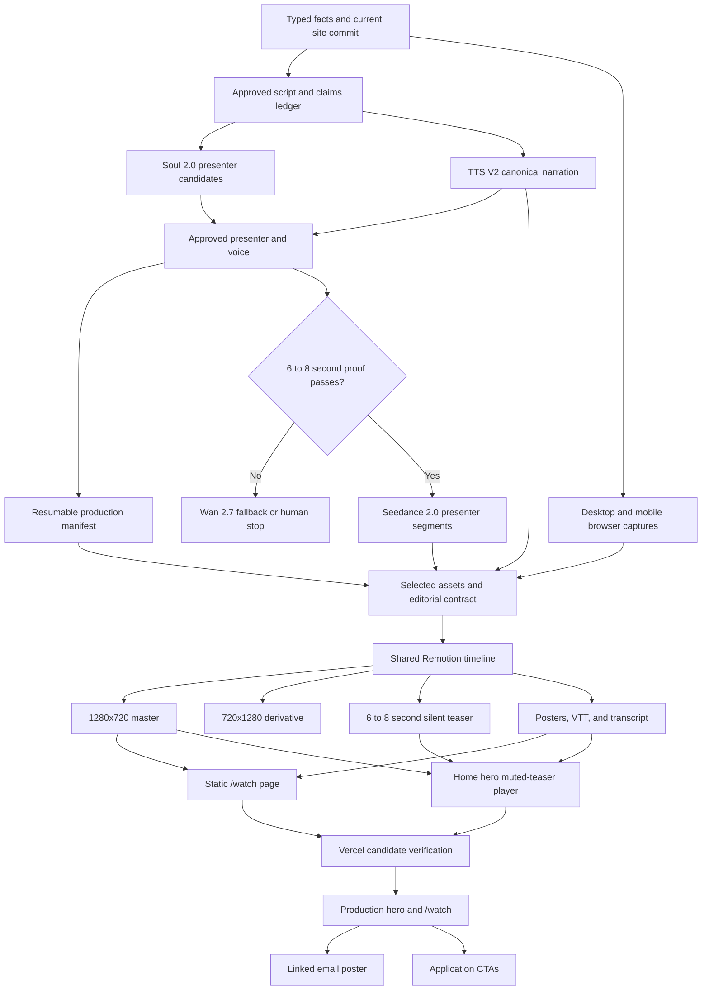
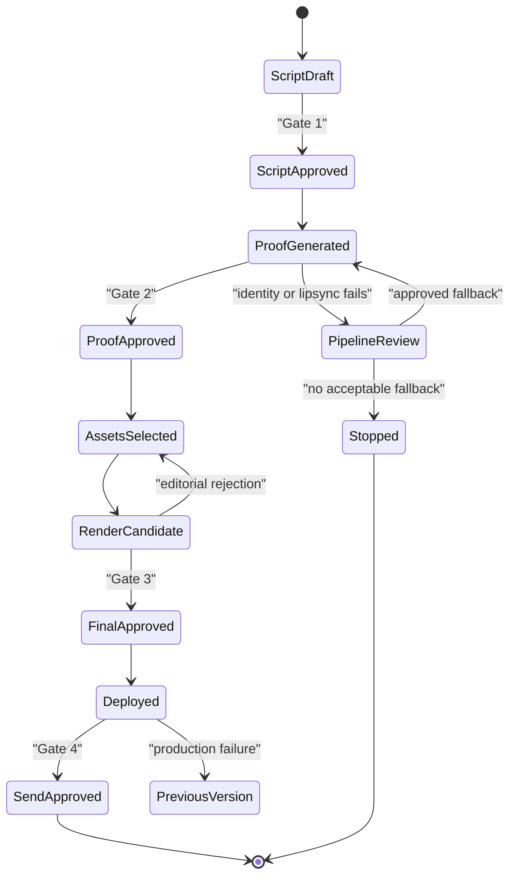

# Langdock Application Video - Plan

**Target repo:** `langdock-application`. This plan lives in the sibling `web-app-resume` repository. Every implementation path below is relative to `langdock-application`.

## Goal Capsule

- **Objective:** Ship a 65 to 75 second English application explainer that combines a disclosed fictional AI guide, real Langdock application walkthroughs, premium Remotion editing, voice, captions, and a clear conversation CTA. Deliver a 16:9 master, a purpose-built 9:16 derivative, a lightweight muted hero teaser that hands off to the full film, a static `/watch` page, and a linked email poster.
- **Product authority:** The confirmed Product Contract below owns audience, message, disclosure, outputs, and approval gates. `PRODUCT.md`, `DESIGN.md`, `src/data/dominik.ts`, `src/data/langdock.ts`, `src/data/systems.ts`, and `src/data/prototypes/registry.ts` own site facts and brand constraints.
- **Execution profile:** Execute U1 through U8 in dependency order. The Higgsfield trial makes U1 through U4 time-sensitive. Prove the voice and presenter pipeline before generating the full asset set. Run a representative Remotion render before the full edit.
- **Stop conditions:** Stop instead of spending credits when an unlimited Higgsfield request is rejected, the one-day entitlement expires, a tool requests a paid path, or an external attempt is active or uncertain. Stop for Dominik's decision if the approved fictional guide cannot maintain acceptable identity or lip synchronization in a complete proof clip. Stop when a spoken fact lacks a current source, when a generated visual could be mistaken for real Langdock UI, or when an action would modify the external Ninety2 source repository.
- **Tail ownership:** Dominik approves the script, presenter and voice, final render, deployment, and send. Implementation ends with production verification and a green pre-send checklist. It does not send the email.

---

## Product Contract

### Summary

Create an email-friendly application film that feels like a direct, modern UGC introduction without pretending that the fictional presenter is Dominik, a customer, or a Langdock employee. The presenter introduces the application in third person. Real browser footage proves the product. Remotion supplies pacing, captions, typography, transitions, sound design, aspect-specific layouts, and deterministic final renders.

The approved horizontal video has two site entry points. The home-page hero presents a muted, captioned 6 to 8 second teaser that autoplays and loops only while visible on capable devices, then restarts the full voiced film from the beginning after a user gesture. Reduced-motion or data-saving visitors receive the static poster instead. The email contains a lightweight linked poster rather than an embedded video or attachment; that link opens a public but unlisted and permanently noindex `/watch` page with the full native player, initially available captions, transcript, chapters, and direct routes into the application. The hero, full player, and watch page resolve one immutable approved media bundle.

### Problem Frame

The application is deeper than a recipient can absorb from an email link without orientation. A conventional screen recording would show features but would not explain why Dominik built them, what his experience contributes, or why he is contacting Langdock. A pure synthetic talking-head clip would feel generic and would weaken the proof already present in the site.

The solution needs human energy, product evidence, and editorial control. It must also survive forwarding, muted playback, mobile playback, a failed media request, and the end of the one-day Higgsfield entitlement.

### Key Decisions

- **Disclosed fictional guide in third person** (session-settled: user-approved - chosen over an undisclosed UGC persona and a synthetic Dominik: it preserves the UGC energy without impersonation or fake testimony). The guide never claims personal experience with Dominik, Langdock, or the application.
- **Real walkthrough as the source of product truth** (session-settled: user-approved - chosen over AI-generated interface footage: recipients must see the application that Dominik built).
- **65 to 75 seconds with a 70-second editorial target** (session-settled: user-approved - chosen over a strict 60-second cut: the narrative needs room for purpose, proof, background, fit, and CTA).
- **One 16:9 master plus one purpose-built 9:16 derivative** (session-settled: user-approved - chosen over one responsive crop: mobile UI and caption layouts need their own composition).
- **Hosted watch experience with a linked email poster** (session-settled: user-approved - chosen over an embedded email video or attachment: playback support and message weight vary across email clients).
- **Muted autoplay teaser in the home hero plus a canonical `/watch` URL** (session-settled: user-approved - short motion makes the introduction immediately discoverable, while user-initiated sound and the watch page preserve browser compatibility, accessibility, performance, and a forward-safe email destination).
- **Higgsfield plugin unlimited path only** (session-settled: user-directed - chosen over CLI or API billing: the active one-day subscription is the authorized generation surface).
- **Remotion as the deterministic finishing layer** (session-settled: user-directed - chosen over a generator-only edit: the final output needs reproducible captions, layouts, timing, exports, and revisions).

### Actors

- A1. **Dominik** creates, reviews, deploys, and sends the application package.
- A2. **Primary recipient** arrives from the email and needs the thesis within the opening seconds.
- A3. **Forwarded reader** reaches the watch page without the original email context.
- A4. **Fictional AI guide** is a disclosed narrative device, not a real person, testimonial, employee, or impersonation.

### Requirements

**Narrative and truth**

- R1. The English video lasts from 65 through 75 seconds inclusive, targets 70 seconds, and covers the application, why Dominik created it, who Dominik is, why he is reaching out, and the request for a conversation.
- R2. The fictional AI guide speaks about Dominik in third person and is disclosed with the exact baseline copy, "Fictional AI guide. Script and application by Dominik Benger."
- R3. The disclosure appears in the opening frame, above the watch-page player, in the email poster context and alt text, and in the closing credit; it does not need to remain on screen for the full runtime.
- R4. Spoken and on-screen factual claims resolve to the current typed data source and a dated claims ledger before generation.
- R5. Generated media never presents invented application screens as real, never resembles a known Langdock employee, and never states or implies a testimonial.

**Production and media**

- R6. Use the installed Higgsfield ChatGPT/Codex plugin with `use_unlim:true` for every generation; stop without paid fallback if unlimited generation is unavailable.
- R7. One approved presenter identity and one approved narration voice remain consistent across the final edit.
- R8. A complete 6 to 8 second proof clip must pass identity, speech, lip synchronization, disclosure, and mobile-playback review before full presenter generation begins.
- R9. Real site footage carries every interface and product claim, using separate desktop and mobile captures for the 16:9 and 9:16 compositions.
- R10. Remotion produces a 1280x720 30 fps H.264/AAC master, a 720x1280 30 fps H.264/AAC derivative, and a 6 to 8 second 960x540 H.264 hero teaser with no audio stream from one shared, reviewed timing and content manifest.
- R11. Both final videos include reviewed burned-in captions; the muted teaser includes reviewed burned-in disclosure and message text derived from the same approved cues; the watch page also provides an English WebVTT track and a visible transcript generated from the same approved cue source.
- R12. Sound remains voice-led and restrained. Any music must have a recorded license; otherwise use narration, silence, and licensed or package-provided interface accents only.

**Watch and email experience**

- R13. `/watch` is static, public, unlisted from global navigation, and permanently noindex; direct files under `/video/*` also return `X-Robots-Tag: noindex, nofollow`.
- R14. The watch page uses a native `<video>` with controls, `playsInline`, a poster, reserved aspect ratio, metadata-only preload, English captions, a transcript, and an honest playback-failure fallback. The home hero replaces its current right-side static visual with a muted, captioned 6 to 8 second teaser that uses `autoplay`, `muted`, `playsInline`, and `loop`, runs only while substantially visible, and pauses offscreen. It preserves the operating-structure artwork in the poster treatment, suppresses autoplay and the teaser request for reduced-motion or data-saving visitors, restarts the full horizontal film from the beginning with sound only after a user gesture, and links to `/watch` as "Watch with transcript and chapters."
- R15. Chapters seek without autoplay and expose keyboard-operable links to the relevant moment and application route.
- R16. The primary CTA is "Explore the application"; supporting chapter links target `/prototypes`, `/systems`, and `/about`.
- R17. The email kit uses a compressed linked poster with meaningful alt text and a plain-text `/watch` link fallback; it does not embed or attach the MP4. The homepage and email must never expose divergent render versions.

**Governance and delivery**

- R18. Four human gates block downstream work: script and claims approval; avatar, voice, and proof-clip approval; final render and watch-page approval; deployment and send approval.
- R19. Every generated or captured production asset records source model or route, job or capture ID, prompt or route, generation or capture date, deployed commit when applicable, viewport, approval state, and file hash.
- R20. The final watch experience contains no recipient-specific personal data and remains understandable when forwarded without the original email.
- R21. Versioned final media supports rollback to the previously approved render without changing the stable `/watch` URL.
- R22. The watch page, hero teaser, and both full compositions preserve the repository's no-em-dash copy rule, masked figures, authorship, accessibility, and responsive design requirements.
- R23. Every external generation attempt has a durable lifecycle and one active writer; an active or uncertain attempt blocks resubmission until its provider state is reconciled or Dominik directs recovery.
- R24. Published media filenames are immutable, and Gate 4 requires the reviewed Vercel candidate and production deployment to match on commit, media identity, byte-range delivery, MIME type, cache behavior, and noindex headers.

### Key Flows

- F1. **Script and identity approval**
  - **Trigger:** Dominik starts production while the unlimited entitlement is active.
  - **Actors:** A1, A4
  - **Steps:** Refresh facts; lock the claims ledger; approve the 65 to 75 second script; generate presenter still candidates; generate voice candidates; approve one identity and voice.
  - **Outcome:** Generation can proceed without changing the factual or creative contract.
  - **Covers:** R1 through R8, R18, R19, R23

- F2. **Proof-first generation**
  - **Trigger:** The script, presenter still, and voice are approved.
  - **Actors:** A1, A4
  - **Steps:** Produce canonical narration; cut one 6 to 8 second audio segment; generate one presenter proof; review at normal mobile speed; accept Seedance 2.0 or test the Wan 2.7 fallback.
  - **Outcome:** Full generation starts only after the riskiest pipeline is proven.
  - **Covers:** R6 through R8, R18, R19, R23

- F3. **Production and editorial assembly**
  - **Trigger:** The proof clip passes.
  - **Actors:** A1, A4
  - **Steps:** Generate presenter segments; capture real desktop and mobile routes; register selected assets; assemble a representative Remotion sequence; finish both full compositions and the hero teaser; render captions, posters, and media.
  - **Outcome:** Two technically valid, editorially matched full video outputs and their bounded silent teaser are ready for review.
  - **Covers:** R9 through R12, R18, R19, R22, R23

- F4. **Video-entry-to-application journey**
  - **Trigger:** A2 or A3 encounters the home hero or clicks the linked email poster.
  - **Actors:** A2, A3
  - **Steps:** On the homepage, see the muted disclosed teaser or its accessible poster fallback, activate it to restart the full film with sound, or follow the transcript-and-chapters link; from email, load `/watch` directly; play with captions or read the transcript; use a chapter; follow the application CTA.
  - **Outcome:** The reader understands the application and can inspect the evidence without Dominik present.
  - **Covers:** R13 through R17, R20, R22, R24

- F5. **Failure, expiry, and rollback**
  - **Trigger:** Unlimited generation rejects, media playback fails, factual review fails, or a deployed render must be withdrawn.
  - **Actors:** A1, A2, A3
  - **Steps:** Stop generation before credits; reconcile any active or uncertain attempt; retain immutable approved artifacts; show transcript and CTA when playback fails; repoint the active version to the previous approved media when rollback is required.
  - **Outcome:** No unauthorized spend occurs and the outreach path remains usable.
  - **Covers:** R6, R14, R18, R21, R23, R24

### Acceptance Examples

- AE1. **Primary recipient path**
  - **Covers:** R1 through R5, R13 through R17
  - **Given:** A recipient opens the email with remote images disabled.
  - **When:** They read the alt text or plain link and open `/watch`.
  - **Then:** They see the disclosure, can play the captioned video, understand the five-part story, and reach the application.

- AE2. **Forwarded-reader path**
  - **Covers:** R1, R2, R16, R20
  - **Given:** A reader receives only the `/watch` URL.
  - **When:** They open it without the original email.
  - **Then:** The page identifies the application, Dominik, the fictional guide, and the conversation CTA without personal recipient context.

- AE3. **Playback failure**
  - **Covers:** R14 through R17
  - **Given:** The browser cannot decode or fetch the MP4.
  - **When:** The native player reports failure.
  - **Then:** The transcript, chapters as application links, and primary CTA remain visible and operable.

- AE4. **Unlimited entitlement failure**
  - **Covers:** R6, R18, R19
  - **Given:** Higgsfield rejects `use_unlim:true` or the entitlement has expired.
  - **When:** The next generation is attempted.
  - **Then:** Production stops, no paid request is submitted, and the asset manifest records the failed attempt without selecting an output.

- AE5. **Lip-synchronization fallback**
  - **Covers:** R7, R8
  - **Given:** The Seedance proof has visible mouth-to-voice mismatch at normal phone playback.
  - **When:** Dominik rejects the proof.
  - **Then:** The same approved still and audio are tested with Wan 2.7; if that also fails, the plan returns to Dominik before the full batch rather than inventing a new presenter strategy.

- AE6. **Accessible chapter behavior**
  - **Covers:** R14, R15, R22
  - **Given:** A keyboard user or reduced-motion user opens `/watch`.
  - **When:** They activate a chapter.
  - **Then:** Focus remains predictable, the player seeks without forced autoplay, and no decorative motion is required to understand the state.

- AE7. **Interrupted generation resumes safely**
  - **Covers:** R6, R18, R19, R23
  - **Given:** Execution stops after local intent is recorded, after provider acceptance, or after provider success but before download.
  - **When:** A fresh agent resumes from repository artifacts.
  - **Then:** It identifies the existing attempt, does not submit a duplicate, and reaches one downloaded hash-verified asset or an explicit human recovery decision.

- AE8. **Candidate-to-production delivery**
  - **Covers:** R13, R14, R21, R24
  - **Given:** A versioned media candidate has passed local verification.
  - **When:** The same commit is verified on a Vercel candidate and promoted to production.
  - **Then:** Anonymous full and range responses preserve the approved media identity, MIME type, cache contract, and noindex headers while stable `/watch` resolves to that version.

- AE9. **Home-hero video entry**
  - **Covers:** R3, R13 through R17, R20, R22, R24
  - **Given:** A reader opens the homepage on a cold desktop or mobile session.
  - **When:** The hero becomes visible and the reader has not activated the full video.
  - **Then:** A bounded muted teaser autoplays and loops only while substantially visible, the approved poster and disclosure preserve stable dimensions, the existing operating-structure visual remains part of the treatment, and activation restarts the approved horizontal render from the beginning with sound. With reduced motion or data saving enabled, no teaser is requested and the same control remains available as a poster button. The reader can also open `/watch` for the transcript and chapters.

### Success Criteria

- The final master and derivative each satisfy R1, R10, and R11 in automated media inspection.
- A cold mobile visit requests at most the bounded silent teaser; reduced-motion or data-saving visits request no teaser; user activation loads only the approved horizontal asset, and `/watch` never downloads the vertical derivative.
- The full narrative is understandable with audio muted and with video playback unavailable.
- Every spoken number and Langdock claim has a current source in the approved claims ledger.
- No Higgsfield credits are consumed during the unlimited production run.
- Production browser QA passes at 390px, 768px, and 1440px with zero console errors caused by the watch page.
- A fresh session can derive the next permitted production action from repository artifacts without relying on conversation history.
- Anonymous production byte-range requests and a previously visited browser both resolve the approved immutable media version without mixed-version state.

### Scope Boundaries

**Included**

- Script, claims ledger, fictional presenter, narration, presenter footage, real application footage, Remotion project, two final aspect ratios, captions, posters, home-hero player, `/watch`, email copy assets, QA, deployment, and rollback instructions.

**Deferred**

- Additional languages, personalized recipient variants, analytics instrumentation, adaptive-bitrate streaming, and social-platform distribution cuts.
- A licensed music bed if no suitable license is already available during execution.

**Outside this product's identity**

- Synthetic impersonation of Dominik or a Langdock employee.
- Fake customer, employee, or recruiter testimonials.
- AI-generated screens presented as the real application.
- Higgsfield CLI or API billing, Marketing Studio credits, automatic paid fallback, or dependency on an unavailable "Higgsfield Computer" surface.
- Modifications to the external Ninety2 source repository.
- Sending the final outreach email.

**Agent-access boundary**

- **Now:** Entitlement preflight, generation submission and polling, durable download and hashing, capture registration, manifest validation, approval-packet preparation, rendering, technical verification, rollback preparation, and production inspection.
- **Later:** A hosted job coordinator, background worker, webhook reconciliation, or production dashboard.
- **Human-only:** Marking Gates 1 through 4 approved, accepting paid generation, changing billing or subscription state, guessing through an uncertain attempt, overriding disclosure or source failures, authorizing publication, and sending the outreach email.

### Dependencies and Assumptions

- The one-day Higgsfield unlimited entitlement remains active only until the account-displayed expiry. Account UI and an accepted diagnostic job show MCP availability, while the balance endpoint may report stale unlimited metadata.
- Active unlimited models include GPT Image 2, Soul 2.0, Seedance 2.0 variants, Wan 2.7, Kling 3.0, Text to Speech V2, and Seed Audio. Every production request still uses `use_unlim:true`.
- The trial limits Seedance output to 720p and up to 8 seconds, so the final compositions use 720p and intercut short presenter segments.
- The installed plugin does not expose Higgsfield Computer. Marketing Studio did not appear in the unlimited model list and quoted more credits than the account balance, so neither is a dependency.
- The target repository is private, clean on `main`, and synchronized with `origin/main` at `746499d` when this plan was authored.
- The final media can meet the quality and size budgets in KTD8 without adaptive streaming.
- Context7 documentation access was unavailable because its OAuth token had expired. Current official Remotion, Next.js, npm, Mailchimp, Higgsfield, EU, and FTC sources were used instead.

### Sources and Research

**Repository authorities**

- `AGENTS.md`, `PRODUCT.md`, and `DESIGN.md`
- `src/data/dominik.ts`, `src/data/langdock.ts`, `src/data/systems.ts`, and `src/data/prototypes/registry.ts`
- `src/components/home/Hero.tsx`, `src/components/home/AskSection.tsx`, and `src/app/about/page.tsx`
- `src/app/layout.tsx`, `src/components/layout/SiteFooter.tsx`, and `src/components/concierge/FloatingConcierge.tsx`
- `docs/browser-smoke.md` and `docs/pre-send-checklist.md`
- Sibling plan `docs/plans/2026-07-22-001-feat-langdock-application-site-plan.md`; current typed data supersedes its old prototype count and retired prototype names.

**External authorities**

- [Higgsfield one-day unlimited trial](https://higgsfield.ai/blog/free-unlimited-ai-video-generation-2026)
- [Higgsfield terms of use](https://higgsfield.ai/terms-of-use-agreement)
- [EU guidelines on AI-generated content transparency](https://digital-strategy.ec.europa.eu/en/policies/guidelines-transparency-ai-generated-content)
- [FTC reviews and testimonials rule FAQ](https://www.ftc.gov/business-guidance/resources/consumer-reviews-testimonials-rule-questions-answers)
- [Remotion Player](https://www.remotion.dev/docs/player), [captions](https://www.remotion.dev/docs/captions), [transitions](https://www.remotion.dev/docs/transitions/transitionseries), [renderMedia](https://www.remotion.dev/docs/renderer/render-media), [renderStill](https://www.remotion.dev/docs/renderer/render-still), and [media](https://www.remotion.dev/docs/media)
- [Next.js video guide](https://nextjs.org/docs/app/guides/videos)
- [Mailchimp video-in-email guidance](https://mailchimp.com/help/add-video-to-an-email/)
- [Remotion npm versions](https://www.npmjs.com/package/remotion?activeTab=versions)
- [Vercel Protection Bypass for Automation](https://vercel.com/docs/deployment-protection/methods-to-bypass-deployment-protection/protection-bypass-automation) and [`vercel curl`](https://vercel.com/docs/cli/curl)

---

## Planning Contract

### Approach

Treat this as a small, governed media product inside the application repository. Keep Higgsfield as an offline source generator. Keep the Remotion workspace isolated under `video/`. Keep the watch page inside the existing static App Router site. Share approved editorial data between the site and the video without adding Higgsfield or Remotion to the production runtime.

Lock the story and claims before the one-day generation sprint. Generate one voice, one still identity, and one complete presenter proof. Only then generate the remaining short presenter segments. Capture real site routes at desktop and mobile viewports. Register the selected assets and assemble one representative sequence before the full edit. Render versioned static media, build the watch page, verify production, and retain the previous approved render for rollback.

### Key Technical Decisions

- KTD1. **Use primitive Higgsfield MCP generations, not Marketing Studio or Computer.** The plugin exposes unlimited-capable image, video, and speech models but does not expose Computer, and Marketing Studio is not proven unlimited. This implements R6 without a paid dependency.

- KTD2. **Use Soul 2.0, Text to Speech V2, and Seedance 2.0 as the primary presenter chain.** Soul 2.0 supplies identity candidates, Text to Speech V2 supplies the canonical narration, and Seedance 2.0 receives the approved still and audio reference. Wan 2.7 is the only planned lip-synchronization fallback. GPT Image 2 is limited to posters or non-UI editorial graphics. Kling 3.0 and Seedance Mini are limited to non-speaking b-roll or recovery shots. This implements R7 and R8.

- KTD3. **Make the approved narration audio canonical and validate its exact duration before video generation.** Immediately after Text to Speech V2 produces the approved narration, measure its decoded duration and record the hash and millisecond duration in the manifest. A result outside 65 to 75 seconds, or inconsistent with the editorial contract, returns to script approval before any proof or presenter-video request. Presenter footage follows pre-cut narration segments with generated audio disabled where the model permits it. Remotion aligns every scene and caption to this source. Do not concatenate independently generated speaking audio. This prevents voice and timing drift and implements R1, R7, R10, and R11.

- KTD4. **Use real browser captures for every product claim.** Capture `/`, `/prototypes?p=enterprise-ai-adoption-blueprint`, `/systems`, and `/about` against a recorded commit. Use 1440px desktop footage in the horizontal composition and 390px mobile footage in the vertical composition. Generated footage is illustrative presenter material only. This implements R4, R5, and R9.

- KTD5. **Create an enforceably isolated `video/` production workspace with exact package alignment.** Resolve the current stable Remotion version at execution, pin the identical exact version for `remotion` and every `@remotion/*` package, and commit the lockfile. Exclude `video/` from root TypeScript, Vitest, and ESLint discovery. Keep packages out of the Next.js runtime dependency graph. A clean root-only install must lint, test, and build without installing video packages. Record the new production dependency rationale in the commit message as required by `AGENTS.md`.

- KTD6. **Drive both consumers from one package-neutral editorial contract.** `content/outreach-video.ts` is dependency-free and versioned. It owns reviewed narrative copy, disclosure, transcript, chapter labels, CTA labels, claims links, asset identifiers, canonical timing in milliseconds, and active media metadata. `src/data/outreach-video.ts` and `video/src/data/editorial.ts` adapt it one way into Next.js and Remotion. Remotion derives 30 fps frames from canonical time. Tests validate contract version, cue ordering, duration, asset identifiers, and consumer parity. This implements R1 through R4, R10, R11, and R16 without upward imports from `video/` into application code.

- KTD7. **Use one native-player component across the hero and static watch route.** Do not ship Remotion Studio, `@remotion/player`, or a custom playback runtime. `ApplicationVideo` owns the native `<video>`, captions, error behavior, and media identity. The `/watch` variant renders immediately with metadata-only preload and the complete transcript and chapter experience. The home-hero variant reserves the poster dimensions, then conditionally mounts the silent teaser when the hero is substantially visible and neither `prefers-reduced-motion` nor a data-saving signal applies; it pauses when offscreen. Its accessible activation control replaces the teaser with the full horizontal source, seeks to zero, enables sound, and calls `play()` within the same user gesture. It provides a separate `/watch` link. This preserves static rendering, bounded motion cost, built-in controls, and one approved playback contract. Hide the floating concierge on `/watch` if its mobile launcher overlaps media controls. This implements R13 through R17.

- KTD8. **Publish bounded, immutable static assets through Vercel.** Keep the horizontal MP4 at or below 25 MB, the vertical MP4 at or below 20 MB, the silent hero teaser at or below 2 MB, each poster at or below 350 KB, and the VTT at or below 100 KB. Keep all deployed files under `public/video/` at or below 100 MB while retaining the current version and the previous approved version when one exists. Keep total tracked production media at or below 250 MB. Published version names are write-once; a revision creates `v002` rather than overwriting `v001`. The watch page loads only the horizontal asset; an unactivated homepage loads at most the teaser and never the full master. Raw, rejected, and selected source media stays outside the Vercel artifact through `.vercelignore`. If the quality and size budgets cannot both pass, stop for a hosting decision.

- KTD9. **Use an executable production-state module and manifest as the authoritative resume and approval contract.** `video/production/state.mjs` is the sole owner of attempt transitions, optimistic revision checks, approval invalidation, and allowed-next-action derivation; `video/production/state.test.mjs` proves its interruption and concurrency behavior without requiring the Remotion workspace. `video/production/manifest.json` records a run ID, monotonic revision, current stage, next permitted action, one active attempt, exact model settings and reference hashes, entitlement snapshot, provider job ID, terminal result, downloaded-file hash, selection state, prompt version, source commit, approvals, and dependency hashes. Preserve attempt and approval history. Update the manifest atomically through the module; one writer owns an active attempt. A stale writer or uncertain attempt blocks resubmission until reconciliation. A provider success is incomplete until the asset is quarantined, validated, hash-verified, and promoted. Signed URLs and credentials are never persisted. This implements R18, R19, R21, and R23.

- KTD10. **Treat the presenter as a narrow video-only design exception.** Update `DESIGN.md` to permit a disclosed fictional presenter in outreach video while preserving the existing no-people rule for `NarrativeImage` and site illustration. The presenter uses a neutral setting, avoids Langdock employee resemblance, and never appears as product evidence. This implements R2, R3, R5, and R22.

- KTD11. **Use restrained, licensed sound design.** The baseline has no music dependency. Use the approved narration, intentional silence, and package-provided or separately licensed low-volume UI accents. Record any external license in the production manifest. This implements R12.

- KTD12. **Keep `/watch` unlisted and exclude raw media from indexing.** Do not add the route to `SiteNav`. Inherit page-level noindex metadata and add `X-Robots-Tag: noindex, nofollow` for `/video/:path*` through `next.config.ts` so Vercel can retain static range requests. This implements R13 and R20.

- KTD13. **Invalidate approvals when their inputs change.** Every approval binds the exact hashes of its script, claims, portrait, voice configuration, narration, proof, selected sources, render, captions, posters, transcript, watch-page bundle, and source commit as applicable. A dependency change invalidates that gate and every downstream gate. Agents prepare approval packets but never infer approval from silence, file presence, or a request to continue. This implements R18, R19, R21, and R23.

- KTD14. **Enforce browser-delivery media compatibility.** Delivery MP4s use fast-start metadata with `moov` before `mdat`, `yuv420p`, Safari-compatible H.264 Main or High profile at level 4.0 or lower, AAC-LC, and a keyframe interval no greater than two seconds. Chapter seeks must land within one second. Metadata preload must stay below 1 MB before play during the production browser check. This implements R10, R14, R15, and R24.

- KTD15. **Promote media atomically through a Vercel candidate.** Validate candidate hashes, duration, dimensions, audio, VTT, and KTD14 compatibility; copy immutable versioned outputs; then change the active watch version in one commit. Verify that commit on a Vercel candidate before production. When Deployment Protection is enabled, use Vercel's official automation-bypass header and browser-cookie flow or `vercel curl`; keep the bypass secret outside the repository and logs, use a dedicated value, and revoke it after candidate verification. Production must match its commit, deployment artifact, and media contract. Rollback repoints the stable page to the previous immutable version when one exists and redeploys; the initial release rolls back to the last known-good deployment with the transcript-and-CTA fallback. Rollback never overwrites or deletes a cached filename. This implements R21 and R24.

- KTD16. **Quarantine and validate every provider download before selection or decoding in the editorial workspace.** Download Higgsfield results only into ignored `video/.artifacts/quarantine/` paths with provider filenames discarded. Enforce an allowlist for file signature, container, MIME type, size, stream count, duration, and dimensions; decode with bounded tooling, strip unnecessary container, provider, and EXIF metadata, compute the content hash, and atomically promote only a passing file into `video/public/media/selected/`. Quarantine paths are excluded from imports, Remotion inputs, Git, and Vercel. A failed or ambiguous validation remains quarantined and blocks selection. This implements R19 and R23.

### High-Level Technical Design



The media workspace remains build-time only. The Next.js application consumes approved static outputs and typed watch-page data. No Higgsfield credential, Remotion renderer, or generator package enters the deployed runtime.



### Editorial Structure

The exact words remain subject to Gate 1, but the timing contract is fixed:

| Segment | Target | Narrative job | Visual emphasis |
|---|---:|---|---|
| Hook and disclosure | 0:00 to 0:06 | Identify the fictional guide and reject the cover-letter frame | Presenter plus application title |
| Why this exists | 0:06 to 0:18 | Explain why Dominik built a working application | Home and prototype console |
| What the application proves | 0:18 to 0:39 | Show authored prototypes and agentic systems | Real desktop or mobile walkthrough |
| Who Dominik is | 0:39 to 0:53 | Connect Google adoption scale and independent systems work | Presenter intercut with sourced proof |
| Why Langdock and why now | 0:53 to 1:05 | State the adoption and systems fit | Systems, About, and ask |
| Invitation and close | 1:05 to 1:10 | Ask for a conversation and invite exploration | Presenter, disclosure, CTA |

The presenter should occupy about one third of the runtime. The product remains the visual lead. The 9:16 composition uses the same narration and cue timing but chooses mobile captures, shorter line lengths, larger captions, and vertically safe presenter framing.

### Output Structure

```text
.
├── .vercelignore
├── DESIGN.md
├── content/
│   └── outreach-video.ts
├── docs/
│   ├── browser-smoke.md
│   ├── pre-send-checklist.md
│   └── video-production.md
├── next.config.ts
├── package.json
├── public/
│   └── video/
│       ├── langdock-application-email-poster-v001.jpg
│       ├── langdock-application-hero-teaser-v001.mp4
│       ├── langdock-application-intro-v001.mp4
│       ├── langdock-application-intro-v001.vtt
│       ├── langdock-application-intro-vertical-v001.mp4
│       └── langdock-application-poster-v001.jpg
├── src/
│   ├── app/
│   │   ├── metadata.test.ts
│   │   └── watch/
│   │       ├── layout.tsx
│   │       ├── page.test.tsx
│   │       └── page.tsx
│   ├── components/
│   │   ├── concierge/
│   │   │   ├── FloatingConcierge.tsx
│   │   │   └── concierge.test.tsx
│   │   └── video/
│   │       ├── ApplicationVideo.test.tsx
│   │       └── ApplicationVideo.tsx
│   └── data/
│       ├── copy-gates.test.ts
│       ├── outreach-video-contract.test.ts
│       └── outreach-video.ts
└── video/
    ├── .artifacts/
    ├── package-lock.json
    ├── package.json
    ├── production/
    │   ├── claims.json
    │   ├── manifest.json
    │   ├── state.mjs
    │   └── state.test.mjs
    ├── public/
    │   └── media/
    │       └── selected/
    ├── remotion.config.ts
    ├── scripts/
    │   ├── render.ts
    │   └── verify-media.mjs
    ├── src/
    │   ├── Root.tsx
    │   ├── compositions/
    │   │   ├── ApplicationIntro.tsx
    │   │   ├── ApplicationIntroTeaser.tsx
    │   │   └── ApplicationIntroVertical.tsx
    │   ├── data/
    │   │   ├── editorial.ts
    │   │   ├── timeline.test.ts
    │   │   └── timeline.ts
    │   ├── index.ts
    │   ├── scenes/
    │   └── theme/
    └── tsconfig.json
```

`.artifacts/`, rejected generations, uncompressed captures, and default render output remain gitignored. `video/public/media/selected/` contains only the bounded source files needed for deterministic re-rendering. `public/video/` contains only approved delivery assets.

### Sequencing and Approval Gates

1. U1 locks narrative data, claims, the design exception, the resumable manifest, and Gate 1.
2. U3 immediately runs the avatar, voice, and complete proof-clip gate while unlimited generation is active.
3. U4 completes selected presenter generation and browser capture before the entitlement expires.
4. U2 runs in parallel after U1 and must join U4 before U5; it cannot block the trial-critical U1 to U3 to U4 path.
5. U5 assembles and renders both full aspect ratios and the silent hero teaser from the approved inputs.
6. U6 validates media, captions, claims, compatibility, and local package integrity.
7. U7 builds and locally verifies the shared home-hero, watch, and email-link experience, then completes Gate 3 against the bound bundle.
8. U8 verifies the same commit on a Vercel candidate, records publish authorization, promotes to production, verifies delivery, and records send authorization without sending.

The critical path is U1 to U3 to U4 to U5. U2 joins before U5. U3 prevents waste. U6 prevents a flawed candidate from reaching the watch page. U7 completes Gate 3 only after the page bundle exists.

### System-Wide Impact

- `DESIGN.md` gains a video-only exception for a fictional presenter. Existing page illustration rules remain unchanged.
- `src/data/copy-gates.test.ts` must inspect the new outreach copy module.
- The existing home hero replaces its right-side `NarrativeImage` presentation with a muted-teaser player while retaining the operating-structure artwork in the poster treatment. On mobile the player stacks without changing the content order or introducing horizontal overflow. Reduced-motion and data-saving visitors retain the static poster.
- Root layout chrome applies automatically to `/watch`. The floating concierge may require a route exclusion to avoid mobile control overlap. `ConsoleProvider` remains mounted.
- `next.config.ts` gains raw media indexing headers. This must preserve CDN range requests.
- Vercel deployment size grows by bounded approved media. No generator or renderer enters the production bundle.
- The watch route stays out of global navigation to preserve the carefully tuned 390px header.
- Repository artifacts become the shared production workspace. A fresh agent must be able to resume from the manifest and neutral editorial contract without chat history.
- Gate 4 contains two human decisions: publish authorization before production and send authorization after production verification. The gate completes only when both exist.

### Risks and Mitigations

| Risk | Impact | Mitigation |
|---|---|---|
| One-day entitlement expires before selection | Presenter assets cannot be regenerated without a new decision | Lock script first, prove one clip, then generate selected takes in priority order with `use_unlim:true` |
| Unlimited metadata is stale or contradictory | Accidental paid request | Treat request acceptance with unchanged credits as proof; stop on any unlimited rejection |
| Execution stops around an external submission | A duplicate job spends time or loses provenance | Record intent before submission, attach the provider job immediately, reconcile uncertain attempts, and allow one active writer |
| Synthetic mouth movement fails | UGC presenter feels artificial | Gate one full proof; use Wan 2.7 once; stop for human direction if both fail |
| Presenter identity drifts | Video loses credibility | Reuse one approved portrait and canonical audio; keep clips short; record prompts and references |
| Narration duration changes after approval | Captions and scene timing drift | Approve canonical audio before final timing and drive all cues from that file |
| Current site facts drift from the earlier plan | Spoken claims become stale | Resolve claims from current typed modules and capture commit, not the July 22 plan |
| Generated presenter conflicts with no-people design rule | Active design authority becomes contradictory | Add the narrow KTD10 exception before production |
| Vertical crop makes UI illegible | Derivative fails on phones | Capture the real 390px application and use a separate 9:16 composition |
| Static MP4 harms mobile load | Recipient abandons before playback | At-most-2 MB visible-only teaser, static reduced-motion and data-saving fallback, metadata-only full-player preload, no vertical download, and KTD8 size caps |
| Published page and media versions drift | Readers receive mixed or missing assets | Use the KTD15 atomic promotion, immutable names, parity tests, and a retained previous version |
| Media decodes locally but fails at the edge | Safari playback or chapter seeking breaks | Enforce KTD14, candidate range checks, MIME checks, and anonymous production playback |
| Provider output is malformed or carries unnecessary metadata | Local parsers, tracked assets, or deployment inherit untrusted content | Quarantine by default, validate under KTD16, strip metadata, and promote only a hash-verified passing file |
| Direct media becomes indexed | Noindex promise is incomplete | Add and production-test `X-Robots-Tag` for `/video/:path*` |
| Protected Vercel preview blocks candidate QA | Candidate checks are skipped or accidentally run only after production | Use Vercel's dedicated automation-bypass flow with an out-of-repository secret, then revoke it after verification |
| External font or sound licensing is unclear | Distribution risk | Use a documented OFL font path and package-provided or recorded-license audio only |
| Context7 remains unavailable | Dependency details may drift | Resolve current official docs and pin exact versions at U2 execution |

---

## Implementation Units

### U1. Lock the creative brief, facts, disclosure, and production governance

- **Goal:** Create the approved source of truth before any full generation.
- **Requirements:** R1 through R8, R18 through R23
- **Dependencies:** None
- **Files:**
  - `DESIGN.md`
  - `content/outreach-video.ts`
  - `src/data/outreach-video.ts`
  - `src/data/outreach-video-contract.test.ts`
  - `src/data/copy-gates.test.ts`
  - `video/production/claims.json`
  - `video/production/manifest.json`
  - `video/production/state.mjs`
  - `video/production/state.test.mjs`
  - `docs/video-production.md`
  - `.gitignore`
- **Approach:**
  - Refresh all prospective spoken facts from `src/data/dominik.ts`, `src/data/langdock.ts`, `src/data/systems.ts`, and `src/data/prototypes/registry.ts`.
  - Define the versioned, dependency-free editorial contract in `content/outreach-video.ts`; keep the Next adapter in `src/data/outreach-video.ts`.
  - Add the neutral contract and adapter to the copy-gate test map so the no-em-dash and AI-tell rules cover them.
  - Add the KTD10 design exception without weakening the no-people rule for existing generated page imagery.
  - Implement the claims manifest and the pure KTD9 production-state module. Route every revision, attempt transition, active-writer check, approval invalidation, and allowed-next-action derivation through that module. Store no credential, private account response, signed URL, or recipient-specific personal data.
  - Use `prepared`, `accepted`, `running`, `succeeded`, `downloaded`, `hashed`, `selected`, `rejected`, and `failed` as attempt states. Treat a prepared attempt without a provider job ID as uncertain until reconciled.
  - Record the four approvals as named manifest gates with timestamp, reviewer, dependency hashes, and invalidation rules under KTD13.
- **Test Scenarios:**
  - `src/data/copy-gates.test.ts` rejects an em dash or prohibited AI-tell phrase in narration or watch copy.
  - A data-contract test rejects missing disclosure placements, source IDs, chapter routes, or a target duration outside 65 to 75 seconds.
  - Claims validation rejects a spoken number without a current source path and snapshot date.
  - Manifest validation rejects a selected asset without provenance, hash, approval state, or `use_unlim:true`.
  - `video/production/state.test.mjs` covers interruption after intent, acceptance, provider success, quarantine, and validation; each state derives one safe next action and blocks duplicate submission.
  - State-module concurrency tests reject a stale manifest revision and a second active attempt.
  - State-module approval tests invalidate a gate and downstream gates after any dependency hash changes.
- **Verification:**
  - Dominik completes Gate 1 against the rendered script, claims table, disclosure, and 70-second timing estimate.
  - `npm test -- src/data/copy-gates.test.ts`
  - `node --test video/production/state.test.mjs`
  - Validate both JSON manifests against their checked schema or typed validator.

### U2. Scaffold the isolated Remotion workspace and representative render

- **Goal:** Prove deterministic video assembly before full editorial assembly.
- **Requirements:** R10 through R12, R19, R21
- **Dependencies:** U1; runs in parallel with U3 and U4, then joins before U5
- **Files:**
  - `package.json`
  - `tsconfig.json`
  - `vitest.config.ts`
  - `eslint.config.mjs`
  - `video/package.json`
  - `video/package-lock.json`
  - `video/tsconfig.json`
  - `video/remotion.config.ts`
  - `video/src/index.ts`
  - `video/src/Root.tsx`
  - `video/src/data/timeline.ts`
  - `video/src/data/timeline.test.ts`
  - `video/src/data/editorial.ts`
  - `video/src/compositions/ApplicationIntro.tsx`
  - `video/src/compositions/ApplicationIntroTeaser.tsx`
  - `video/src/compositions/ApplicationIntroVertical.tsx`
  - `video/src/theme/*`
  - `video/scripts/render.ts`
  - `video/scripts/verify-media.mjs`
- **Approach:**
  - Resolve the current stable Remotion release from official docs and npm. Pin the same exact version for `remotion`, `@remotion/cli`, `@remotion/renderer`, `@remotion/media`, `@remotion/captions`, and `@remotion/transitions`; add `@remotion/sfx` only if U5 uses it.
  - Exclude `video/` from root TypeScript, Vitest, and ESLint discovery. Add root convenience scripts that call `npm --prefix video ...` without turning the main repository into an npm workspace.
  - Load an OFL-compliant Instrument Sans asset through a documented video-only path. Mirror the existing semantic media palette through a tested theme module derived from `src/lib/og.ts` or the canonical CSS tokens.
  - Consume the package-neutral editorial contract through `video/src/data/editorial.ts`. Register the two fixed full compositions and one fixed silent teaser composition at 30 fps, derive frames from canonical milliseconds, and use explicit `TransitionSeries.Sequence` components.
  - Implement a 10 to 15 second representative sequence with placeholder narration, one mock presenter asset, one mock desktop capture, captions, a transition, and a poster frame.
  - Render through `renderMedia()` and `renderStill()` rather than relying on Studio output.
- **Test Scenarios:**
  - `video/src/data/timeline.test.ts` rejects gaps, negative durations, caption cues outside their scene, and total duration outside R1.
  - Composition tests assert 1280x720, 720x1280, and the 6 to 8 second 960x540 silent teaser at 30 fps.
  - Theme tests compare the video palette to the chosen canonical media tokens.
  - Contract parity tests prove the Next and Remotion adapters consume the same version, cues, transcript, chapters, CTAs, and active asset identifiers.
  - A representative H.264 render contains one AAC audio stream, the expected frame size, and no missing asset warnings.
- **Verification:**
  - `npm --prefix video test`
  - `npm --prefix video run typecheck`
  - `npm --prefix video run render:proof`
  - `npm --prefix video run verify -- video/out/proof.mp4`
  - A clean root-only install, lint, test, and build succeeds without installing `video/` dependencies.

### U3. Select the fictional guide and voice, then pass the proof-clip gate

- **Goal:** Validate identity, voice, and lip synchronization while the unlimited entitlement is active.
- **Requirements:** R2, R3, R5 through R8, R18, R19
- **Dependencies:** U1
- **Files:**
  - `video/production/manifest.json`
  - `video/public/media/selected/presenter/*`
  - `video/public/media/selected/audio/*`
  - `docs/video-production.md`
- **Approach:**
  - Generate a small Soul 2.0 portrait slate at 2K with UGC-natural framing, neutral background, brand-compatible wardrobe, no logo, and no resemblance prompt.
  - Generate a small Text to Speech V2 voice slate from one approved script excerpt. Record exact preset, voice ID, and voice type.
  - After Dominik selects one portrait and voice, generate the complete canonical narration and hash it.
  - Decode and measure the canonical narration immediately. Record its exact millisecond duration and block every proof or presenter-video request unless it is from 65 through 75 seconds and matches the editorial contract; a script correction invalidates Gate 1 and returns there before narration is regenerated.
  - Cut one 6 to 8 second canonical audio segment that contains natural mouth movement and a representative sentence.
  - Before each external submission, atomically record a local attempt ID, entitlement expiry, capture time, exact credit balance, model settings, prompt version, and reference hashes. Attach the provider job ID as soon as the request is accepted.
  - Generate one Seedance 2.0 720p presenter proof with the approved portrait and audio reference, `use_unlim:true`, and generated audio disabled when supported.
  - Poll the recorded job after interruption instead of submitting a replacement. Download successful output promptly into `video/.artifacts/quarantine/`, apply KTD16 validation and metadata stripping, verify its hash, then promote it atomically to selected media.
  - Review at normal speed on a phone-sized display. If rejected only for lip synchronization, run the same still and audio once through Wan 2.7.
- **Test Scenarios:**
  - The proof remains the same recognizable fictional identity from first through last frame.
  - Mouth closures, plosives, and sentence endings do not show obvious mismatch at normal phone playback.
  - Audio contains no voice change, clipping, invented words, or generator-added music.
  - The presenter cannot reasonably be read as Dominik or a named Langdock employee.
  - Credits before and after each job remain unchanged and the request record contains `use_unlim:true`.
  - A proof request is impossible until the canonical narration has a recorded passing duration; any duration-changing regeneration invalidates dependent proof state.
  - A mismatched signature, MIME type, container, stream count, size, duration, or dimensions prevents promotion from quarantine.
  - Unlimited rejection, expiry between preflight and submission, unexpected credit decrease, or a paid offer blocks every further request.
- **Verification:**
  - Gate 2 binds the approved portrait hash, voice configuration, canonical narration hash and exact duration, proof asset, prompt settings, provider job ID, and fallback result if used.
  - Run the proof through the installed Higgsfield video-analysis capability when available, then perform the required human mobile review.
  - Do not proceed to U4 unless one proof is approved.

### U4. Generate selected presenter segments and capture the real application

- **Goal:** Produce the complete, traceable source set for both compositions.
- **Requirements:** R4 through R9, R12, R19, R22, R23
- **Dependencies:** U3
- **Files:**
  - `video/production/manifest.json`
  - `video/public/media/selected/presenter/*`
  - `video/public/media/selected/captures/desktop/*`
  - `video/public/media/selected/captures/mobile/*`
  - `docs/video-production.md`
- **Approach:**
  - Split canonical narration into presenter segments of no more than 8 seconds and generation-safe sentence boundaries.
  - Define a required presenter-and-capture slot matrix. Each slot moves through `planned`, `created`, `validated`, `selected`, or `waived`.
  - Generate only planned presenter shots with the approved still, exact prompt grammar, canonical audio slices, and `use_unlim:true`. Prefer three or four strong host appearances over wall-to-wall talking head.
  - Use Seedance 2.0 as primary. Use Wan 2.7 only for a speaking segment that fails the approved proof standard. Use Kling 3.0 or Seedance Mini only for planned silent cutaways.
  - Download every generated result into quarantine and run KTD16 before it can satisfy a slot or enter the selected-media directory.
  - Capture `/`, `/prototypes?p=enterprise-ai-adoption-blueprint`, `/systems`, and `/about` with Chrome DevTools against the recorded deployed commit.
  - Capture desktop footage at 1440px and mobile footage at 390px. Use deterministic scroll and click paths, reduced cursor noise, no personal browser chrome, and no recipient-specific query or state.
  - Inspect every captured route at the source viewport before selection. Record route, viewport, commit, date, duration, and hash.
- **Test Scenarios:**
  - Every selected presenter segment matches the approved identity and voice.
  - Every product statement in the script has a matching real capture from the recorded commit.
  - Mobile captures show the real mobile navigation and content without desktop cropping.
  - Captures contain no console error, loading skeleton, personal notification, secret, account token, or accidental PII.
  - Rejected takes remain absent from tracked selected-media paths.
  - Selected-media paths contain only files promoted through the KTD16 validator; quarantine never appears in a Remotion import graph or deployment artifact.
  - U4 cannot close while a slot lacks a selected hash or approved waiver, an external attempt is active or uncertain, credits have changed, or the active-generation marker remains set.
- **Verification:**
  - Run Chrome DevTools capture playback review at original scale and inside both composition previews.
  - Compare the manifest's selected file hashes with the files in `video/public/media/selected/`.
  - Confirm Higgsfield credit balance did not fall before closing the generation window.
  - Resume the unit from the slot matrix and manifest in a fresh session without conversation history.

### U5. Build the master, vertical, and hero-teaser Remotion edits

- **Goal:** Assemble the approved story into two premium, aspect-specific full compositions and one bounded silent hero teaser.
- **Requirements:** R1 through R5, R7, R9 through R12, R19, R22
- **Dependencies:** U2, U4
- **Files:**
  - `content/outreach-video.ts`
  - `video/src/data/timeline.ts`
  - `video/src/data/timeline.test.ts`
  - `video/src/compositions/ApplicationIntro.tsx`
  - `video/src/compositions/ApplicationIntroTeaser.tsx`
  - `video/src/compositions/ApplicationIntroVertical.tsx`
  - `video/src/scenes/*`
  - `video/src/theme/*`
  - `video/scripts/render.ts`
  - `video/production/manifest.json`
- **Approach:**
  - Lock scene boundaries to canonical narration and reviewed caption cues from the neutral editorial contract.
  - Use explicit sequences for the six editorial segments. Account for transition overlap in total duration.
  - Keep product footage visually primary. Use presenter windows and full-frame host shots only where the narration benefits from direct address.
  - Build 16:9 and 9:16 layouts from the same semantic scenes but select aspect-specific captures, crop policies, caption line lengths, and safe zones.
  - Build the 6 to 8 second 960x540 teaser from the strongest approved horizontal moments. Remove the audio stream, include the disclosure and one concise burned-in message, and make the last frame loop cleanly into the first without implying that the teaser is the whole film.
  - Use Langdock smoke, white, ink, blue, and sparse yellow; Instrument Sans; flat surfaces; no shadows; no generic AI glow.
  - Add high-contrast burned captions with two to three lines maximum. Preserve safe distance from native player controls and mobile browser chrome.
  - Use restrained transitions and optional low-volume interface accents under KTD11. Keep voice intelligible at all times.
  - Render a first complete low-cost draft, perform editorial review, then render approved delivery versions and posters.
- **Test Scenarios:**
  - Both compositions share identical narration and caption cue text.
  - The horizontal composition uses desktop captures and the vertical composition uses mobile captures for every interface scene.
  - All caption cues fit their scene and safe zone without overflow at maximum expected line length.
  - Reduced-motion preview replaces nonessential spring or parallax motion without removing information.
  - First and last frames contain the R3 disclosure treatment.
  - The final edit contains no generated UI represented as product footage.
  - Any change to narration, presenter, selected capture, or source commit invalidates the affected render candidate under KTD13.
- **Verification:**
  - `npm --prefix video test`
  - `npm --prefix video run typecheck`
  - `npm --prefix video run render:master`
  - `npm --prefix video run render:vertical`
  - `npm --prefix video run render:teaser`
  - Review both full outputs at normal speed, muted, audio-only, and at 0.75x for caption and cut inspection; review the silent teaser as a loop at its intended hero size.

### U6. Validate, package, and approve the media deliverables

- **Goal:** Convert render candidates into technically valid, immutable media candidates for watch-page integration.
- **Requirements:** R1 through R12, R18, R19, R21 through R24
- **Dependencies:** U5
- **Files:**
  - `video/scripts/verify-media.mjs`
  - `video/production/manifest.json`
  - `.vercelignore`
  - `content/outreach-video.ts`
  - `public/video/langdock-application-intro-v001.mp4`
  - `public/video/langdock-application-intro-vertical-v001.mp4`
  - `public/video/langdock-application-hero-teaser-v001.mp4`
  - `public/video/langdock-application-intro-v001.vtt`
  - `public/video/langdock-application-poster-v001.jpg`
  - `public/video/langdock-application-email-poster-v001.jpg`
  - `src/data/outreach-video.ts`
- **Approach:**
  - Inspect duration, fps, dimensions, codecs, stream count, audio loudness, black frames, frozen frames, output size, fast-start metadata, pixel format, profile, level, audio profile, and keyframe interval through a deterministic verification script backed by `ffprobe` and approved media utilities.
  - Export VTT from the same caption cues used for burned captions. Verify monotonic timestamps and cue bounds.
  - Render a player poster and 1200x630 email poster. Both use real application imagery or approved editorial composition, the disclosure context, and a play affordance.
  - Copy only immutable versioned candidates into `public/video/`. Update the neutral contract's candidate metadata only after hashes, KTD14 compatibility, and budgets pass. Do not overwrite a published filename.
  - Review every spoken fact against the claims ledger and every generated shot against the production manifest.
  - Revalidate that every generated selected source has a KTD16 quarantine-to-promotion record, sanitized metadata, and matching hash; never package a direct provider download.
  - Compare the recorded source commit and current typed facts with the capture ledger. Mark affected claims and captures stale when their sources changed.
  - Record automated media-candidate validation in the manifest. Gate 3 remains open until U7 binds and reviews the complete local watch-page bundle.
- **Test Scenarios:**
  - Master is 1280x720, derivative is 720x1280, both are 30 fps fast-start H.264/AAC-LC with `yuv420p`, compatible profile and level, and keyframes at least every two seconds, and both last from 65 through 75 seconds.
  - Teaser is 960x540 at 30 fps, lasts from 6 through 8 seconds, uses fast-start H.264 with `yuv420p`, contains no audio stream, and loops without a visible discontinuity.
  - Master stays at or below 25 MB, vertical stays at or below 20 MB, teaser stays at or below 2 MB, each poster stays at or below 350 KB, and VTT stays at or below 100 KB.
  - VTT contains the complete narration, valid English metadata, and no cue outside the media duration.
  - Hashes in candidate metadata and the manifest match local packaged files.
  - Provider, container-comment, and EXIF metadata not required for playback is absent from selected and packaged media.
  - Active and rollback assets, posters, VTT, approvals, and hashes remain internally consistent in a build-time integrity test.
  - The current version and any existing previous approved version stay within the 100 MB deployed-media budget; all tracked production media stays within 250 MB.
  - The email poster remains legible at common inbox thumbnail widths.
- **Verification:**
  - `npm --prefix video run verify -- public/video/langdock-application-intro-v001.mp4`
  - `npm --prefix video run verify -- public/video/langdock-application-intro-vertical-v001.mp4`
  - `npm --prefix video run verify -- public/video/langdock-application-hero-teaser-v001.mp4`
  - Inspect VTT with the caption parser used by the Remotion project.
  - Preserve the prior approved filenames and record the candidate bundle hash for U7.

### U7. Build the shared home-hero player, static watch page, and email-link package

- **Goal:** Deliver an accessible, resilient home-and-email-to-application experience without a video runtime.
- **Requirements:** R2, R3, R13 through R17, R18, R20 through R24
- **Dependencies:** U6
- **Files:**
  - `src/app/watch/layout.tsx`
  - `src/app/watch/page.tsx`
  - `src/app/watch/page.test.tsx`
  - `src/app/metadata.test.ts`
  - `src/components/home/Hero.tsx`
  - `src/components/home/home.test.tsx`
  - `src/components/video/ApplicationVideo.tsx`
  - `src/components/video/ApplicationVideo.test.tsx`
  - `src/components/concierge/FloatingConcierge.tsx`
  - `src/components/concierge/concierge.test.tsx`
  - `src/data/outreach-video.ts`
  - `content/outreach-video.ts`
  - `next.config.ts`
  - `docs/pre-send-checklist.md`
- **Approach:**
  - Add static watch metadata and preserve root noindex. Keep `/watch` out of `SiteNav`.
  - Replace the hero's right-side static `NarrativeImage` presentation with the shared video's muted-teaser variant. Preserve the operating-structure artwork in the approved poster composition and keep the existing copy, primary CTA order, and responsive content flow.
  - Render a keyboard-operable activation control, disclosure, duration label, and "Watch with transcript and chapters" link to `/watch` over a reserved-ratio poster. When substantially visible on a capable device, mount and loop only the bounded muted teaser; pause it offscreen. For reduced-motion or data-saving visitors, keep the static poster and do not request the teaser.
  - After a user gesture, replace the teaser with the approved horizontal master, seek to zero, enable sound, and start playback within that direct gesture. Do not attempt sound autoplay.
  - On `/watch`, render the disclosure and one-sentence context above the shared player's immediate variant.
  - Provide controls, `playsInline`, metadata preload on `/watch`, poster, H.264 source, English caption track, transcript, playback error copy, chapters, and CTAs.
  - Make chapters accessible buttons or links that seek without autoplay and provide matching direct application routes.
  - Hide the floating concierge on `/watch` only if browser inspection shows overlap; retain root providers and footer authorship.
  - Add `X-Robots-Tag: noindex, nofollow` to `/video/:path*` through `next.config.ts`.
  - Add the email subject option, concise body copy, linked poster HTML guidance, meaningful alt text, and plain URL fallback to the pre-send document. Do not send.
  - Bind the local page, exact render, VTT, posters, transcript, active version, source commit, and fallback behavior into one Gate 3 approval packet. Complete Gate 3 only after Dominik reviews that local bundle.
- **Test Scenarios:**
  - `src/app/watch/page.test.tsx` finds the exact disclosure, native controls, poster, source, English caption track, transcript, chapters, and canonical CTA routes.
  - `src/components/home/home.test.tsx` finds the teaser player and disclosure in the hero, verifies the transcript-and-chapters link, and proves the server markup contains no eager full-video source.
  - `src/components/video/ApplicationVideo.test.tsx` proves visibility starts and pauses only the muted teaser, reduced-motion and data-saving modes retain the poster without a teaser request, hero activation replaces the teaser with the approved horizontal source at time zero with sound, chapter seek does not call `play()`, and playback failure leaves transcript and CTAs visible.
  - Metadata tests verify watch title, description, canonical policy, and noindex.
  - Header tests verify `/video/:path*` receives the raw-media noindex rule.
  - Concierge tests verify the launcher does not cover watch controls if the route exclusion is added.
  - Copy gates inspect every new email and watch-page string.
  - Integrity tests fail when active or rollback filenames, hashes, approval dependencies, transcript version, or media files disagree.
- **Verification:**
  - `npm test -- src/components/home/home.test.tsx src/app/watch/page.test.tsx src/components/video/ApplicationVideo.test.tsx src/app/metadata.test.ts src/components/concierge/concierge.test.tsx src/data/copy-gates.test.ts`
  - `npm run lint`
  - `npm run build`
  - Complete Gate 3 against the exact local watch-page bundle.

### U8. Run browser QA, deploy, verify production, and prepare the send gate

- **Goal:** Prove the full homepage-and-email-to-watch-to-application journey on production and retain a rollback path.
- **Requirements:** R13 through R24
- **Dependencies:** U7
- **Files:**
  - `docs/browser-smoke.md`
  - `docs/pre-send-checklist.md`
  - `video/production/manifest.json`
  - `content/outreach-video.ts`
- **Approach:**
  - Extend browser smoke coverage for the home hero and `/watch`, including teaser visibility, full-master request only after activation, captions, chapters, keyboard behavior, transcript fallback, controls, CTA routes, overflow, media errors, and reduced motion.
  - Inspect the local production build with Chrome DevTools at 390px, 768px, and 1440px. Include an iPhone/WebKit playback check when available.
  - Verify cold-load poster and teaser behavior on `/`, no full-master request before hero activation, the bounded muted teaser request only when eligible and visible, the approved horizontal request after activation, no unexpected vertical asset request on either surface, and zero page-caused console errors.
  - Create a Vercel candidate from the Gate 3 commit. If Deployment Protection is enabled, establish candidate access only through Vercel's official automation-bypass header and `x-vercel-set-bypass-cookie: true` browser-cookie flow or `vercel curl`; keep the dedicated secret outside the repository and logs. Verify full, `HEAD`, and range responses, MIME types, inline disposition, caching, noindex, playback, chapter seeks, preload size, and all approved media identities.
  - Record Dominik's publish authorization, candidate deployment ID, approved commit, media hashes, and last known-good deployment before production. Revoke the dedicated candidate-bypass secret after candidate verification and record only the revocation result, never the value.
  - Promote or deploy the exact candidate commit and assets. Production is a no-go if its commit, media identity, or response contract differs.
  - Verify anonymous production range requests return `206`, correct `Content-Range`, `Content-Length`, and `Accept-Ranges: bytes`. Confirm `X-Robots-Tag` on full and partial responses.
  - Verify a fresh browser and a previously visited browser resolve stable `/watch` to the approved immutable version without a mixed page-and-asset state.
  - Run the linked email-poster journey with absolute production URLs in anonymous desktop and mobile mail-client previews, images enabled and disabled, and a plain-text fallback. Confirm scanner or prefetch activity causes no autoplay or state change.
  - Record the production deployment ID, byte identities, checks, and send authorization. Gate 4 completes only when publish and send authorization both exist. Do not send.
  - Before send, rollback may promote the last known-good deployment. After send, keep `/watch` stable and repoint it to the previous immutable media or retain the transcript-and-CTA fallback.
- **Test Scenarios:**
  - At 390px, player controls and burned captions remain unobscured and the page has no horizontal overflow.
  - At 768px and 1440px, the player, transcript, chapters, and CTAs retain the intended hierarchy.
  - Keyboard users can reach controls, captions, chapters, transcript, and CTAs in a predictable order.
  - Reduced-motion users receive the same information without required decorative movement.
  - A blocked MP4 request reveals the fallback while keeping transcript and CTAs usable.
  - A cold eligible homepage requests only the at-most-2 MB muted teaser while the hero is visible; reduced-motion and data-saving sessions request no teaser; keyboard or pointer activation restarts the approved full source with sound and no other render version.
  - Production `/watch` and every `/video/*` asset remain noindex.
  - A cold `/watch` visit downloads no vertical MP4 and begins no autoplay.
  - Full and range responses use correct MP4, VTT, and image MIME types with inline delivery and noindex preserved.
  - Chapter seeks land within one second and metadata preload remains below 1 MB before play.
  - A production rollback never removes stable `/watch` after the email link has been shared.
  - A protected candidate passes the same browser and range matrix through the official bypass cookie, without exposing the bypass value in commands captured by logs, screenshots, repository files, or the production manifest.
- **Verification:**
  - `npm run lint`
  - `npm test`
  - `npm run build`
  - Run the updated Chrome DevTools browser-smoke matrix locally and on both `https://langdock.dbenger.com/` and `https://langdock.dbenger.com/watch`.
  - Inspect production response headers for `/watch` and all files in `public/video/`.
  - Compare candidate and production commit, deployment artifact, content lengths, and approved hashes or hash-equivalent byte identities.
  - Complete the pre-send checklist and both Gate 4 authorizations. Do not send the email.

---

## Verification Contract

| Gate | Command or inspection | Proves | Applies to |
|---|---|---|---|
| App lint | `npm run lint` | Next.js, TypeScript, and repository lint rules | U1, U7, U8 |
| App tests | `npm test` | Existing suite plus watch, metadata, copy, concierge, and header contracts | U1, U7, U8 |
| Production build | `npm run build` | Static watch route, media references, and production compilation | U7, U8 |
| Video tests | `npm --prefix video test` | Timeline, cue, dimensions, theme, and manifest invariants | U2, U5, U6 |
| Video typecheck | `npm --prefix video run typecheck` | Isolated Remotion workspace and cross-package typed data imports | U2, U5 |
| Root isolation | Clean root-only dependency install followed by the app lint, test, and build gates | The Next.js project does not discover or require `video/` dependencies | U2, U7, U8 |
| Editorial parity | Neutral-contract tests plus Next and Remotion adapter tests | Version, timing, transcript, chapters, CTAs, and asset IDs cannot drift between consumers | U1, U2, U7 |
| Resume safety | `node --test video/production/state.test.mjs` plus manifest lifecycle, stale-revision, interruption, and approval-invalidation fixtures | The executable state owner lets a fresh agent choose one safe next action without duplicate generation or inferred approval | U1, U3, U4 |
| Proof render | `npm --prefix video run render:proof` | End-to-end local ingest, audio, caption, transition, and poster path | U2 |
| Delivery renders | `npm --prefix video run render:master`, `npm --prefix video run render:vertical`, and `npm --prefix video run render:teaser` | Deterministic approved full and hero-teaser media outputs | U5 |
| Media verification | `npm --prefix video run verify -- <file>` | Duration, dimensions, fps, fast start, H.264/AAC-LC compatibility, pixel format, keyframes, streams, size, and integrity | U2, U6 |
| Claims review | Claims ledger against typed data and capture commit | Spoken and shown facts remain current and sourced | U1, U6 |
| Generated-media review | Manifest plus human normal-speed phone review | Disclosure, identity, lip synchronization, provenance, and no paid use | U3, U4, U6 |
| Local browser matrix | Chrome DevTools at 390px, 768px, and 1440px | Layout, controls, captions, chapters, fallback, keyboard, reduced motion, and console health | U7, U8 |
| Candidate parity | Chrome DevTools and response inspection on the Vercel candidate through direct anonymous access or Vercel's official automation-bypass cookie when protected | Commit, media identity, MIME, range, caching, noindex, seek, and preload contracts pass before production without leaking preview credentials | U8 |
| Production browser matrix | Fresh and previously visited Chrome sessions on `https://langdock.dbenger.com/` and `https://langdock.dbenger.com/watch` | Muted hero teaser, reduced-motion and data-saving fallback, full-video handoff, shared media identity, real CDN playback, cache coherence, cold load, CTA routes, and production console health | U8 |
| Header and range inspection | Anonymous full, `HEAD`, and partial responses for `/watch` and `/video/*` | `206` byte ranges, correct MIME and lengths, inline delivery, caching, and page plus raw-media noindex | U8 |
| Email preview | Anonymous desktop and mobile previews with linked poster, images on and off, scanner prefetch, and plain-text fallback | Reliable production email-to-watch journey without embed, attachment, autoplay, or authenticated context | U8 |

All automated checks must pass on the final tracked state. Gate 2 and Gate 3 require human perceptual review because no automated score can establish whether a fictional presenter feels credible or whether the final edit is persuasive.

---

## Definition of Done

### Product

- R1 through R24 are implemented and traceable to tests, inspections, or recorded approval gates.
- The approved English video communicates the application, purpose, Dominik's background, Langdock fit, and conversation CTA within 65 to 75 seconds.
- The fictional AI guide is disclosed at every required context and never functions as a testimonial or impersonation.
- Every product claim appears with real site footage from the recorded application commit.
- The 16:9 and 9:16 outputs use aspect-specific browser captures and share approved narration and caption cues.

### Media

- The master and vertical derivative pass codec, duration, dimensions, fps, stream, caption, loudness, hash, and size checks; the silent teaser passes its separate duration, no-audio, loop, compatibility, hash, and size checks.
- The English VTT and visible transcript match the burned captions and canonical narration.
- All selected generated and captured assets have complete provenance and approval records.
- No Higgsfield credit was consumed and no paid fallback was invoked.
- The current version and any existing previous approved version remain available until production verification passes; the initial release retains the last known-good deployment and transcript-and-CTA fallback.
- Every external attempt is terminal and hash-verified or is explicitly blocked for human reconciliation; no active or uncertain attempt remains at completion.
- Every provider download has a recorded quarantine-to-promotion result; no unvalidated or metadata-bearing provider file enters selected, tracked, rendered, or deployed paths.
- Published media filenames are immutable, and deployed and tracked media stay inside KTD8 budgets.

### Application and delivery

- The homepage hero presents an accessible, muted, captioned 6 to 8 second teaser while visible on capable devices, preserves the operating-structure visual in its poster treatment, suppresses teaser loading for reduced-motion and data-saving visitors, restarts the approved horizontal render from the beginning with sound after activation, and links to `/watch` for transcript and chapters.
- `/watch` is static, accessible, responsive, unlisted from global navigation, and permanently noindex.
- Native playback, captions, transcript, chapters, CTA routes, and failure fallback work at 390px, 768px, and 1440px.
- Direct MP4, VTT, and poster responses carry `X-Robots-Tag: noindex, nofollow`.
- Anonymous full and partial media responses pass byte-range, MIME, cache, fast-start, seek, and preload checks on the Vercel candidate and production.
- The email kit contains a compressed linked poster, disclosure context, meaningful alt text, and a plain-text URL fallback.
- Production at `https://langdock.dbenger.com/` and `https://langdock.dbenger.com/watch` passes the full browser and header matrix and resolves the same approved immutable media version.
- Candidate and production use the same approved commit and media identities.
- The pre-send checklist is complete, Gate 4 contains publish and send authorization, and no email is sent by the implementation run.

### Engineering quality

- `npm run lint`, `npm test`, `npm run build`, video tests, video typecheck, all three delivery renders, and media verification pass on the final tracked state.
- Remotion dependencies use one exact version and remain isolated from the production Next.js runtime.
- A clean root-only install can lint, test, and build without video dependencies, while the isolated video workspace passes its own gates.
- A fresh session can derive the current stage, next permitted action, active or uncertain attempts, approvals, and stop conditions from repository artifacts.
- The Vercel candidate is fully verified through direct anonymous access or the official protected-preview bypass flow, and any dedicated bypass secret is revoked without being persisted.
- The dependency rationale is recorded in the implementing commit.
- Raw, rejected, duplicate, or superseded experimental files are removed from tracked paths or kept in the documented ignored workspace.
- No abandoned presenter strategy, unused composition, dead scene, debug asset, local credential, or failed-attempt code remains in the final diff.
