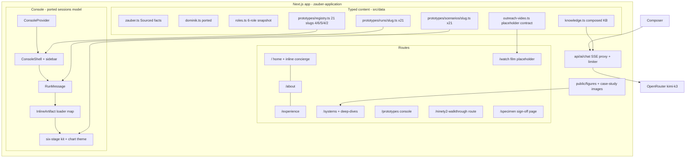
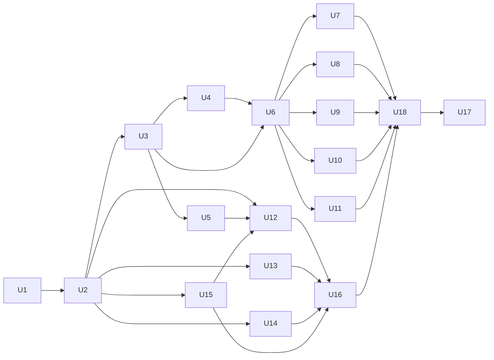

# Zauber Application Site - Plan

**Target repo:** `zauber-application` — a new private repo at `~/projects/zauber-application` (created by U1). This plan document lives in `web-app-resume`; all file paths in Implementation Units are relative to the target repo. Paths prefixed `langdock-application/` point into the sibling template repo at `~/projects/langdock-application` (read-only pattern source, verified green at 744 tests).

## Goal Capsule

- **Objective:** Ship a premium, open-application job-application website for Zauber (gozauber.com), styled in Zauber's visual language, centered on a console of 21 six-stage freight-forwarding prototype workspaces, with a live concierge, carried-over systems proof, and a video-placeholder film page — deployed noindex at `zauber.dbenger.com`, QA'd to the sibling-site pre-send discipline.
- **Means:** Mirror the final as-built state of `langdock-application` (KTD1, KTD5), re-skinned to the Zauber design system (KTD2) with an all-new freight prototype roster (R15).
- **Product authority:** The Product Contract below (confirmed with Dominik 2026-08-24 through the scoping synthesis and the four-question mockup gate). Design authority: the approved mockup artifact (https://claude.ai/code/artifact/eee53fda-ff6e-4ac6-8257-5001f3cb7abf), `~/Downloads/zauber-–-ai-agents-for-sea-&-air-freight-DESIGN.md`, and the live gozauber.com. Content authority for Dominik facts: `langdock-application/src/data/dominik.ts` (already reviewed and gate-pinned).
- **Execution profile:** Foundation serial (U1 → U5), pilot prototype with a hard-stop check-in (U6), then the four remaining scenario families in parallel with exclusive file ownership (U7–U11), pages and tails after. Verification Contract gates green before every commit to `main`.
- **Stop conditions:** Surface to Dominik instead of guessing when: (1) `moonshotai/kimi-k3` becomes unavailable on OpenRouter — model replacement is his decision; (2) a Zauber-side fact needed for copy or a prototype cannot be traced to the research dossier or gozauber.com; (3) the U6 pilot review is not approved; (4) any change would touch `~/ninety2` or the creative-health source project (both hard read-only).
- **Tail ownership:** Dominik owns the send: final copy approval, the film (produced separately), the send email, and the send moment. The build ends at "deployed, live-verified, pre-send checklist green, film placeholder live."

---

## Product Contract

### Summary

The sixth sibling application site, mirroring the Langdock site's final architecture: a Next.js app in Zauber's cream-and-ink visual language with a Cursor-style multi-session prototype console serving 21 six-stage freight-forwarding workspaces (Brief, Analysis, System, Evidence, Decision, Handoff), a live Kimi K3 concierge, home/about/experience/systems pages with the Ninety2 and Creative Health deep-dives carried over, and a film page shipping as a placeholder until Dominik produces the video separately. Addressed to Zauber as a company, usable as an open application, role-agnostic with an honest mapping onto the open roles.

### Problem Frame

Zauber builds AI agents for sea and air freight forwarders; its founder scaled Forto and its Deployments team owns exactly the work Dominik does best: turning skeptical operators into daily users. The six open roles (all Berlin) do not name his profile directly, so a targeted role application would undersell him while a PDF shows nothing he can actually do. The Langdock site proved the answer: an application built in the recipient's own design language whose prototypes demonstrate applied thinking in their domain. Zauber's domain is new — freight operations — so all 21 prototypes must be re-imagined from freight-forwarding mechanics, not translated from Langdock's enterprise-AI roster. The site must read as an open application (no named recipient) and survive a forward to Zauber's engineers.

### Key Decisions

- **Open application, company-general, role-agnostic** (session-settled: user-directed — chosen over addressing Erik Muttersbach directly and over role-anchored framing: Dominik will send it as an open application; the fit content still maps onto the open roles where honest). Governs R8, R19, R20.
- **21 prototypes at Langdock depth parity, roster approved as proposed** (session-settled: user-approved — the full roster in R15, family partition Deployment 4 / Operations 6 / Margin 5 / Intelligence 4 / Meta 2, five flagships, approved 2026-08-24 at the mockup gate; chosen over a smaller or restructured slate). Governs R15, R16.
- **Design direction approved from the rendered mockup** (session-settled: user-approved — the mockup artifact is the visual benchmark: Zauber palette, serif-italic display voice, console and workspace treatments; chosen over iterating further before planning). Amended same day (user-directed): the hero embeds the film player like the Langdock template — two-column hero, film order-first on mobile, honest placeholder state until the film publishes — superseding the mockup's original single-column hero; the mockup was updated to match. Governs R1–R4, R6.
- **Typefaces: Inter + Baskervville, open licenses** (session-settled: user-directed — chosen over buying Saans/Louize Display licenses and over shipping Zauber's commercial faces unlicensed: Baskervville is the fallback serif gozauber.com itself declares; a later license purchase is a config-level swap). Governs R2.
- **Systems page carries over both deep-dives** (session-settled: user-approved — Ninety2 deep-dive and the Creative Health (Pip's Peaks) case study, re-framed for freight operations; chosen over a leaner Zauber-specific page: proof of shipped agentic systems must survive a forward to engineers). Governs R21–R24.
- **Film ships as a placeholder** (session-settled: user-directed — Dominik produces the video in a separate process; the page ships with the player wiring and an honest in-production state so the film drops in without a rebuild). Governs R25–R26.
- **Named build tools** (session-settled: user-directed): Mobbin for design inspiration, `/impeccable` and `/shadcn` for design execution, `/excalidraw` for hand-drawn figures, and Zauber's own CDN for the brand mark (logo.dev was tried and is token-gated; documented fallback). Governs R27, R28.

### Actors

- A1. **Zauber readers** — Erik Muttersbach, Dennis Agidigbi (careers contact), and the Deployments/engineering team. Design-literate, freight-fluent, evaluating "what could this person do for us." Desktop or phone; time-constrained.
- A2. **Forwarded readers** — engineers (Forward Deployed, Founding) who will judge the prototypes' domain fidelity and the systems depth without Dominik present.
- A3. **Dominik** — owner; sends the link by email as an open application, out of band.
- A4. **The concierge** — server-side AI agent answering free-text questions from a curated knowledge base; never improvises facts.

### Requirements

**Brand and design system**

- R1. The site implements the Zauber design system per the approved mockup: cream `#f5f2e3` field, near-black-brown ink `#251400`, warm gray `#8d8372`, hairlines `#e5e2d1`/`#d5d1bd`, link blue `#0000ee` as the interactive accent, raised surface `#faf8ec`, pill buttons, ~7px control radius, flat elevation, dark ink sections for the console and film, uppercase tracked eyebrows, serif display headlines with italic emphasis.
- R2. Typography is a two-family hierarchy: Baskervville (display serif, roman + italic) and Inter (body/UI sans), both open-license via `next/font/google`. The site must not rehost Saans or Louize Display. A later swap to licensed Zauber faces must require only the font-loading config and token mapping, no component edits.
- R3. The register matches Zauber's voice: calm, confident, short declarative statements, low-hype, the "unsung heroes of global trade" respect for forwarders, sparing wordplay in the "Like magic. But real." spirit. Copy passes a side-by-side read against gozauber.com without tonal whiplash.
- R4. Responsive from 390px phones to wide desktop; verified in both Chrome and real WebKit (Safari-engine bugs are invisible in Blink — sibling lesson).

**Site structure**

- R5. Pages: Home, Prototypes (the console), Systems, Experience, About ("Why Zauber + Dominik"), Watch (the film), plus contact affordances (email, LinkedIn, resume PDF). Navigation mirrors the Langdock end-state: desktop inline links + portfolio CTA, hamburger below `sm`.
- R6. Home states the thesis in executive terms: the "working application" hero pairing the thesis column with the film player (the Langdock hero grammar — `ApplicationFilm` compact, order-first on mobile, rendering the honest in-production placeholder until the film publishes), why Dominik and Zauber fit (adoption track record, agents in production daily, EU-grounded delivery), an inline live concierge section, path cards into the console and systems, and the explicit ask with contact paths.
- R7. Experience carries the career story (Google 2017–2025; independent since Feb 2025) from the ported `dominik.ts`, with the resume PDF downloadable. Dates, never year-counts; masked figures stay masked.
- R8. The site is addressed to Zauber as a company; no personalization to any individual appears anywhere.
- R9. English throughout.
- R10. A persistent authorship line renders on every surface: "An application to Zauber, built by Dominik Benger. Not affiliated with Zauber Technology GmbH."

**Prototype console**

- R11. The console is the Langdock end-state grammar: Cursor-style multi-session workbench (each prototype opens its own chat session with the authored run inline; "New question" opens a concierge session; sidebar lists open Chats distinct from the family-grouped catalog), full-viewport app region, footer suppressed, composer with honest model disclosure.
- R12. Prototype runs are fully authored, deterministic, replayable, and deep-linkable (`/prototypes?p=<slug>`); ≥8 phased steps in stage order, under 4 seconds total; reduced motion renders instantly.
- R13. Phones get the drawer sidebar, full-width sessions, and artifact-safe layouts (container queries, not viewport breakpoints, inside artifacts).
- R14. Console accessibility floor carries over: keyboard operability end to end, aria-live run announcements, focus management on drawer/session transitions, accessible names on all artifact-interior interactives.

**The 21 prototypes**

- R15. All 21 ship as six-stage workspaces at the depth of the Langdock depth-upgrade (analyst threads with evidence chips and working, typed schematics, drill tables with detail panels, what-if rails with pure compute, verdict cards with ranked actions, provenance drawers with follow-up chips). Roster (approved 2026-08-24; ★ = flagship):

| # | Slug | Family | ★ | Workspace | Grounding |
|---|---|---|---|---|---|
| 1 | `forwarder-rollout-blueprint` | Deployment | ★ | A top-20 forwarder from kickoff to 40 branches: waves, hypercare, per-branch adoption KPIs | Agent Deployment Manager lifecycle; Dominik's Google-scale adoption |
| 2 | `agent-readiness-scorecard` | Deployment | | Data, systems, process maturity, people scored before the first agent goes live; 90-day path | Zauber's sales motion; readiness diagnostics |
| 3 | `sop-to-agent-compiler` | Deployment | | A customer SOP document decomposed into deterministic steps, agentic steps, human gates | Zauber's Build pillar; "SOPs hidden in Word files" pain point |
| 4 | `operator-adoption-cockpit` | Deployment | | Sessions, trust, skeptic-to-champion journeys per branch and operator | Zauber's adoption tracking claim; the JD's "AI champions" |
| 5 | `inbox-triage-command` | Operations | ★ | A morning's shared inbox classified, routed, answered; SLA clocks; honest escalations | Zauber's inbox-native wedge; email-centric ops |
| 6 | `spot-quotation-desk` | Operations | | Rate request to sell quote: buy rates, local charges, margin, expiry guards | +7pp spot quote conversion; rate request use-case tab |
| 7 | `booking-file-autopilot` | Operations | | Quote accepted to carrier booking to CargoWise file; intervention reasons visible | ~84% one-touch bookings; file-creation use-case tab |
| 8 | `document-extraction-bench` | Operations | | BLs and invoices parsed with per-field confidence, validated against the shipment | Document extraction use-case tab; document error cascade |
| 9 | `milestone-arrival-integrity` | Operations | | ETA changes and arrival notices pushed to customers before the carrier tells them | Milestone automation at tens of thousands/month; terminal ETA tab |
| 10 | `cutoff-compliance-sentinel` | Operations | | SI, VGM, and doc cut-offs chased across the book; roll risk ranked | SI/VGM hard deadlines; rolled-shipment cost |
| 11 | `gp-leakage-auditor` | Margin | ★ | Where gross profit leaks: missed surcharges, unbilled D&D, expired rates, entry errors | −10% GP leakage; margin-leak mechanics (pilot, mockup exemplar) |
| 12 | `conversion-control-tower` | Margin | | Quote-to-book funnel by branch, lane, customer; why-lost taxonomy | +7pp conversion; quote-to-book KPI |
| 13 | `exception-response-room` | Margin | | A rollover cascade managed live: triage, customer comms, recovery, D&D clock | Exception handling as the highest-judgment work |
| 14 | `branch-consistency-console` | Margin | | One workflow across 40 branches: adherence variance, standardization plays | "Deploy once, runs everywhere"; 40+ country branches |
| 15 | `governance-audit-room` | Margin | | Approvals, permissions, full audit trail; automate what you trust | Zauber's auditability pillar; human oversight |
| 16 | `operational-truth-miner` | Intelligence | | Emails, documents, TMS joined into one operational truth | Zauber's Measure pillar verbatim |
| 17 | `productivity-ledger` | Intelligence | | The 88% time-saved claim decomposed task by task; hours returned | Up to 88% time saved per task (5–8 min → <1 min) |
| 18 | `sop-sharpening-loop` | Intelligence | | Exceptions observed, patterns surfaced, SOP updates proposed | Zauber's Accelerate pillar; compounding service quality |
| 19 | `value-realization-dashboard` | Intelligence | | The forwarder CFO's view: GP/TEU, conversion, productivity, payback | +12% GP per TEU; Dominik's analytics DNA |
| 20 | `fit-map` | Meta | ★ | Dominik's evidence against Zauber's open roles; honest weak fits shown weak | Roles snapshot (derived count); role-agnostic stance |
| 21 | `first-90-days` | Meta | ★ | A deployment-shaped plan: learn the lanes, own a forwarder go-live, write the playbook | Agent Deployment Manager JD: kickoff → go-live → hypercare → rollout |

- R16. Scenarios 1–19 are hypothetical (fictional forwarders, role-descriptive identifiers, the kit's hypothetical-scenario disclosure); the two Meta scenarios carry real, sourced facts with dated source notes. Provenance is legible before a reader opens a workspace: the console catalog marks hypothetical workspaces with a visible fictional-scenario indicator derived from the disclosure discriminant. Every Zauber-side figure used anywhere traces to `zauber.ts` with a source URL; every scenario's derived figures compute from one source array with load-time invariants.

**Concierge**

- R17. The concierge ports the Langdock chassis unchanged in behavior: OpenRouter, `moonshotai/kimi-k3` pinned, server-side key, SSE streaming of content deltas only, reasoning suppressed, the full calm degrade ladder (keyless 503, pacing and upstream-429 as plain-text 200s, 45s deadline, empty-completion fallback, partial-drop discard-and-retry), per-IP token bucket with IPv6 /64 keying, 500-char message cap shared client and server, no visitor content ever logged.
- R18. The knowledge base is composed from the typed modules (Dominik, Zauber facts, roles, prototype sitemap) so it cannot drift from what renders; the concierge answers only from it, declines gracefully outside it, resists injection, and states the data posture. Follow-up chips on every prototype must be answerable from the KB alone.
- R19. The concierge and the About/fit copy may map Dominik onto the open roles (Agent Deployment Manager and Forward Deployed Engineer nearest) but always inside the role-agnostic stance.

**Roles and fit**

- R20. `roles.ts` snapshots Zauber's Ashby board (6 roles as of 2026-08-24) with snapshot date and source; the Fit Map derives its count from `roles.length`; the pre-send refresh is a one-file edit.

**Systems page and carried-over depth**

- R21. The Systems page carries the altitude story, the four system cards, the Ninety2 deep-dive, and the Creative Health (Pip's Peaks) case study, with copy re-framed for the freight/Zauber audience (deterministic engines with AI narration, governance gates, EU-resident posture as Zauber-relevant parallels).
- R22. The Creative Health confidentiality gate ports with the section: char-code-built banned client tokens, infra-pattern regexes, screenshots scanned before commit.
- R23. The hand-drawn Excalidraw figure set carries over from `langdock-application/public/figures/` (with `figures-src/`); any new Zauber-specific figure is drawn with the `/excalidraw` canvas tooling in the same hand.
- R24. The ninety2 walkthrough hosted copy ships at its own route with Zauber-appropriate framing edits (authorship line, any Langdock-specific pitch reworded), noindex meta plus `X-Robots-Tag`, and `~/ninety2` byte-untouched.

**The film (Watch page)**

- R25. The Watch page ships with the outreach-video contract shape, the chapters and transcript wiring, and the player rendering an honest in-production placeholder state (no master asset yet, `publicationStatus: "planned"`). The film drops in later without component changes.
- R26. The Remotion `video/` workspace is deferred entirely until the film exists; the contract test is authored for the pre-production state (no approved-gates assertions against a manifest that does not exist yet).

**Accuracy and delivery**

- R27. The DB × Zauber lockup uses Zauber's official mark from their site CDN (webclip asset, saved into the repo); favicon and OG imagery follow the warm palette.
- R28. Build-time design work uses Mobbin for reference patterns and `/impeccable` and `/shadcn` for design execution; the mockup artifact remains the benchmark. All reader-facing prose passes a `/no-ai-slop` edit (installed at project level from github.com/petergyang/no-ai-slop if absent) before its unit merges, preserving the site's voice while stripping AI-tell patterns — complementary to the copy-gates' banned-phrase list.
- R29. Every claim about Dominik traces to the ported `dominik.ts`; masked figures stay masked; no invented metrics; Zauber metric discrepancies (the ~90% vs 84% one-touch figures) are resolved by citing each figure only with its own page source, never blended.
- R30. New private GitHub repo `Ninety2UA/zauber-application`; Vercel; `zauber.dbenger.com`; noindex triple layer (robots.ts disallow-all, `metadata.robots`, `X-Robots-Tag` on raw-HTML routes) permanent unless Dominik opts to lift it.
- R31. Link previews (OG image 1200×630, titles, descriptions) polished for the email-share moment.

### Key Flows

- F1. **First visit.** **Trigger:** a Zauber reader opens the link. **Steps:** Zauber-native home lands the thesis; paths lead to the console, systems, and the film. **Outcome:** who Dominik is, why the fit, built in Zauber's language. **Covers R1, R3, R5, R6.**
- F2. **Prototype session.** **Trigger:** a catalog click or deep link. **Steps:** the run plays phased steps, the six-stage workspace renders inline, the reader drills, adjusts what-ifs, and asks the concierge about "this" via the session context. **Outcome:** a premium deterministic demonstration per prototype. **Covers R11–R16.**
- F3. **Free-text question.** **Trigger:** composer submit anywhere. **Steps:** grounded streamed answer or graceful decline. **Outcome:** working AI proof of craft. **Covers R17–R19.**
- F4. **The forward.** **Trigger:** the link is shared to an engineer. **Steps:** they open the systems page, the deep-dives, the walkthrough, and judge prototype domain fidelity. **Outcome:** depth survives without Dominik. **Covers R21–R24, R31.**
- F5. **The film, later.** **Trigger:** Dominik's video is produced. **Steps:** assets land in `public/video/`, the contract flips from placeholder to published. **Outcome:** the Watch page completes without a rebuild. **Covers R25, R26.**

### Acceptance Examples

- AE1. **Covers R18.** **Given** the concierge is asked "What is Zauber's 2027 roadmap?", **When** the topic is outside the KB, **Then** it declines without inventing and names what it can answer.
- AE2. **Covers R13.** **Given** a 390px phone in WebKit, **When** any prototype workspace renders, **Then** no schematic collapses and no horizontal overflow appears.
- AE3. **Covers R17.** **Given** a missing OpenRouter key, **When** a visitor sends a message, **Then** an honest unavailability message appears and every prototype run still works.
- AE4. **Covers R12.** **Given** reduced motion, **When** a prototype opens via deep link, **Then** the run renders complete and instantly.
- AE5. **Covers R25.** **Given** no master video asset exists, **When** the Watch page renders, **Then** the player shows the in-production state (no broken video element) and the chapters/transcript rails render from the placeholder contract.
- AE6. **Covers R16.** **Given** any of the 19 hypothetical workspaces, **When** its provenance drawer renders, **Then** the hypothetical-scenario disclosure appears; **Given** either Meta workspace, **Then** the real-facts note with a dated source line appears instead.

### Success Criteria

- Side-by-side with gozauber.com, the site reads as the same design language; a freight-fluent reader finds no domain howlers in any of the 21 workspaces.
- The executive path lands within five minutes without opening a prototype; the depth path survives a forward to engineers.
- Full sibling-discipline QA before send: browser smoke at 390/768/1440 in Chrome and WebKit, scripted concierge QA sweep, all 21 runs verified on prod, zero console errors.
- Every fact traceable to a source; roles and Zauber facts snapshot-dated; the film placeholder is honest about its state.

### Scope Boundaries

- The film itself is out of scope: Dominik produces it separately; only the placeholder contract, player state, and drop-in path ship (F5).
- `~/ninety2` and the creative-health source project are read-only; `langdock-application` is a read-only pattern source.
- dbenger.com and the other sibling sites are unchanged.
- No SEO, no analytics decision needed before deploy (default off; `@vercel/analytics` stays unmounted unless Dominik opts in), no ATS integration, no German localization, no live AI inside prototype runs.
- The send email is Dominik's, out of band.

#### Deferred to Follow-Up Work

- The Remotion `video/` workspace and the film production pipeline (separate process, Dominik-led; see R26).
- Buying Saans/Louize Display licenses and swapping the fonts (config-level; documented in U1).
- Lifting noindex (Dominik's explicit opt-in only).

### Dependencies / Assumptions

- `OPENROUTER_API_KEY` provisioned for dev and Vercel production; Kimi K3 remains available (stop condition if not). The OpenRouter credit cap remains the durable spend ceiling.
- The `langdock-application` repo stays available locally as the pattern source at its current green state.
- The Excalidraw canvas tooling is available at build time for any new figure.
- Zauber facts and the 6-role list are the 2026-08-24 research snapshot with source URLs; refresh before send.
- The approved mockup artifact remains reachable as the design benchmark.

### Outstanding Questions

**Deferred to implementation (non-blocking)**

- OG image: bespoke card vs styled console screenshot — decided at U16 against the live link-preview check.
- Which of the 16 non-flagship workspaces gain extra interactivity beyond the kit floor — executor's call inside the family units, flagships first.
- Analytics on/off — Dominik's call at deploy time (default off).

**From the 2026-08-24 review (deferred)**

- Hero CTA order: the cross-model review argued the primary "Open the console" CTA sends a time-constrained executive into the densest surface before the thesis lands; the approved mockup's hierarchy stands for now — if the U17 cold read stalls in the console, swapping the hero primary to the fit/ask path is a one-line change (Dominik's call).
- Session-context depth: whether prototype sessions pass richer scenario data to the concierge than the context string plus registry one-liners — decided during U5/U6 against token cost and answer drift.
- Watch in the primary nav before the film exists: tease intent vs finished-surfaces-only (nav-gate on `publicationStatus`, page stays reachable by URL and footer) — Dominik's call at build time.

### Sources / Research

- **Zauber dossier (2026-08-24, live fetches):** gozauber.com (home, /product, /security, /team, /manifesto, llms.txt — Zauber publishes a machine-readable summary), zauber.notion.site/careers, Ashby posts for Agent Deployment Manager and Forward Deployed Engineer. Verified: metrics (+7pp conversion, +12% GP/TEU, −10% GP leakage, +15% productivity, 88% time saved, ~84–90% one-touch bookings with a cross-page discrepancy per R29), integrations (CargoWise One, Outlook/365, rate systems, SharePoint, Teams/Slack), security posture (GDPR, EU-hosted, ISO 27001 *pending* — badges say pending, never claim certified), testimonial (Stefan Borgreve, Hellmann Worldwide Logistics), team (12 named + Erik Muttersbach), funding (Point Nine Capital + Michael Wax, deutsche-startups.de 2025-12-04, no amount disclosed), manifesto voice ("unsung heroes of global trade", "Like magic. But real.").
- **Freight domain map:** the 13-area operational grounding for scenario authors — condensed in the Appendix.
- **Template repo inventory (2026-08-24):** `langdock-application` at HEAD, 63 test files / 744 tests green; the Mirror checklist ordering and the per-subsystem source-of-truth paths cited throughout the units.
- **Typefaces:** Saans is Displaay (commercial only); Louize Display is 205TF (commercial only); gozauber.com's own CSS declares Baskervville as its serif fallback — the basis for KTD3.
- **Design references:** the approved mockup artifact; Mobbin patterns (Navan adoption stat tiles, Programa grouped operations tables, SSENSE serif/grotesk editorial mix).

---

## Planning Contract

### Approach

Port the proven Langdock architecture wholesale — chassis, kit, console, concierge, gates — into a fresh repo, re-tokened to Zauber's design system, then spend the bulk of the build where the value is: 21 new freight-forwarding scenarios authored against the ported six-stage contract. Foundation lands serially so every gate exists before the first scenario; a pilot workspace (the mockup's GP Leakage Auditor) goes through a hard-stop review with Dominik; the remaining families then build in parallel with exclusive file ownership. Pages, carried-over systems depth, the film placeholder, and the QA/deploy tail close it out.

### Key Technical Decisions

- KTD1. **Chassis: pin to `langdock-application` versions.** Next 16.2.10, React 19.2.4, Tailwind v4 (CSS-first), Vitest 4.1.9 + Testing Library + jsdom, Recharts 3.9.x, framer-motion 12, lucide-react, Base-UI/shadcn utilities — copied from `langdock-application/package.json`, not floated. The fourth port of this chassis in this genre. `@vercel/analytics` is not installed unless Dominik opts in (the Langdock repo carries it unmounted — drop it here).
- KTD2. **Design tokens as Tailwind v4 `@theme` values, light-only, two-family type.** Rewrite `src/app/globals.css` in the Langdock token architecture (semantic `@theme inline` mapping, `--text-*` type-scale tokens with sub-tokens, `:root` palette) with the Zauber palette per R1. The one deliberate divergence from the Langdock doctrine: `--font-heading` (Baskervville) genuinely differs from `--font-sans` (Inter). Keep the two-tier accent pattern: validate `#0000ee` on cream and on white for AA at small text during U1; if it fails, add an `--accent-text` variant as Langdock did. Severity triad stays foreground-grade only. `design-tokens.test.ts` recalibrates its pinned hexes and computed contrast gates to the new palette.
- KTD3. **Typefaces via `next/font/google`: Inter (400/500/700) + Baskervville (400 roman + italic)** (session-settled: user-directed — chosen over licensed or unlicensed Saans/Louize per the Key Decision). Baskervville has a single weight; display hierarchy comes from size and the italic, matching the mockup. The `/specimen` page carries both faces and the palette as the sign-off surface; a licensed-font swap later touches only the font loader and the `@theme` font variables (R2).
- KTD4. **Concierge: port the Langdock route and client surfaces.** `src/app/api/ai/chat/route.ts`, `src/lib/ai/{limiter,limits}.ts`, the SSE fixtures pattern, and `src/components/concierge/` port with behavior unchanged (R17); the system prompt's persona and CURRENT VIEW mechanics stay, the TENURE rule stays, facts re-point at the Zauber KB. `model-info.ts` remains the single disclosure source for UI and route.
- KTD5. **Prototype architecture: port the six-stage kit and its gates verbatim, re-tinted through tokens.** `src/components/prototypes/kit/` (Stage, StageIndex, Schematic + pure layout, AnalystThread, VerdictCard, ProvenanceDrawer, DrillTable, WhatIfRail, BriefTable, ConstraintChips, LegendEntry, strings), `scenario-types.ts` (the binding contract with its authoring JSDoc), `scenario-format.ts`, `run-types.ts`, and the gate suite (`grammar.test.ts`, `wiring.test.ts`, `scenario-shape.test.ts`, the scenario sections of `copy-gates.test.ts`, `chart-gates.test.ts`). Registry pins 21 slugs, partition 4/6/5/4/2, the five flagship slugs in order. Run modules are named by slug (retiring the Langdock short-name legacy); run stats import from their scenario module. Scenario discovery stays eager-glob with the `!*.test.ts` negative pattern at the glob level.
- KTD6. **Console: port the sessions model as-built.** `ConsoleProvider` (root-mounted, multi-session, per-session streams, ~200-char context to the chat route), `ConsoleShell`, sidebar/drawer, `Thread`, `Composer`, `RunMessage`, `InlineArtifact` with the loader-map registry (raw dynamic-import loaders, fresh `lazy()` per retry), `console-url-state.ts` as the single URL authority. Footer suppressed on `/prototypes` via `ConditionalFooter`.
- KTD7. **`zauber.ts` facts module in the `Sourced<T>` pattern.** Every fact carries a source URL and module-level `asOf`; keys cover thesis, product pillars and use-cases, integrations, metrics (each of the one-touch figures pinned to its own page source per R29), security posture (ISO 27001 explicitly "pending"), testimonial, leadership/team, funding (Point Nine + Michael Wax), manifesto lines, HQ/contacts. The vendor-token fence from `copy-gates.test.ts` is re-based for this site with a two-tier rule (the template's leaf-field-only fence would fight freight prose — CargoWise write-back and the Outlook wedge ARE the story of several scenarios): a Zauber-context tier (CargoWise One, Outlook, Microsoft 365, Teams, Slack, SharePoint) permitted in scenario prose and `zauber.ts`; every other vendor token stays leaf-field-only under per-slug allowlisting; competitor names (Raft, Vooma, Augment, Expedock) banned site-wide; client names beyond the public Hellmann testimonial banned.
- KTD8. **Film placeholder: keep the outreach-video contract, author it pre-production.** Port `content/outreach-video.ts` shape and the `src/data/outreach-video.ts` adapter; author a placeholder contract (`publicationStatus: "planned"`, no master asset entry) and extend `ApplicationFilm` with an explicit in-production state when the master asset is absent. The contract test asserts the placeholder shape (disclosure lines present, third-person gate, timeline shape for the planned segments) and does not import the Remotion workspace's `claims.json`/`manifest.json` (deferred per R26).
- KTD9. **Systems carry-over as asset + component port with copy re-frame.** `SystemCard`, `AltitudeStory`, `Ninety2DeepDive`, `CreativeHealthDeepDive`, `NarrativeImage` (padding-ratio spacer — WebKit-safe), the four figure SVGs + `figures-src/`, the two case-study screenshots, and `creative-health.test.ts` (confidentiality gate) port from the Langdock repo; copy is re-framed for freight/Zauber (R21). The walkthrough copy ports from `langdock-application/public/ninety2/system-walkthrough.html` (already content-updated) with surgical re-edits: the authorship line and any Langdock-framed passages re-aimed at Zauber; served by a `force-static` route with `X-Robots-Tag` (R24).
- KTD10. **Delivery:** private repo `Ninety2UA/zauber-application`; Vercel project; `zauber.dbenger.com`; noindex triple layer per R30 with flip-procedure comments; env `OPENROUTER_API_KEY` — a dedicated key with its own credit cap for this site, never shared with the Langdock site's (a drained or leaked key must not take down the other application's concierge), stored only in Vercel production env and local `.env.local`, excluded from preview scopes, with rotation noted in the pre-send checklist; `npx vercel --prod` as the deploy path (Git auto-deploy needs the dashboard grant — sibling precedent).
- KTD11. **Copy gates as tests, Zauber pins.** Port `copy-gates.test.ts` and `data-integrity.test.ts` mechanics: recursive em-dash ban, AI-tell list, authorship-line pin (R10 wording), masked-figure gate, source-URL presence on every `zauber.ts` fact, headline-period rule, what-if `compute(index)` sweep, kit chrome pins, comment-stripped component source scan, and the volatile-facts inventory (any file reading `zauberFacts.<key>` must declare it in the registry entry). Registry integrity asserts 21 unique slugs, the 4/6/5/4/2 partition, the five flagship slugs, and Fit Map deriving from `roles.length`.
- KTD12. **Design execution doctrine** (session-settled: user-directed): Mobbin searches for reference patterns before major surfaces, `/impeccable` for design-quality passes, `/shadcn` for component work where it fits the ported chassis, `/excalidraw` for any new hand-drawn figure, and `/no-ai-slop` over all reader-facing prose per R28 (project-level install: copy the repo's `skills/no-ai-slop/` into `.claude/skills/` if the skill is absent). The approved mockup is the benchmark; the brand mark comes from Zauber's website CDN (webclip PNG) via `next/image` (logo.dev is token-gated — verified 401 without a key).
- KTD13. **Chart theme re-based for the warm palette.** Port `chart-theme.tsx` as the only color source; re-pick `--chart-1..5` for cream surfaces (fixed categorical order, adjacent-pair distinguishability, AA-checked in `design-tokens.test.ts`); one accent per chart, direct labels over tick clutter; `chart-gates.test.ts` continues to forbid color literals in prototype sources.

### High-Level Technical Design

### Sequencing

Foundation is serial and gate-first: U1 (scaffold/tokens) → U2 (data + gates) → U3 (kit + scenario contracts + gates) → U4 (console) and U5 (concierge) in either order. U6 (pilot + hard-stop check-in) needs U3 + U4. U7–U11 (the families) run in parallel after U6 approval with exclusive file ownership per family. U12–U15 (pages, systems, watch) need U2 (U12 also U5); U16 (OG/metadata) needs the pages; U17 ships it.

**Parallel-execution guidance (U7–U11):** one agent per family, exclusive ownership of `src/data/prototypes/scenarios/<family slugs>.ts`, `src/data/prototypes/runs/<family slugs>.ts`, and `src/components/prototypes/<FamilyComponents>.tsx`; workers run focused tests only; the orchestrator owns commits and full gates. The split is conflict-free only because U3/U4 pre-wire every shared slug-keyed map in full with stubs (run import map, artifact loader registry, `componentByShell`) — family agents replace their own stub files and never edit a shared map. Each family passes the adversarial freight fact-check (Verification Contract row) before it merges. After all five families have merged, an orchestrator-owned integration step closes the four completeness pins re-opened at U3 (the template solved this with a dedicated post-batch step) — no family unit closes them, since nothing guarantees which finishes last. Sibling lessons apply: a session-limit kill leaves work on disk (git status + full suite before re-dispatch); never `npm run build` while the dev server runs.

---

## Implementation Units

| U-ID | Unit | Key files | Depends on |
|---|---|---|---|
| U1 | Repo scaffold, design system, chrome | `src/app/globals.css`, `src/app/layout.tsx`, `src/components/layout/*`, `src/app/specimen/*` | — |
| U2 | Content data layer + gates | `src/data/*` | U1 |
| U3 | Prototype kit, contracts, registry, gates | `src/components/prototypes/kit/*`, `src/data/prototypes/*` | U2 |
| U4 | Console | `src/components/console/*`, `src/app/prototypes/*`, `src/lib/console-url-state.ts` | U3 |
| U5 | Concierge | `src/app/api/ai/chat/*`, `src/lib/ai/*`, `src/components/concierge/*`, `src/data/knowledge.ts` | U2, U3 |
| U6 | Pilot workspace + check-in (hard stop) | `src/data/prototypes/scenarios/gp-leakage-auditor.ts` + run + component | U3, U4 |
| U7 | Deployment family (4) | scenarios/runs/components for slugs 1–4 | U6 |
| U8 | Operations family (6) | scenarios/runs/components for slugs 5–10 | U6 |
| U9 | Margin family (4 remaining) | scenarios/runs/components for slugs 12–15 | U6 |
| U10 | Intelligence family (4) | scenarios/runs/components for slugs 16–19 | U6 |
| U11 | Meta family (2, real facts) | scenarios/runs/components for slugs 20–21 | U6 |
| U12 | Home page | `src/app/page.tsx`, `src/components/home/*` | U2, U5, U15 |
| U13 | About + Experience pages | `src/app/about/*`, `src/app/experience/*`, `src/components/experience/*` | U2 |
| U14 | Systems page + carried-over depth | `src/app/systems/*`, `src/components/systems/*`, `public/figures/*`, walkthrough route | U2 |
| U15 | Watch page placeholder | `content/outreach-video.ts`, `src/data/outreach-video.ts`, `src/components/video/*`, `src/app/watch/*` | U2 |
| U16 | OG images + metadata | `src/app/opengraph-image.tsx`, `src/lib/og.ts`, per-route layouts | U12–U15 |
| U17 | QA, deploy, live verification | `docs/*`, Vercel | all (U18 before deploy) |
| U18 | Multi-agent code review | `docs/residual-review-findings/*` | U7–U16 |

### U1. Repo scaffold, design system, and chrome

- **Goal:** A running Next.js app with the Zauber design system, Inter + Baskervville, nav/footer chrome with the DB × Zauber lockup, authorship line, noindex, and the specimen sign-off page.
- **Requirements:** R1, R2, R4, R5 (nav), R8–R10, R27, R30.
- **Dependencies:** none.
- **Files:** `package.json`, `tsconfig.json`, `vitest.config.ts`, `postcss.config.mjs`, `next.config.ts`, `eslint.config.mjs`, `components.json`, `src/app/{layout.tsx,globals.css,robots.ts,layout.test.tsx,design-tokens.test.ts}`, `src/app/specimen/page.tsx`, `src/components/layout/{SiteNav,MobileNav,Logo,SiteFooter,ConditionalFooter,AuthorshipLine}.tsx` + tests, `src/components/media/NarrativeImage.tsx` + test, `public/zauber-mark.png`, `AGENTS.md`, `DESIGN.md`, `PRODUCT.md`.
- **Approach:**
  1. Scaffold from the `langdock-application` dependency set per KTD1 (copy versions, not latest).
  2. Rewrite `globals.css` per KTD2; load fonts per KTD3.
  3. Port the layout chrome components, re-skinned: lockup "Dominik Benger × [mark] Zauber" (mark from Zauber's CDN saved to `public/`, collapses below `sm` per the Langdock pattern), nav links per R5, hamburger MobileNav, footer, `AuthorshipLine` with the R10 wording. Port `NarrativeImage` here (About and Systems both consume it; it carries the WebKit padding-ratio spacer).
  4. Noindex per KTD10 with flip comments; write the repo's own `AGENTS.md`/`DESIGN.md`/`PRODUCT.md` early (gate comments reference them — sibling lesson).
  5. Keep `/specimen` rendering the type scale, palette, and both faces; verify against the approved mockup artifact side by side.
- **Patterns to follow:** `langdock-application/src/app/globals.css` (token architecture), `src/components/layout/*` (chrome), `MobileNav` a11y contract.
- **Test scenarios:**
  - Layout renders the nav links, the lockup with the Zauber mark, and the exact R10 authorship line.
  - `robots.ts` disallows all; layout metadata carries `index: false, follow: false`.
  - Design tokens: cream/ink custom properties present; computed WCAG contrast of ink-on-cream and link-blue on cream/white passes the KTD2 gate.
  - MobileNav: open moves focus in, Escape closes and returns focus.
- **Verification:** lint/test/build clean; shell renders at 390 and 1440; specimen matches the mockup's feel side by side.

### U2. Content data layer and gates

- **Goal:** All typed content modules with sources and snapshot dates, and the copy/data-integrity gates enforcing house rules from day one.
- **Requirements:** R7, R16 (fact tracing), R20, R29; KTD7, KTD11.
- **Dependencies:** U1.
- **Files:** `src/data/{types.ts,dominik.ts,zauber.ts,roles.ts,systems.ts,copy-gates.test.ts,data-integrity.test.ts}`.
- **Approach:**
  1. Port `types.ts` and `dominik.ts` from the Langdock repo (Family type re-pointed at the five Zauber families).
  2. Author `zauber.ts` per KTD7 from the Sources dossier; every fact `Sourced` with `asOf: "2026-08-24"` plus a short source excerpt or locator recording where on the cited page the claim lives — a URL alone can stop supporting its number without any gate noticing.
  3. Author `roles.ts`: the 6 Ashby roles with team, URL, snapshot date (no comp bands are published — omit the field rather than invent it).
  4. Port `systems.ts` unchanged in facts.
  5. Port both gate tests with Zauber pins per KTD11 (authorship line, two-tier vendor fence per KTD7, partition 4/6/5/4/2, flagship slugs). Two porting traps from the template: `copy-gates.test.ts` statically imports the creative-health, outreach-video, prototype-registry, and run-collection (`getAllRuns`) modules that land in later units — convert those imports to guarded globs at U2 and let U3/U14/U15 flip them static as their modules land; and the roles assertions must drop the template's comp-band regex (Zauber publishes no comp bands) while re-pinning `rolesSource` to Zauber's Ashby board.
- **Test scenarios:**
  - Registry integrity: 21 unique slugs, partition and flagship pins (activates fully once U3 lands the registry; author the assertions here).
  - Every `zauber.ts` fact has a non-empty https source; the ISO 27001 fact contains "pending"; both one-touch figures carry distinct sources.
  - Copy gates: a deliberately inserted em dash fails; the authorship-line pin matches R10 exactly; masked figures in `dominik.ts` stay masked.
  - Roles: every entry has the Ashby URL and the snapshot date; count is never hardcoded outside the module.
- **Verification:** `npm test` green; spot-check the em-dash tripwire then revert.

### U3. Prototype kit, scenario contracts, registry, and gates

- **Goal:** The entire six-stage architecture ported and re-tinted: kit components, scenario/run contracts, the 21-slug registry, and every prototype gate green against zero scenarios (gates first, scenarios second).
- **Requirements:** R12 (run shape), R14 (kit a11y), R15 (registry), R16 (contracts); KTD5, KTD13.
- **Dependencies:** U2.
- **Files:** `src/components/prototypes/kit/*` (all kit components + tests), `src/components/charts/chart-theme.tsx`, `src/data/prototypes/{registry.ts,scenario-types.ts,scenario-format.ts,run-types.ts,grammar.test.ts,wiring.test.ts,scenario-shape.test.ts,chart-gates.test.ts}`, `src/data/prototypes/runs/*.ts` (21 null-exporting stubs).
- **Approach:**
  1. Port the kit verbatim per KTD5; colors flow only through tokens, so the re-tint is the U1 palette.
  2. Port the scenario/run contracts including the authoring-rules JSDoc; keep `assertScenarioInvariant` and the disclosure discriminant (hypothetical vs real-facts).
  3. Author `registry.ts` with the R15 roster: slugs, families, flagship tiers, shortLabels, one-liners, volatileFacts inventories.
  4. Port the gate suite; run modules resolve by slug (KTD5).
  5. Re-base `chart-theme.tsx` per KTD13.
  6. Pre-wire every shared slug-keyed map in full so family units never touch a shared file: 21 null-exporting run stubs plus the complete run import map in `run-types.ts`, and the complete `componentByShell` map in `data-integrity.test.ts`.
  7. Extend `scenario-shape.test.ts` beyond the template: assert `evidence.series` is non-empty per scenario (the template gates only the drill records, so a chartless workspace would pass), and execute every scenario module's load-time invariant hook (`assertScenarioInvariant`) per slug so a scenario that hardcodes derived figures instead of computing from its source array fails the gate.
- **Execution note:** Land the gates before any scenario exists so every scenario lands against a hard contract. The template ships its completeness window CLOSED: four end-state pins fail until all 21 land — the grammar full-registry sweep, the wiring all-slugs loops and landed-count pin, scenario-shape's one-module-per-slug test, and data-integrity's volatile-facts file scan. Re-open landed-slug scoping across all four for the U6–U11 window (the disk-discovery idiom still exists in the template files to copy from); U11 closes them.
- **Test scenarios:**
  - Kit component tests port with the kit (AnalystThread first-open, DrillTable keyboard + aria-live detail, WhatIfRail pure compute, Schematic `data-schematic` marker, reduced-motion complete render).
  - Registry: the U2 integrity assertions go green.
  - Chart gates: no color literal in any prototype source.
  - Grammar gate teeth: the stub-scenario tooth tests prove the gate fails on a missing stage.
- **Verification:** lint/test/build green with zero scenarios present.

### U4. Console

- **Goal:** The multi-session console shell serving the registry, playing authored runs inline, with deep links, drawer, and the full a11y floor.
- **Requirements:** R11–R14; KTD6.
- **Dependencies:** U3.
- **Files:** `src/lib/console-url-state.ts` + test, `src/components/console/*` (Provider, Shell, Sidebar, Drawer, Thread, Composer, RunMessage, InlineArtifact, artifact-registry, model-info, useReducedMotion) + tests, `src/app/prototypes/{page.tsx,layout.tsx}`.
- **Approach:** Port per KTD6 with the sibling gotchas preserved: root-mount the provider (this unit edits `src/app/layout.tsx` for the mount — coordinate with U5, which mounts the concierge providers in the same file), gate the seed effect on `!hasDeepLink`, loader-map (not cached lazy), `stageDomId` scoping, footer suppression. Pre-wire `artifact-registry.tsx` with all 21 loader entries pointing at stub components (dynamic-import specifiers are type-checked, so the stubs must exist); family units replace their own component files only. The composer's model pill reads `model-info.ts`.
- **Test scenarios:**
  - Deep link `?p=gp-leakage-auditor` opens that session; invalid slug falls back clean.
  - Multi-session: opening two prototypes creates two sessions; re-opening focuses, never duplicates; closing never leaves the console empty.
  - URL round-trip through `console-url-state`.
  - Drawer focus management; keyboard path through catalog → run → workspace.
  - Reduced motion renders a run complete instantly (AE4).
- **Verification:** lint/test/build green; keyboard-only walkthrough succeeds at 390 and 1440 with a stub scenario.

### U5. Concierge

- **Goal:** The live grounded assistant on the ported chassis: route, limiter, fixtures, client surfaces, and the composed Zauber KB.
- **Requirements:** R17–R19; AE1, AE3; KTD4.
- **Dependencies:** U2, U3 (the KB composes the prototype sitemap from U3's registry; U4's composer mounts it in the console; the home/floating surfaces are independent).
- **Files:** `src/app/api/ai/chat/{route.ts,route.test.ts,fixtures/*}`, `src/lib/ai/{limiter.ts,limits.ts}` + tests, `src/data/knowledge.ts` + test, `src/components/concierge/{ConciergeProvider,ConciergeChat,FloatingConcierge,HomeConcierge}.tsx` + tests, `src/app/layout.tsx` (provider + FloatingConcierge mounts — same file U4 edits; coordinate).
- **Approach:** Port per KTD4. `knowledge.ts` composes from `dominik.ts` + `zauber.ts` + `roles.ts` + the registry sitemap; sections mirror the Langdock KB (ABOUT / APPLICATION / CAREER / SYSTEMS / ABOUT ZAUBER dated / OPEN ROLES dated / THIS SITE / DATA POSTURE / COVERAGE BOUNDARY). Reuse the captured K3 SSE fixtures from the Langdock repo for the route tests.
- **Test scenarios:**
  - Covers AE1: out-of-KB decline scaffolding reaches the request; KB question streams.
  - Covers AE3: keyless → friendly 503; console runs unaffected.
  - Degrade ladder rows port: 429 resting reply, empty-completion fallback, mid-stream drop discards the partial into retry, 45s deadline.
  - Limiter: pacing after burst; IPv6 /64 keying.
  - KB test: contains all 21 prototype titles, all 6 roles + snapshot date, "Kimi K3", the coverage boundary; masked figures stay masked.
  - No log call carries visitor text (spy assertion).
  - Injection acceptance rows with defined pass behavior: an instruction-override attempt, a system-prompt-extraction attempt, and an unsupported-fact request each produce a source-bounded refusal that discloses no hidden instructions (prompt-scaffolding assertions in unit tests; the same three rows run live in the U17 sweep).
- **Verification:** lint/test/build green; one live dev exchange (grounded answer, decline, injection attempt) logged; keyless drill passes locally.

### U6. Pilot workspace and check-in (hard stop)

- **Goal:** The GP Leakage Auditor built to full six-stage depth as the quality bar, reviewed live by Dominik before the remaining 20 are built.
- **Requirements:** R15 (#11), R16; F2; AE6 (hypothetical arm).
- **Dependencies:** U3, U4.
- **Files:** `src/data/prototypes/scenarios/gp-leakage-auditor.ts`, `src/data/prototypes/runs/gp-leakage-auditor.ts`, `src/components/prototypes/GpLeakageAuditor.tsx`, tests colocated.
- **Approach:** Expand the mockup's exemplar into the full contract: brief with constraint chips and input records; ≥4 analyst claims with evidence and working; a lanes schematic (sources → matching agent → outcomes); evidence series + ≥5 drill records with detail; verdict with ranked owner/effort actions and a recovery-rate what-if; handoff with assumptions, sensitivity, production needs, and KB-answerable follow-ups. All figures from one source array with load-time invariants; domain mechanics from the Appendix (D&D, surcharges, rate expiry).
- **Execution note:** Before authoring, ground the Appendix's 13 areas in named primary freight sources (the current rows carry no citations; add them to the Appendix), and run the adversarial freight fact-check (Verification Contract row) on the pilot before the check-in. This unit ends at a hard stop: present the live pilot to Dominik (dev server or preview deploy) together with a paper six-stage mapping for the two Meta workspaces (`fit-map`, `first-90-days` — the pair the grammar fits worst, per the Langdock precedent's own check-in), and get explicit approval of depth, domain voice, and the Meta mapping before dispatching U7–U11. His feedback re-baselines the family units. Frame depth and voice as the cheap feedback surface: the roster and partition are already gate-pinned, so roster-level changes at this point are expensive.
- **Test scenarios:**
  - The full gate suite passes with the first real scenario (grammar six stages, shape floors, wiring run, copy sweep incl. what-if readouts).
  - Workspace-specific: drill selection syncs the chart highlight; what-if pills recompute the readout; hypothetical disclosure renders (AE6).
- **Verification:** gates green; Chrome + WebKit render at 390/1440; Dominik's approval recorded.

### U7. Deployment family

- **Goal:** Slugs 1–4 at the pilot bar: `forwarder-rollout-blueprint` (★), `agent-readiness-scorecard`, `sop-to-agent-compiler`, `operator-adoption-cockpit`.
- **Requirements:** R15, R16; F2.
- **Dependencies:** U6 (approval + bar).
- **Files:** four scenario modules, four run modules, four components, tests colocated.
- **Approach:** Per the R15 grounding column. Signature visualizations: rollout wave timeline with per-branch adoption ramp (blueprint); five-axis readiness scoring with a 90-day path (scorecard); SOP text decomposed into a typed step schematic with deterministic/agentic/human-gate lanes (compiler); adoption cohort curves with skeptic-to-champion drill journeys (cockpit — the Navan-style stat tiles from the mockup research).
- **Test scenarios:** the shared gate suite covers structure; per workspace, one interaction test for its signature control (wave selector, axis drill, step-type toggle, cohort drill).
- **Verification:** gates green; both-engine render pass; facts trace; a freight-plausibility self-review against the Appendix per workspace.

### U8. Operations family

- **Goal:** Slugs 5–10 at the pilot bar: `inbox-triage-command` (★), `spot-quotation-desk`, `booking-file-autopilot`, `document-extraction-bench`, `milestone-arrival-integrity`, `cutoff-compliance-sentinel`.
- **Requirements:** R15, R16; F2.
- **Dependencies:** U6.
- **Files:** six scenario modules, six run modules, six components, tests colocated.
- **Approach:** The freight-daily-work family; keep each workspace's mechanics honest to the Appendix (SI/VGM deadlines, arrival-notice flows, buy/sell rate arithmetic that reconciles). Signature visualizations: queue board with SLA clocks (triage); quote build-up waterfall from buy rate to sell (quotation desk); touchless-vs-intervention flow (autopilot); per-field confidence extraction view validated against the shipment (bench); ETA-change propagation timeline (integrity); deadline risk ranking (sentinel — the Programa grouped-table pattern).
- **Test scenarios:** shared gates; per workspace one signature-control test; quotation-desk arithmetic invariant (sell = buy + charges + margin) asserted at module load.
- **Verification:** gates green; both-engine pass; a freight-plausibility self-review against the Appendix per workspace.

### U9. Margin family (remaining)

- **Goal:** Slugs 12–15 at the pilot bar: `conversion-control-tower`, `exception-response-room`, `branch-consistency-console`, `governance-audit-room`.
- **Requirements:** R15, R16; F2.
- **Dependencies:** U6.
- **Files:** four scenario modules, four run modules, four components, tests colocated.
- **Approach:** Signature visualizations: funnel by branch/lane with why-lost drill (tower); incident timeline with customer-comms thread and D&D exposure clock (response room); branch adherence variance matrix (consistency console); approval/audit trail with permission scopes (governance room).
- **Test scenarios:** shared gates; per workspace one signature-control test; funnel totals reconcile across drill levels (invariant).
- **Verification:** gates green; both-engine pass; a freight-plausibility self-review against the Appendix per workspace.

### U10. Intelligence family

- **Goal:** Slugs 16–19 at the pilot bar: `operational-truth-miner`, `productivity-ledger`, `sop-sharpening-loop`, `value-realization-dashboard`.
- **Requirements:** R15, R16; F2.
- **Dependencies:** U6.
- **Files:** four scenario modules, four run modules, four components, tests colocated.
- **Approach:** Signature visualizations: three-source join map with surfaced findings (truth miner); task-by-task before/after minutes ledger rolling up to the 88% claim shape (productivity ledger — cite the Zauber figure only via `zauber.ts`); exception-pattern-to-SOP-diff loop (sharpening loop); CFO scorecard with payback math (value realization).
- **Test scenarios:** shared gates; per workspace one signature-control test; ledger roll-up arithmetic invariant.
- **Verification:** gates green; both-engine pass; a freight-plausibility self-review against the Appendix per workspace.

### U11. Meta family (real facts)

- **Goal:** Slugs 20–21 as `RealFactsScenario`s: `fit-map` (★) and `first-90-days` (★).
- **Requirements:** R15, R16, R19, R20; AE6 (real-facts arm).
- **Dependencies:** U6 (U2's roles module feeds both).
- **Files:** two scenario modules, two run modules, two components, tests colocated.
- **Approach:** Fit Map scores Dominik's evidence against the 6 roles from `roles.ts` (count derived), visibly differentiated with honest weak fits (Founding Engineer and Enterprise Sales score low with honest one-liners) and the role-agnostic stance rendered; First 90 Days is deployment-shaped per the R15 grounding, citing the Agent Deployment Manager lifecycle vocabulary. Both carry dated `sourcesNote`s. Per-role fit evidence (score, one-liner, evidence keys) is colocated in `roles.ts` entries so the Fit Map maps over roles and the R20 one-file refresh stays honest. The four completeness pins close in the orchestrator's post-family integration step (see Sequencing), not here.
- **Test scenarios:** shared gates; fit rows derive from `roles.length` with non-uniform scores (spread asserted); every role entry renders a fit row sourced from its own colocated fit fields (a board refresh that misses a role fails the test); real-facts disclosure renders with the dated source line (AE6); every claimed Dominik fact resolves to `dominik.ts`.
- **Verification:** gates green (the completeness pins close in the post-family integration step); both-engine pass; a freight-plausibility self-review against the Appendix per workspace.

### U12. Home page

- **Goal:** The executive thesis page per the approved mockup: hero, fit tiles, console path cards, inline concierge, the ask.
- **Requirements:** R3, R6, R10; F1.
- **Dependencies:** U2, U5, U15 (the hero mounts `ApplicationFilm` compact).
- **Files:** `src/app/page.tsx`, `src/components/home/{Hero,IntroPanel,FitPillars,PathCards,AskSection}.tsx` + tests (plus the `HomeConcierge` mount from U5 and the `ApplicationFilm` compact mount from U15).
- **Approach:** Port the Langdock home structure re-skinned to the mockup: serif hero with italic payoff and the `IntroPanel` identity card, stat row from `dominik.ts`, three fit tiles, primary CTA deep-linking the flagship (`/prototypes?p=forwarder-rollout-blueprint`), the inline concierge section, the two-column ask card with contact rows. The hero keeps the template's two-column grammar: thesis column plus the film player (`ApplicationFilm` compact from U15, order-first on mobile per the template's `Hero.tsx`), rendering the honest in-production placeholder state until the film publishes (user-directed 2026-08-24, superseding the mockup's original single-column hero; the mockup was updated to match).
- **Test scenarios:** hero renders the mockup-approved headline shape; the hero film column renders the in-production placeholder (no video element error) while no master asset exists; stats flow from `dominik.ts` (no hardcoded copies); CTA href targets the flagship deep link; ask renders email/LinkedIn/resume/portfolio rows.
- **Verification:** lint/test/build green; visual pass vs the mockup at 390/1440.

### U13. About + Experience pages

- **Goal:** "Why Zauber + Dominik" and the career story with the resume download.
- **Requirements:** R7, R19; F1.
- **Dependencies:** U2.
- **Files:** `src/app/about/*`, `src/app/experience/*`, `src/components/experience/CareerTimeline.tsx` + tests, `public/resume/Dominik_Benger_Resume.pdf`, About-side narrative imagery under `public/images/` (rendered via U1's `NarrativeImage`).
- **Approach:** Port both pages' structure; About re-argues the fit for freight (adoption lifecycle = deployment lifecycle; honest role mapping per R19); Experience ports the timeline over `careerChapters`. Resume copied from `~/Documents/Resume & Jobs/` (latest version at build time).
- **Test scenarios:** four career chapters with dates; masked figures masked; resume link points at the PDF; About names the two nearest roles inside the role-agnostic stance.
- **Verification:** lint/test/build green; PDF downloads in dev; a pre-merge audit confirms every factual claim in the resume PDF is represented in `dominik.ts` (the PDF is otherwise a second, unpinned source of truth).

### U14. Systems page and carried-over depth

- **Goal:** The systems narrative with both deep-dives, figures, and the walkthrough copy — re-framed for Zauber.
- **Requirements:** R21–R24, R10; F4.
- **Dependencies:** U2 (U1 for the route scaffolding).
- **Files:** `src/app/systems/*`, `src/components/systems/*` (SystemCard, AltitudeStory, Ninety2DeepDive, CreativeHealthDeepDive, Figure), `public/figures/*` + `figures-src/*`, `public/images/*` (case-study screenshots), `src/data/creative-health.ts` + `creative-health.test.ts`, `public/ninety2/system-walkthrough.html`, `src/app/ninety2-walkthrough/route.ts` + test.
- **Approach:** Port per KTD9. Copy re-frame: the deep-dives' Zauber-relevant parallels (deterministic engine + AI narration ≈ agents with human oversight; scrub gates ≈ auditability; EU posture ≈ Zauber's sovereignty story). Walkthrough: surgical edits only (authorship line to R10 wording, Langdock-framed passages re-aimed, noindex meta) — check presenter mode and print behavior before/after; draw any new Zauber-context figure with `/excalidraw` in the walkthrough hand (R23).
- **Test scenarios:**
  - Four system cards with live links; thesis line verbatim from `systems.ts`.
  - Confidentiality gate green over the ported case study (char-code tokens, infra regexes).
  - Walkthrough route: 200, `X-Robots-Tag`, contains the R10 authorship line and no Langdock-specific pitch phrase (assert a known removed phrase is absent).
  - Figures exist, non-trivial size, non-empty alt.
- **Verification:** lint/test/build green; presenter-mode manual check; `git -C ~/ninety2 status` clean.

### U15. Watch page placeholder

- **Goal:** The film page live with the placeholder contract and an honest in-production player state.
- **Requirements:** R25, R26; F5; AE5.
- **Dependencies:** U2.
- **Files:** `content/outreach-video.ts`, `src/data/outreach-video.ts` + contract test, `src/components/video/ApplicationFilm.tsx` + test, `src/app/watch/{page.tsx,layout.tsx}` + test, `public/video/` (poster placeholder only).
- **Approach:** Per KTD8. The placeholder contract carries the planned segment/chapter skeleton (so the page renders a real structure), the disclosure set reworded for Zauber, and `publicationStatus: "planned"` with no master asset. In-production state spec (the template player has no placeholder branch to copy): when the contract carries no master asset, `ApplicationFilm` renders the approved mockup's bordered film frame with a static branded card (eyebrow "Film in production", serif line), renders no native video controls at all, and the planned chapter timestamps are hidden or qualified as approximate until `publicationStatus` flips to published — the page never shows exact-looking timings for unshot content. The placeholder state covers both the full Watch player and the `compact` hero variant U12 mounts. Document the drop-in path (F5) in the repo docs.
- **Test scenarios:**
  - Covers AE5: no master asset → in-production state, no `<video>` error, chapters/transcript render from the contract.
  - Contract test (pre-production shape): disclosure placements present, third-person gate, gap-free planned timeline, no import of the deferred Remotion workspace files.
  - The disclosure line names the film as by Dominik and not affiliated with Zauber.
- **Verification:** lint/test/build green; the page reads as intentional, not broken, at both breakpoints.

### U16. OG images and metadata

- **Goal:** Polished link previews and per-route metadata in the warm palette.
- **Requirements:** R31; F4.
- **Dependencies:** U12–U15.
- **Files:** `src/app/opengraph-image.tsx`, `src/lib/og.ts`, per-route `layout.tsx` metadata, `src/app/metadata.test.ts`.
- **Approach:** Port the Satori pipeline; `OG_COLORS` duplicates the cream/ink hexes with the change-both comment; font loading fetches Inter + Baskervville TTFs (Satori rejects woff2). Bespoke card vs console screenshot decided against the live preview check (Open Question).
- **Test scenarios:** every route exports title + description (≥40 chars, no em dash); OG renders 1200×630 png with alt.
- **Verification:** build clean; OG inspected; preview validated in U17.

### U17. QA, deploy, and live verification

- **Goal:** Live at `zauber.dbenger.com`, noindex, fully QA'd, pre-send checklist written and green.
- **Requirements:** R30, Success Criteria; AE1–AE6 live.
- **Dependencies:** all prior units.
- **Files:** `docs/{concierge-qa.md,browser-smoke.md,pre-send-checklist.md}`.
- **Approach:** Author the three QA docs from the Langdock templates, adapted: concierge sweep (grounding, declines naming covered topics, injection rows, tenure rule, data posture, model-pill honesty, and ALL follow-up chips across the 21 workspaces swept for KB-answerability — no automated gate covers this, so the sweep is the enforcement); browser smoke (every page + console flows at 390/768/1440 in Chrome AND WebKit via playwright-cli, keyboard-only pass, reduced motion, deep links, walkthrough presenter, the gozauber.com side-by-side read, five-minute cold read); pre-send checklist (fact/roles refresh with asOf bumps re-verifying each claim against its recorded source excerpt, dedicated-key credit cap + OpenRouter account settings pinned (prompt logging and training off, minimal retention) + rotation note, keyless drill, link previews with cache purge, film-drop-in row, a flagship-polish row checking each of the five flagships ships its named extra interaction, one timed cold read by a reader outside the project with their unprompted takeaway recorded against the intended thesis, analytics decision, the send — Dominik-owned rows marked). Deploy per KTD10; verification sweeps run against `npm run build && npm start`, never the dev server (sibling lesson).
- **Test scenarios:** Test expectation: none — checklist execution and live verification; artifacts are the three QA docs with dated PASS logs.
- **Verification:** all three docs run with dated PASS logs; Verification Contract green on the deployed commit; live checks: a registry-driven smoke over all 21 prototype deep links on prod (each authored run completes; dated PASS per slug), concierge triple-check on prod, noindex live on pages and both walkthrough URLs, OG preview correct, WebKit 390 pass on prod.

### U18. Multi-agent code review

- **Goal:** The full diff reviewed by the sibling multi-agent code-review discipline before anything deploys, with validated findings applied and residuals recorded.
- **Requirements:** Success Criteria (sibling-discipline QA); every R the reviewed code implements.
- **Dependencies:** U7–U16 (runs on the complete surface, before U17's deploy).
- **Files:** `docs/residual-review-findings/*`.
- **Approach:** Run the ce-code-review discipline over the full built surface (multi-persona local review plus a cross-model adversarial peer where available — expect the peer to time out on a very large diff, per the sibling precedent; local lenses then carry the gate-attack division). Apply all validated findings before U17; record unapplied residuals with reasons. The template's own review caught two real holes in the ported copy-gate suite — attack the gates as well as the code.
- **Test scenarios:** Test expectation: none — this unit is review execution; its artifact is the applied-findings record plus the residuals file.
- **Verification:** every validated finding applied or recorded as a reasoned residual; full gate suite green after fixes; the residuals file exists and names each deferred finding.

---

## Verification Contract

| Gate | Command / procedure | Applies to | Pass signal |
|---|---|---|---|
| Lint | `npm run lint` | every unit | 0 errors, 0 warnings |
| Unit tests | `npm test` (Vitest) | every unit | all green |
| Build | `npm run build` | every unit | clean; never run while the dev server is up |
| Copy gates | `src/data/copy-gates.test.ts` in `npm test` | U2 onward | em-dash / AI-tell / authorship pin / masked figures / source presence / what-if sweep green |
| Prototype gates | `grammar` / `wiring` / `scenario-shape` / `chart-gates` tests | U3 onward | six stages + schematic per slug; all-21 wiring at U11; shape floors; no color literals |
| Confidentiality | `creative-health.test.ts` | U14 onward | banned tokens and infra patterns absent |
| Freight domain check | adversarial fact-check by a non-author agent against primary freight sources (not the Appendix) | U6, U7–U11 | every flagged mechanic corrected or its claim softened before the family merges |
| Code review | multi-agent ce-code-review discipline, cross-model where available | U18 | validated findings applied before deploy; residuals recorded |
| Concierge QA | `docs/concierge-qa.md` vs dev, re-run vs prod | U5, U17 | every row PASS, dated log |
| Browser smoke | `docs/browser-smoke.md`, Chrome + WebKit (playwright-cli), 390/768/1440 | U17 (spot per unit) | all rows green incl. WebKit 390, keyboard-only, reduced motion, side-by-side read |
| Keyless drill | rename `.env.local`, exercise composer locally | U5, U17 | honest 503; runs unaffected (AE3) |
| Read-only sources | `git -C ~/ninety2 status`; langdock repo untouched | U14, U17 | zero modifications |
| Live verify | prod checklist in `docs/pre-send-checklist.md` | U17 | all-21 deep-link sweep, concierge triple-check, noindex, OG, WebKit pass on prod |

---

## Definition of Done

- All R-IDs satisfied on the deployed site, or explicitly deferred with Dominik's sign-off.
- U1–U18 landed on `main`; every Verification Contract gate green on the shipped commit.
- All 21 workspaces at the U6-approved bar: six stages, schematic, analyst thread, drill, what-if, verdict, provenance; each of the five flagships ships at least one named interaction beyond the shared kit floor (a second what-if lever or an enhanced drill), checked by the pre-send flagship-polish row.
- The U6 hard stop was honored: Dominik approved the pilot before the families were built.
- Concierge live on `moonshotai/kimi-k3` with honest disclosure; any model contingency was Dominik's decision, never silent.
- The Watch page shows the honest in-production state; the film drop-in path is documented and tested.
- The walkthrough serves with presenter mode intact and `~/ninety2` byte-untouched; the Creative Health confidentiality gate is green.
- Deployed at `zauber.dbenger.com`, noindex verified live, private repo pushed.
- QA docs written and run with dated PASS logs; remaining pre-send items are Dominik-owned (copy approval, fact refresh, the film, the send).
- No dead-end or experimental code in the final diff.
- Dominik has walked the live site and the pre-send checklist.

---

## Appendix

### Freight-forwarding domain map (scenario grounding, condensed)

| Area | Mechanics | Metrics | Leak / failure modes |
|---|---|---|---|
| Spot quotation | Rate request email → buy rates (contract/spot) → local charges + margin → sell quote | Quote-to-book conversion, turnaround time | Expired rates, missed surcharges (BAF/CAF/PSS/GRI), margin errors, slow quotes lose |
| Booking lifecycle | Quote accepted → carrier booking (portal/EDI/email) → confirmation → TMS shipment file | Low-touch rate, booking cycle time | Re-keying errors, booking against expired rates |
| SI / VGM cut-offs | Shipper Instruction and Verified Gross Mass are hard carrier deadlines pre-departure | On-time submission rate | Late customer data, unchased VGM → rolled shipments |
| Space / allocation | Carrier allotments vs actual volumes, peak season, blank sailings | Space utilization, rollover rate | Over/under-booking allocation |
| Milestone tracking | ETD/ETA changes, transshipments, delays pushed to customers proactively | Update latency, proactive ratio | Customer learns of delay from the carrier first |
| Documents | MBL/HBL, arrival notice, commercial invoice, packing list, customs docs | Doc error rate, turnaround | Manual transcription errors cascade into customs/billing disputes |
| Exceptions | Rollings, no-shows, D&D accrual, congestion, customs holds | Resolution time, D&D avoided | Highest-judgment work; agents assist, humans decide |
| SOP compliance | Customer-specific SOPs (carriers, docs, escalation) across branches | Adherence rate | SOPs in scattered Word files; branch variance |
| Inbox operations | Shared-inbox triage; operators re-key between email, sheets, TMS | Response time, % auto-triaged | The core wedge; Outlook stays the surface |
| CargoWise One | System of record for large forwarders; agents must write back reliably | — | Trust depends on clean write-back |
| Forwarder KPIs | GP per TEU/shipment, conversion, response time, low-touch rate, DSO | — | Map 1:1 onto Zauber's published metrics |
| Margin leakage | Missed surcharges, unbilled D&D, rate expiry, entry errors, forgotten follow-ups | GP leakage % | "No more forgotten quotes and containers" |
| Competitors | Raft, Vooma, Augment, Expedock | — | Names banned on-site per KTD7; differentiation: EU sovereignty, founder freight depth, inbox-native |
